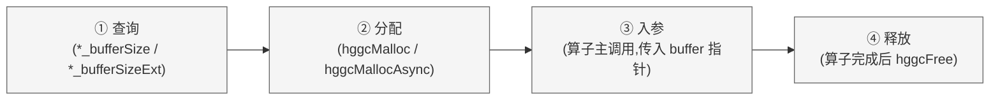

# T-Head SAIL acSPARSE <span style="float: right;"><a href="00_index.md">目录</a></span>

## 目录

- [1. 概览 {#概览}](#1-概览-概览)
  - [1.1. 阅读指引 {#阅读指引}](#11-阅读指引-阅读指引)
- [2. 平台与集成 {#2}](#2-平台与集成-2)
  - [2.1. 运行时与第三方依赖 {#2-1}](#21-运行时与第三方依赖-2-1)
  - [2.2. 链接配置 {#2-2}](#22-链接配置-2-2)
  - [2.3. 库的交付形态 {#2-3}](#23-库的交付形态-2-3)
- [3. acSPARSE API 使用指南 {#3}](#3-acsparse-api-使用指南-3)
  - [3.1. 代码示例约定 {#3-1}](#31-代码示例约定-3-1)
  - [3.2. 并发调用与线程安全 {#3-2}](#32-并发调用与线程安全-3-2)
  - [3.3. 计算结果的确定性与可复现性 {#3-3}](#33-计算结果的确定性与可复现性-3-3)
  - [3.4. 性能优化指南 {#3-4}](#34-性能优化指南-3-4)
- [4. 通用约定 {#4}](#4-通用约定-4)
  - [4.1. 缓冲区申请协议 {#4-1}](#41-缓冲区申请协议-4-1)
  - [4.2. 内存对齐要求 {#4-2}](#42-内存对齐要求-4-2)
  - [4.3. 标量参数与指针模式 {#4-3}](#43-标量参数与指针模式-4-3)
  - [4.4. stream 与异步行为 {#4-4}](#44-stream-与异步行为-4-4)
  - [4.5. 返回状态与故障排查 {#4-5}](#45-返回状态与故障排查-4-5)
  - [4.6. 矩阵变换 op() 的通用定义 {#4-6}](#46-矩阵变换-op-的通用定义-4-6)
  - [4.7. 数据存放位置与所有权归属 {#4-7}](#47-数据存放位置与所有权归属-4-7)
- [5. acSPARSE 存储格式 {#5}](#5-acsparse-存储格式-5)
  - [5.1. 索引基 {#5-1}](#51-索引基-5-1)
  - [5.2. 向量格式 {#5-2}](#52-向量格式-5-2)
  - [5.3. 矩阵格式 {#5-3}](#53-矩阵格式-5-3)
- [6. acSPARSE 基础 API {#6}](#6-acsparse-基础-api-6)
  - [6.1. acSPARSE 类型参考 {#6-1}](#61-acsparse-类型参考-6-1)
  - [6.2. acSPARSE 管理 API {#6-2}](#62-acsparse-管理-api-6-2)
  - [6.3. acSPARSE 日志 API {#6-3}](#63-acsparse-日志-api-6-3)
- [7. 函数级算子接口（Legacy）— 按算子族组织 {#7}](#7-函数级算子接口legacy-按算子族组织-7)
  - [7.1. 算子族索引 {#7-1}](#71-算子族索引-7-1)
  - [7.2. 命名约定 {#7-2}](#72-命名约定-7-2)
  - [7.3. acSPARSE Legacy 类型参考 {#7-3}](#73-acsparse-legacy-类型参考-7-3)
  - [7.4. acSPARSE 辅助函数参考 {#7-4}](#74-acsparse-辅助函数参考-7-4)
  - [7.5. acSPARSE Level 2 函数参考 {#7-5}](#75-acsparse-level-2-函数参考-7-5)
  - [7.6. acSPARSE Level 3 函数参考 {#7-6}](#76-acsparse-level-3-函数参考-7-6)
  - [7.7. acSPARSE Preconditioners Reference（预处理条件器参考） {#7-7}](#77-acsparse-preconditioners-reference预处理条件器参考-7-7)
  - [7.8. acSPARSE Format Conversion Reference（格式转换参考） {#7-8}](#78-acsparse-format-conversion-reference格式转换参考-7-8)
- [8. 描述符级算子接口（Generic）— 按算子族组织 {#8}](#8-描述符级算子接口generic-按算子族组织-8)
  - [8.1. 算子族索引 {#8-1}](#81-算子族索引-8-1)
  - [8.2. 通用类型参考 {#8-2}](#82-通用类型参考-8-2)
  - [8.3. Dense 向量 API {#8-3}](#83-dense-向量-api-8-3)
  - [8.4. 稀疏向量 API {#8-4}](#84-稀疏向量-api-8-4)
  - [8.5. Dense 矩阵 API {#8-5}](#85-dense-矩阵-api-8-5)
  - [8.6. 稀疏矩阵 API {#8-6}](#86-稀疏矩阵-api-8-6)
  - [8.7. 通用 API 函数 {#8-7}](#87-通用-api-函数-8-7)


## 1. 概览 {#概览}

T-Head SAIL acSPARSE（以下简称 acSPARSE）库用户指南。acSPARSE 库提供两套 API 接口，支持稀疏矩阵-向量乘法（SpMV）和稀疏矩阵-矩阵乘法（SpMM）等稀疏线性代数运算，支持 CSR、COO 等存储格式及混合精度计算。

| 能力维度 | 具体范围 |
| :--- | :--- |
| 核心运算能力 | 稀疏-稠密向量乘积（SpMV）、稀疏-稠密矩阵乘积（SpMM）、稀疏间矩阵乘积（SpGEMM）、三角系统求解（SpSM）、稀疏与稠密之间的格式互换、图着色与矩阵行列重新编号 |
| 支持的矩阵编码方式 | CSR(Compressed Sparse Row，压缩稀疏行，首选编码)、CSC(Compressed Sparse Column，压缩稀疏列)、COO(Coordinate，坐标格式)、切片式 ELL(SELL)、BSR(Block Sparse Row，块稀疏行)、分块 ELL(Blocked-ELL)、稀疏向量表示 |
| 数值精度覆盖 | `float` / `double`；行列下标支持 32 位或 64 位整数 |
| 并发执行模型 | 单一 stream / 多 stream 并行 / 计算图录制与回放；描述符对象可安全地在多线程间使用 |
| T-Head SAIL SDK 内部协作关系 | 底层依赖 `hggc` 运行时环境和 stream 机制；可与 [acBLAS](08_acblas.md) 和 acSOLVER 在同一计算管线内混合使用 |

> **入门路径**：「通用接口（Generic APIs）」是 acSPARSE 的主力接口层，封装了 SpMV / SpMM 等常用运算，在描述符层面内置了参数一致性检查。需要对接既有 Sparse BLAS 风格代码时，可参考「函数级接口」部分。

### 1.1. 阅读指引 {#阅读指引}

| 使用目标 | 推荐起点 |
| :--- | :--- |
| 快速构建并运行一个最小工作示例 | [2.2 链接配置](#2-2) |
| 为业务数据选择合适的稀疏编码 | [5.3.1. 格式选型决策路径](#5-3-decision)  |
| 定位函数返回的错误状态 | [6.1.2 控制类型— `acsparseStatus_t`](#6-1-control) |
| 了解多 stream 下的并发使用方式 | [3.2 并发调用与线程安全](#3-2) |
| 查阅某个具体函数的调用签名 | [6.（基础 API）](#6)、[7.(Legacy APIs)](#7)、[8.(Generic APIs)](#8) |

## 2. 平台与集成 {#2}

本章围绕「把 acSPARSE 接入项目」这一实操目标，按照开发者实际操作的先后顺序组织内容：首先明确运行时需要哪些底层组件，接着演示如何在编译链接阶段将 acSPARSE 纳入工程，最后介绍库的交付形态与典型部署场景。各节相互独立，也可按需跳读。

### 2.1. 运行时与第三方依赖 {#2-1}

acSPARSE 没有独立的运行时组件，它直接挂载在 T-Head SAIL SDK 提供的 `hggc` 运行时之上。换言之，只要 T-Head SAIL SDK 的安装和环境配置是完整的，acSPARSE 所需的运行时基础设施就已经就位。下表逐项列出进程启动后实际会被动态加载的底层组件以及它们各自的触发条件：

| 组件名称 | 依赖等级 | 触发场景 | 补充说明 |
| :--- | :--- | :--- | :--- |
| `hggc` 运行时 | 强制依赖 | 任何 acSPARSE 函数调用均需要 | 随 T-Head SAIL SDK 一同安装部署 |
| `libhgjitlink.so` | 按需加载 | 当调用 SpMMOp 等涉及 JIT-LTO(即时编译链接时优化)编译的算子时 | 若该文件与 `libacsparse.so` 位于同一目录下，则无需手动配置搜索路径 |

运行时库的搜索路径设置：需要将 `hggc` 运行时和 `libhgjitlink.so` 的存放目录追加到 `LD_LIBRARY_PATH` 中。关于 JIT-LTO 在哪些算子上生效的详细列表，请参阅 [`acsparseSpMMOp()`](#8-7-6) 的说明。

### 2.2. 链接配置 {#2-2}

运行时依赖确认无误后，下一步是将 acSPARSE 引入编译流程。通过真武 PPU 原生工具链（[`hgcc`](10_hgcc.md)）链接：

```bash
hgcc app_sparse_demo.cu -lacsparse -o app_sparse_demo
```

### 2.3. 库的交付形态 {#2-3}

acSPARSE 以共享库形式交付：

| 交付形式 | 对应文件 | 说明 |
| :--- | :--- | :--- |
| 共享库（动态链接） | `libacsparse.so` | 多个应用进程可共享同一份库代码，减少磁盘和内存占用 |

## 3. acSPARSE API 使用指南 {#3}

本章聚焦于 acSPARSE 在实际工程落地时的四个常见主题：多线程/多流环境下的并发使用、计算结果的确定性保证、T-Head SAIL SDK 版本升级时的代码兼容策略，以及关键场景下的性能调优手段。四个主题各自独立成节，读者可根据当前关注点直接定位；各函数的完整签名与参数定义分别收录在第 6-8 章。

对于贯穿全部 API 的基础性约定（如数据在主机/设备端的存放规则、标量传递模式、句柄的语义定位、调用的异步执行行为等），[4. 通用约定](#4) 已做集中阐述，本章不再逐一展开，阅读中遇到相关概念时可随时跳转查阅。

### 3.1. 代码示例约定 {#3-1}

本手册中出现的全部 C/C++ 示例代码均遵循下列统一规范。后续章节的示例只呈现与当前讨论直接相关的业务逻辑，**下表所列的基础性代码模板在示例中一律省略** ，在生产代码中请务必补全这些部分：

| 规范项 | 具体约定 |
| :--- | :--- |
| 头文件包含顺序 | `#include <hggc.h>` → `#include <acsparse.h>` → C/C++ 标准库头文件 |
| 返回值校验 | 所有 HGGC 和 acSPARSE 函数调用均应被下方定义的 `HGGC_CALL` / `ACSPARSE_CALL` 宏包裹 |
| 设备内存管理 | 默认使用 `hggcMallocAsync` 配合 stream 进行异步分配；在无 stream 上下文的场景中退化为同步的 `hggcMalloc` |
| 标量传递方式 | 默认设置为 `acsparseSetPointerMode(handle, ACSPARSE_POINTER_MODE_HOST)`；标量从主机端按值传入 |
| 示例矩阵尺寸 | 各算子的最小可运行示例统一采用 `M=12, N=8, nnz≈20` 的规模（刻意避开教科书中常见的 5×5 或 5×4 尺寸，防止与既有教学材料混淆） |

返回值校验宏的推荐定义如下：

```cpp
#define HGGC_CALL(expr)                                                      \
    do {                                                                       \
        hggcError_t _ret = (expr);                                             \
        if (_ret != hggcSuccess) {                                             \
            fprintf(stderr, "[hggc] 运行时错误 %d, 位置 %s(%d)\n",            \
                    (int)_ret, __FILE__, __LINE__);                             \
            exit(EXIT_FAILURE);                                                 \
        }                                                                      \
    } while (0)

#define ACSPARSE_CALL(expr)                                                    \
    do {                                                                        \
        acsparseStatus_t _st = (expr);                                          \
        if (_st != ACSPARSE_STATUS_SUCCESS) {                                   \
            fprintf(stderr, "[acsparse] 状态码 %d (%s), 位置 %s(%d)\n",        \
                    (int)_st, acsparseGetErrorName(_st), __FILE__, __LINE__);    \
            exit(EXIT_FAILURE);                                                  \
        }                                                                       \
    } while (0)
```

> T-Head SAIL SDK 内所有子库都采用统一的 `<LIB>_CALL` 宏命名风格：`HGGC_CALL` / `ACSPARSE_CALL` / `ACSOLVER_CALL` / `ACRAND_CALL`，在跨库集成代码中保持一致的错误检查写法。

### 3.2. 并发调用与线程安全 {#3-2}

**推荐做法是为每个线程分配专属的 handle，为每条独立任务分配专属的 stream；多个线程复用同一个 handle 是应当避免的做法。**

#### 3.2.1. 线程安全保证 {#线程安全保证}

acSPARSE 的接口设计是线程安全的，但这一保证有一个前提条件：不允许一个线程在另一个线程正在访问某对象时对其进行写入。函数签名中标记为 `const` 的参数表明该参数不会被算子修改；所有未标记 `const` 的输出参数和临时工作区，需要调用方自行确保不会出现竞争写入。

应当避免在多个线程之间共享同一个 `acsparseHandle_t` 实例。虽然从技术实现角度来说这样做不会崩溃，但 handle 内部携带的配置状态（当前绑定的 stream、标量指针模式、日志级别等）对所有使用者均可见。如果线程 A 通过 `acsparseSetStream` 切换了 stream，线程 B 紧随其后的调用就会无意中使用这个被更改的 stream。**为每个工作线程创建独立的 handle**：各线程在初始化阶段调用 `acsparseCreate` 获取自己的 handle，在清理阶段调用 `acsparseDestroy` 释放。

> handle 本质上是一个轻量的配置载体，而不是跨调用的状态累积器，库函数执行完毕后不会在 handle 上遗留任何与本次计算相关的状态。因此每个线程持有独立 handle 所增加的开销，仅限于 handle 对象自身占用的少量主机内存。

#### 3.2.2. 同一设备上的多 stream 并行 {#同一设备上的多stream并行}

当应用需要同时执行大量互不依赖的小规模运算，或者希望让数据搬运与计算过程在时间上重叠时，应当借助 HGGC stream 将这些任务分发到不同的执行通道，由设备端硬件调度器自动寻找重叠执行的机会。操作步骤如下：

1. 通过 `hggcStreamCreate()` 为每条独立的任务通道分别创建 stream。
2. 在切换到某条任务通道之前，调用 `acsparseSetStream(handle, stream)` 将当前 handle 的 stream 绑定更新为目标流。
3. 此后通过该 handle 发起的一切 acSPARSE 调用，其底层计算核函数都会被调度到该 stream 上排队执行。

需要注意，实际能达到的并行度受到两方面的硬性约束：

- 单块真武 PPU 设备上能够同时运行的核函数实例数量上限为 16，超出此数量的额外 stream 并不能带来更高的真实并发度。
- 跨 stream 的并行收益只有在单个算子的计算规模不足以占满整个设备时才能显现；如果每个算子本身就能充分利用设备资源，则多流之间实质上只能串行执行。

在多 stream 场景下，还有一条实践经验值得采纳：将指针模式设为 `ACSPARSE_POINTER_MODE_DEVICE` 与多 stream 配合使用效果更好，此模式下标量系数和返回结果都通过设备内存传递，主机端无需在每次算子调用前后插入同步操作，从而最大化异步执行链路的效率。

### 3.3. 计算结果的确定性与可复现性 {#3-3}

**在相同硬件、相同可执行文件、相同输入数据的条件下，绝大多数算子的非转置路径可以做到逐比特一致；但涉及转置操作或跨环境运行时，不提供确定性保证。**

#### 3.3.1. 确定性计算的适用范围 {#确定性计算的适用范围}

acSPARSE 的设计理念优先考虑计算吞吐量，逐比特可重复性并非作为无条件硬性保证提供。下表给出了不同运行条件下的确定性边界：

| 运行条件 | 结果是否逐比特一致 |
| :--- | :--- |
| 同一机器、同一可执行文件、同一组输入、使用 `NON_TRANSPOSE` 路径 | 是 |
| 上述条件不变，但使用 `TRANSPOSE` 路径 | **不保证**，累加顺序可能因运行时调度而变化 |
| 更换了硬件型号 / HGGC 驱动版本 / acSPARSE 库版本 | **不保证**，底层可能选用不同的计算核函数或算法策略 |
| 输入数据的内存对齐方式发生改变（即使数据值完全相同） | **不保证**，不同对齐状态可能触发不同的核函数分支 |

对于确实需要比特级精确复现的业务场景，一种可行的工程方案是：预先将转置操作的结果物化为独立矩阵（即显式构造 `A^T`），然后统一使用 `NON_TRANSPOSE` 路径执行计算，同时将可执行文件版本、依赖库版本和输入数据的对齐方式全部固化。

#### 3.3.2. 特殊浮点值（NaN / Inf）的传播特性 {#特殊浮点值nan--inf的传播特性}

在稀疏计算中，NaN 和 Inf 等特殊浮点值的传播行为不遵循稠密计算中的常规预期。acSPARSE 的计算核函数在设计上假设输入数据由有限浮点值构成，NaN 或 Inf 只有在计算路径恰好触及它们时才会出现在输出中；而且由于计算核函数的选择会随 T-Head SAIL SDK 版本和运行时的启发式决策而变化，特殊浮点值的传播行为本身也可能在不同版本之间产生差异。

在这个问题上最容易引发困惑的场景是稀疏计算与稠密计算对「显式存储的零值」的不同处理方式。以下面的示例说明：设 `x = [0, NaN, 0]`、`y = [1, 2, 3]`：

- **稠密内积运算** ：遍历所有下标位置，`0 * NaN` 的结果仍然参与累加，最终结果被 NaN 污染。
- **稀疏内积运算** ：如果 `x` 以稀疏格式存储且只记录了非零项（即仅包含 `x[1] = NaN`），那么只有 `x[1] * y[1] = NaN` 参与归约，结果依然是 NaN； 然而如果 `x` 的稀疏表示中仅显式记录了 `x[0] = 0` 和 `x[2] = 0`（NaN 所在的位置未被纳入稀疏结构），稀疏遍历就完全跳过了 NaN 所在位置，最终得到有限值 0。

这并非计算错误，而是「沿结构化索引遍历有效元素」与「按连续下标遍历全部元素」这两种算法范式在数值语义上的本质区别。在生产环境中如果使用 NaN 作为标记值或哨兵值，必须事先确认该值是否被纳入了稀疏数据结构的显式存储范围内。

### 3.4. 性能优化指南 {#3-4}

**主要优化途径：利用 HGGC 计算图机制将重复执行的算子序列打包回放以消除逐次启动开销。**

#### 3.4.1. 通过 HGGC 计算图减少核函数启动开销 {#hggc-graph-reduce-overhead}

acSPARSE 的绝大多数算子都支持被 HGGC 计算图捕获机制完整录制，之后以计算图回放的形式一次性执行。这种方式带来两方面的显著收益：

- 原本需要 N 次独立发起的核函数启动被合并为单次计算图回放，主机端的调度和提交开销基本被消除。
- HGGC 运行时获得完整的计算图结构后，能够在多个核函数之间进行全局视角的调度优化和资源复用，这是逐次提交单个核函数时无法实现的。

最适合使用计算图的场景是：推理管线或迭代求解器中，同一组算子以相同的数据结构（但不同的数值内容）被反复执行的循环体。

> 使用计算图时有一个常见的陷阱需要注意：算子配套的 `*_bufferSize` 查询接口返回的是主机端数值， 不应当被放入计算图捕获区间内。正确做法是在进入捕获区间之前完成缓冲区大小查询，然后将分配好的设备端 buffer 指针传入捕获区间内的算子调用。

比赛关联：计算图捕获 + 多 stream 是直接对应比赛 TTFT/吞吐评分项的手段——decode 阶段反复执行的稀疏算子序列可录制为图一次回放，消除 kernel 启动开销；`ACSPARSE_POINTER_MODE_DEVICE` 可避免主机同步插入异步链路。

## 4. 通用约定 {#4}

> 本章将各算子共用的底层约定（工作区管理、地址对齐规范、标量传递方式、异步执行模型、返回状态体系、数据宿主归属）统一归纳在一处。**后续的 API 章节在涉及这些维度时，将以「见 3.X」的简短引用替代完整描述，不再逐接口重复** 。如果当前只需要查阅某个特定接口的用法，可先行跳过本章，在阅读接口文档遇到引用时再返回对照。

### 4.1. 缓冲区申请协议 {#4-1}

acSPARSE 中凡是需要临时工作区或内部中间状态的算子，一律采用「查询-分配-传入」的统一工作区管理流程，这是本库获取临时空间的**唯一** 规定方式，调用方绝不应自行估算算子内部所需的字节数。



| 阶段 | 执行方 | 要点提示 |
| :--- | :--- | :--- |
| ① 查询所需空间 | 由调用方调用对应的 `*_bufferSize` / `*_bufferSizeExt` 接口 | 返回的字节数取决于当前输入矩阵的规模和参数配置，**每当输入数据发生变化都必须重新查询** |
| ② 分配设备内存 | 由调用方在设备端分配不小于查询结果的连续内存块 | 分配的起始地址必须符合 [4.2](#4-2) 中规定的对齐约束 |
| ③ 传入算子调用 | 将分配好的 buffer 指针作为参数传入算子主函数 | 算子**不获取该内存的所有权**，buffer 的完整生命周期由调用方负责管理 |
| ④ 释放工作区 | 在算子执行结束后由调用方释放 | 在多次调用之间复用同一块 buffer 是被允许的（前提是前一次调用已经通过 stream 同步确认完成） |

> **典型误区** ：将 `*_bufferSize` 的查询结果缓存下来作为固定常量反复使用，这是不正确的做法。不同的矩阵尺寸、不同的稀疏模式、不同的算法选择都可能导致所需工作区大小发生变化。**正确做法** 是：只要输入矩阵或算法配置有任何改变，就重新调用一次查询接口。

### 4.2. 内存对齐要求 {#4-2}

acSPARSE 对调用方提供的设备端内存施加两级对齐约束。如果传入的地址**不满足对齐要求**，接口会统一返回 `ACSPARSE_STATUS_INVALID_VALUE` 状态码，运行时不会尝试自动纠正地址偏移。

| 适用内存 | 最低对齐粒度 | 涉及场景 | 约束来源 |
| :--- | :--- | :--- | :--- |
| 工作区 `pBuffer` 的起始地址 | **128 字节** 对齐 | 所有遵循「查询-分配-传入」协议的临时工作区 | 内部计算核函数的合并访存（coalesced access）路径要求 |
| 数据数组（`values` / `indices` / `*Offsets` 等）的起始地址 | 按对应**数据类型的字节宽度** 对齐 | 所有稀疏矩阵和稠密矩阵的描述符 | 由 `valueType` / `idxType` 等精度枚举所确定的类型宽度 |

通过 `hggcMalloc` / `hggcMallocAsync` 分配的设备内存指针**天然满足** 128 字节对齐；只要不对返回的指针做手动偏移操作，在大多数情况下无需额外关注对齐问题。**如果确实需要在分配的内存块中按偏移量使用子区域** ：必须确保偏移量本身也是 128 字节的整数倍（对工作区而言）或数据类型字节宽度的整数倍（对数据数组而言）。

各数据类型对应的字节宽度请参阅 [`hggcDataType_t`](#6-1-data) 中的类型字段表。

### 4.3. 标量参数与指针模式 {#4-3}

算子中出现的 α / β 等标量系数支持从主机端或设备端两种途径传入，通过 handle 上的 `acsparseSetPointerMode` 函数进行切换：

| 传递模式 | 标量数据来源 | 典型应用场景 | 附加说明 |
| :--- | :--- | :--- | :--- |
| `ACSPARSE_POINTER_MODE_HOST`（默认值） | 来自主机栈或主机内存，以值或主机指针形式传入 | 标量为编译期常量或推理阶段的固定参数 | 算子核函数在设备端异步运行，主机端在调用返回后可以立即修改标量值供下一次调用使用 |
| `ACSPARSE_POINTER_MODE_DEVICE` | 来自设备内存，以设备端指针形式传入 | 标量是由前序计算核函数在设备端动态产生的、需要保持在异步执行链路中 | 该标量值对主机端不可见，只有在 stream 同步后通过显式回拷才能在主机端读取 |

> **关于切换的生效时机** ：调用 `acsparseSetPointerMode` 会立即更新 handle 上的模式设置，但**不会追溯影响** 已经提交但尚未执行完毕的算子。已在 stream 中排队等待的算子，使用的是它们被提交那一刻所记录的指针模式。

### 4.4. stream 与异步行为 {#4-4}

acSPARSE 的所有算子调用对主机线程而言都是异步的，函数在完成参数校验后立即返回控制权给主机线程，实际的设备端计算被提交到 handle 当前所绑定的 stream 中排队执行。

| 操作意图 | 对应方法 |
| :--- | :--- |
| 将后续算子提交到指定 stream | 在算子调用前执行 `acsparseSetStream(handle, stream)` |
| 等待某条 stream 上的全部任务执行完毕 | `hggcStreamSynchronize(stream)` |
| 等待设备上所有 stream 的全部任务完成 | `hggcDeviceSynchronize()`（开销较大，非必要不使用）|
| 将结果同步拷回主机端并立即读取 | `hggcMemcpy(..., D2H)` 是阻塞式拷贝，内含隐式同步 |
| 异步拷回主机，之后再读取 | `hggcMemcpyAsync(..., D2H, stream)` 加上后续的 `Synchronize` 调用 |
| 将一系列算子调用录制下来批量回放 | HGGC 计算图捕获（详见 [3.4 性能优化指南](#3-4)）|

**异步执行模式下需要留意的问题** ：

- 当使用 `HOST` 指针模式时，标量值在调用时按值复制到提交队列中，因此算子返回后修改主机端标量变量不会波及已经排队等待执行的计算； 但是使用 `DEVICE` 指针模式时，请勿在算子调用返回后、stream 同步之前修改标量指针所指向的设备内存，计算核函数此时可能仍然在读取该地址。
- 某些阻塞性质的查询接口在内部会隐式触发 `hggcDeviceSynchronize()`，将它们放在对延迟敏感的热路径上会导致**严重的性能退化** 。
- 在 `hggcGraphCapture` 录制区间内，所有 acSPARSE 算子都可以被正常录制；但要注意其前置的 `*_bufferSize` 查询接口返回的是主机端数值，不应被包含在录制区间中，应在进入录制之前完成查询。

### 4.5. 返回状态与故障排查 {#4-5}

acSPARSE 的所有公开接口统一通过 `acsparseStatus_t` 返回执行结果，在发生错误时给出问题类别的粗粒度分类；精确定位问题根因时需配合**专用诊断接口** 或**运行时日志** 。下表按「收到此状态码后应采取什么行动」的维度组织，帮助开发者在排查时快速确定下一步操作方向。

| 返回状态 | 问题类别 | 建议的排查/处理方向 |
| :--- | :--- | :--- |
| `ACSPARSE_STATUS_SUCCESS` | 正常完成 | 可以继续执行后续逻辑；但对于分解类或三角求解类算子，**即使返回成功也需要** 通过诊断接口（如 zero pivot 查询、info 对象）确认数值层面是否存在奇异性问题 |
| `ACSPARSE_STATUS_NOT_INITIALIZED` | handle 未就绪或运行时缺失 | 确认是否已调用 `acsparseCreate()` 完成初始化、HGGC 设备驱动是否正常加载、acSPARSE 库文件版本是否与运行时匹配 |
| `ACSPARSE_STATUS_ALLOC_FAILED` | 内存分配失败（设备端或主机端） | 释放不再使用的内存资源，或者减小 batch 大小 / 矩阵维度以降低内存需求 |
| `ACSPARSE_STATUS_INVALID_VALUE` | 参数值非法、越界或不满足约束 | 逐项核对该函数的参数说明表；如果涉及 buffer 指针，检查 [4.2](#4-2) 的对齐要求；如果涉及算法选择枚举，查阅对应算子文档中的有效取值 |
| `ACSPARSE_STATUS_ARCH_MISMATCH` | 当前真武 PPU 硬件缺少该算子所需的硬件特性 | 更换到具备所需硬件特性的真武 PPU 设备，或在运行时通过能力查询接口动态选择代码路径 |
| `ACSPARSE_STATUS_MAPPING_ERROR` | 内部资源映射操作失败 | 通常反映系统级资源已耗尽或执行上下文处于异常状态；尝试重启应用进程或主动回收占用的系统资源 |
| `ACSPARSE_STATUS_EXECUTION_FAILED` | 设备端计算核函数执行出错 | 优先排查驱动程序版本兼容性、传入算子的设备内存是否在核函数执行期间被外部代码改写或释放、是否存在数组越界访问 |
| `ACSPARSE_STATUS_INTERNAL_ERROR` | 库内部一致性约束被违反 | 这通常意味着外部代码破坏了 acSPARSE 维护的内部状态；建议开启运行时日志，收集最小可复现路径后提交问题报告 |
| `ACSPARSE_STATUS_MATRIX_TYPE_NOT_SUPPORTED` | 矩阵的结构类型声明与算子要求不匹配 | 检查并调整 `acsparseMatDescr_t::MatrixType` 的设置，或者改用支持当前矩阵类型的其他算子 |
| `ACSPARSE_STATUS_ZERO_PIVOT` | 分解或三角求解过程中遇到数值为零或接近零的主元 | 检查输入矩阵的结构完整性，确认对角元素是否正确存储 |
| `ACSPARSE_STATUS_NOT_SUPPORTED` | 当前的算法、数据精度和索引基组合尚未实现 | 调整为已实现的参数组合；各算子文档的「算法与精度支持矩阵」段落列出了全部有效组合 |
| `ACSPARSE_STATUS_INSUFFICIENT_RESOURCES` | 工作区空间不足或片上资源耗尽 | 重新调用 buffer 大小查询接口获取正确的空间需求，按新的结果扩容后重试 |

> **深入排查工具** ：通过设置环境变量（如 `ACSPARSE_LOG_LEVEL`）可开启 acSPARSE 运行时日志，在状态码所传达的信息之外获得库内部各模块的详细诊断轨迹；具体配置方法参见 [6.3 acSPARSE 日志 API](#6-3)。

### 4.6. 矩阵变换 op() 的通用定义 {#4-6}

acSPARSE 所有涉及矩阵-向量乘积、矩阵-矩阵乘积以及三角系统求解的算子中出现的 `op(A)` / `op(B)` / `op(X)` 记号，均共享以下这组统一的变换语义。**本节是这组语义的唯一权威定义** ；后续各算子的文档仅在与此默认行为存在差异时（例如某算子不支持转置）进行差异化说明。

| 枚举值 | 对应的数学运算 | 含义 |
| :--- | :--- | :--- |
| `ACSPARSE_OPERATION_NON_TRANSPOSE` | $A$ | 使用原始矩阵，这是默认选择 |
| `ACSPARSE_OPERATION_TRANSPOSE` | $A^T$ | 对矩阵做转置（交换行与列） |

> **关于数值确定性** ：`TRANSPOSE` 路径采用按列扫描的归约策略，不同次运行之间浮点累加的元素顺序可能发生变化。这会导致结果在低有效位上出现微小波动。如果业务上要求逐比特可复现，建议预先将矩阵显式转置为独立数据，然后统一使用 `NON_TRANSPOSE` 路径执行计算。

> **个别算子的限制** ：部分算子在当前版本中并不支持全部两种变换选项。每个算子的文档节点会单独标注其支持的变换选项子集。

### 4.7. 数据存放位置与所有权归属 {#4-7}

下表明确了 acSPARSE 接口中每类数据对象应当存放在主机端还是设备端，以及其分配和释放的责任归属，这些规则是所有 API 的统一前提。

| 数据对象 | 要求的存放位置 | 分配与释放责任 | 补充信息 |
| :--- | :--- | :--- | :--- |
| 稀疏矩阵的结构与数值数组（如 rowOffsets / colIndices / values） | 设备端 | 由调用方负责，通常使用 `hggcMalloc*` 系列函数分配 | acSPARSE 既不复制这些数据，也不获取其所有权 |
| 稠密向量和稠密矩阵（无论作为输入还是输出） | 设备端 | 由调用方负责 | 同上 |
| 描述符对象（`acsparseSpMatDescr_t` / `acsparseDnMatDescr_t` 等） | 主机端句柄 + 库内部的关联状态 | 由 acSPARSE 管理，通过配对的 `Create*` / `Destroy*` 接口创建和释放 | 描述符本身是轻量对象，可以在不同 stream 之间安全复用 |
| 算子临时工作区（`pBuffer`） | 设备端 | 由调用方按 [4.1](#4-1) 的流程进行分配和释放 | 多个算子之间可以复用同一块工作区，但**在不同 stream 之间共享工作区时必须由调用方自行管理同步** |
| 标量参数（α / β / 标量形式的计算结果） | 主机端或设备端（由当前指针模式决定） | 由调用方负责 | 具体行为 [参见 4.3](#4-3) |
| 诊断输出（`info` / `position` 等） | 主机端或设备端（由当前指针模式决定） | 由调用方负责 | 使用设备端指针时，在主机端读取前需要先执行 D2H 内存拷贝 |

## 5. acSPARSE 存储格式 {#5}

acSPARSE 通过描述符系统提供以下数据布局：稠密向量与稀疏向量各一种，稠密矩阵一种，以及七种稀疏矩阵编码方案。为避免在每种布局中反复解释索引编号规则，5.1 首先统一定义"索引基"概念，后续各节直接引用该定义即可。

### 5.1. 索引基 {#5-1}

在 acSPARSE 的描述符体系中，行号、列号、行列偏移量以及块编号等所有整型索引的起始值由枚举 `acsparseIndexBase_t` 统一控制，可选 0 基或 1 基。选择 0 基时，索引天然对齐 C/C++ 的数组下标习惯；选择 1 基时，来自 MATLAB 或 R 等从 1 开始编号的上游数据可以直接传入，无需在调用前逐元素减一。

需要特别注意：同一描述符内的全部索引数组必须使用**相同的基** 。例如，不允许 `rowOffsets` 采用 0 基而 `colIndices` 采用 1 基，单个数组内部也不得混用两种基。

### 5.2. 向量格式 {#5-2}

acSPARSE 将向量分为稠密和稀疏两种表示。稠密表示将向量的每一个分量（含零值） 逐一存放在连续内存中；稀疏表示则仅记录非零分量及其对应的位置索引，省略所有零元素。两者之间可以借助 `acsparseGather` / `acsparseScatter` 进行相互转换。

#### 5.2.1. 稠密向量格式 {#5-2-1}

稠密向量的内存表示极为直接：一段连续的 `values[]` 数组，其中第 $i$ 个位置直接存放分量 $x_i$，不需要任何辅助的索引或元数据结构。以下示意图以一个 7 维的稠密向量为例展示其内存排列，读者可将其与后续稀疏向量的双数组表示进行比较。

#### 5.2.2. 稀疏向量格式 {#5-2-2}

稀疏向量通过"索引数组 + 数值数组"的配对方式表达，仅被显式列出的分量会参与后续运算，其余位置的值一律视为零：

- `values[nnz]`：按出现次序存放各非零分量的实际数值。
- `indices[nnz]`：长度与 `values` 一致，其第 $k$ 个元素标明 `values[k]` 对应于完整稠密向量中的哪一个位置。

以下示意图将 5.2.1 中的 7 维稠密向量转写为等价的稀疏表示，同时给出 0 基索引与 1 基索引两个版本的对比，以便直观感受索引基的差异。

**稠密向量**


**图 1 稠密向量表示**

**稀疏向量**

**索引值（零基）**


**稀疏向量**

**索引值（一基）**


**图 2 稀疏向量表示**

!!! note
    acSPARSE 的稀疏向量例程要求索引数组严格单调递增且无重复项。如果输入数据违反此约束，计算结果的正确性将无法得到保证。

### 5.3. 矩阵格式 {#5-3}

acSPARSE 同时提供一种稠密矩阵布局和多种稀疏矩阵编码。**建议首先根据下方的选型参考表确定适合的格式，再查阅相应小节了解详细的参数定义和图示说明** 。

#### 5.3.1. 格式选型决策路径 {#5-3-decision}

| 数据特点 | 建议格式 | 章节 | 说明 |
| :--- | :--- | :--- | :--- |
| 非零元素分布不规则，且主要沿行方向遍历 | **CSR** | [5.3.2](#5-3-csr) | acSPARSE 中覆盖面最广的格式，新项目应优先采用 |
| 非零元素分布不规则，主要沿列方向访问或需计算 $A^\top x$ | **CSC** | [5.3.3](#5-3-csc) | 结构上是 CSR 的列方向对称形式 |
| 数据以 (row, col, value) 三元组从文件或网络载入 | **COO** | [5.3.4](#5-3-coo) | 适合数据导入环节；后续运算前建议通过 `acsparseConvert*` 转为 CSR |
| 非零元素占比较高(> 30%)，或仅用于基准对比 | **Dense** | [5.3.5](#5-3-dense) | 此类场景使用 [acBLAS](08_acblas.md) / acSOLVER 往往效率更高 |
| 各行非零元素数量相近，适合 SIMD 向量化 | **SELL** | [5.3.6](#5-3-sell) | 分片填充策略，格外适合结构化网格产生的矩阵 |
| 非零元素天然聚成固定尺寸小块（如有限元/CFD 场景） | **BSR** | [5.3.7](#5-3-bsr) | 块内为稠密存储，块间按稀疏索引 |
| 在 BSR 基础上希望利用 Tensor Cell 加速 SpMM | **Blocked-ELL** | [5.3.8](#5-3-bell) | 具体算法支持见 7. SpMM 部分 |
| 已有 BSR 数据且需要轻量级子矩阵裁切 | **BSRX** | [5.3.9](#5-3-bsrx) | 新代码建议使用 BSR 搭配应用层子矩阵视图 |

> **关于小节排列顺序**：各格式按实际使用频率从高到低排列，而非按照字母或教科书惯例的顺序。因此，最常用的 CSR 位于首位，BSRX 排在末尾。

> 所有格式的通用规则（以下各节不再逐一重申）：
> - 索引起始值（0 基或 1 基） 统一在描述符上通过 `acsparseIndexBase_t` 设定。
> - 同一行或同一列中的索引可以不按顺序排列，但**严禁出现重复**。存在重复索引时行为未定义。
> - 所有数据缓冲区（values 数组、行列索引数组等） 的内存分配与释放均由调用方自行管理，acSPARSE 既不会拷贝这些数据，也不会接管其所有权。

#### 5.3.2. 压缩稀疏行（CSR） {#5-3-csr}

CSR 格式使用三个数组来表达一个 $m \times n$ 的稀疏矩阵。其核心思路是：不再为每个非零元素单独记录行号，而是用一个偏移数组记录每一行在数据序列中的起止位置：

| 数组 | 长度 | 内容 |
| :--- | :--- | :--- |
| `rowOffsets` | $m+1$ | 记录第 $i$ 行的非零元素在 `colIndices` 和 `values` 中从哪个位置开始；数组最后一项固定等于 nnz |
| `colIndices` | nnz | 各非零元素所在的列编号 |
| `values` | nnz | 各非零元素的实际数值，逐行连续排列 |

> 要访问第 $i$ 行的全部非零元素，只需取 `colIndices[rowOffsets[i] .. rowOffsets[i+1])` 这一段区间，无需线性扫描即可以 O(1) 复杂度定位到目标行。

6×4 示例：


**映射到稠密矩阵中的位置**：

```cpp
// 行优先:    元素 (row, colIndices[k]) 在稠密中的下标
row * ld + colIndices[rowOffsets[row] + k]
// 列优先
colIndices[rowOffsets[row] + k] * ld + row
```

> **T-Head SAIL 工程提示（CSR）**
> - acSPARSE 的大多数核心算子（SpMV / SpMM / SpGEMM / SpSM） 均将 CSR 作为首选输入格式。若传入其他格式，库内部通常会先将其转成 CSR 再执行计算，因此预先完成格式转换有助于消除重复的转换开销。
> - 对于真武 PPU 平台，在行数未超过 $2^{31}$ 的情况下，推荐将 `rowOffsets` 的索引类型设为 32 位（`acsparseIndexType_32I`），以减少不必要的内存带宽消耗。
> - 当同一矩阵需要被多个算子反复使用时，应将矩阵描述符 `acsparseSpMatDescr_t` 保存下来以便复用，因为描述符内部的预处理结果可被后续调用共享。

#### 5.3.3. 压缩稀疏列（CSC） {#5-3-csc}

CSC 与 CSR 互为转置对偶关系：CSR 按行压缩索引，CSC 则按列压缩。从内存布局来看，一个 $m \times n$ 矩阵的 CSC 数据与其 $n \times m$ 转置矩阵的 CSR 数据完全相同，无需任何变换。

| 数组 | 长度 | 内容 |
| :--- | :--- | :--- |
| `colOffsets` | $n+1$ | 标记第 $j$ 列的非零元素在 `rowIndices` 和 `values` 中的起始位置 |
| `rowIndices` | nnz | 各非零元素所在的行编号 |
| `values` | nnz | 各非零元素的实际数值，逐列连续排列 |

6×4 示例（0 基）：


6×4 示例（1 基）：


**映射到稠密矩阵中的位置**：

```cpp
// 行优先
rowIndices[colOffsets[col] + k] * ld + col
// 列优先
col * ld + rowIndices[colOffsets[col] + k]
```

> **T-Head SAIL 工程提示（CSC）**
> - 在计算 $y \leftarrow A^\top x$ 时，可以直接将 $A$ 的 CSC 表示传给 SpMV，效果等同于对 $A^\top$ 执行 CSR 格式的 SpMV，从而省去显式转置的步骤。
> - CSC 并非 acSPARSE 内部的默认计算路径；库的 `Convert` 流程一般会先将 CSC 转为 CSR 后再执行算子。如果 CSC 数据需要被频繁使用，建议提前调用 `acsparseCsr2cscEx2` 完成离线转换并将 CSR 结果持久化保存。

#### 5.3.4. 坐标格式（COO） {#5-3-coo}

COO 采用最直观的三元组列表方式存储稀疏矩阵，是数据导入和交换时最常见的格式。每一个非零元素由 `(rowIdx, colIdx, value)` 三个分量完整描述：

| 数组 | 长度 | 内容 |
| :--- | :--- | :--- |
| `rowIndices` | nnz | 各非零元素的行编号 |
| `colIndices` | nnz | 各非零元素的列编号 |
| `values` | nnz | 各非零元素的数值 |

6×4 示例：


0 基与 1 基对照：


**映射到稠密矩阵中的位置**：

```cpp
// 行优先
rowIndices[i] * ld + colIndices[i]
// 列优先
colIndices[i] * ld + rowIndices[i]
```

> **T-Head SAIL 工程提示（COO）**
> - acSPARSE 要求传入的 COO 数据已按行号排好序。如果原始数据未经排序，需首先调用 `acsparseXcoosortByRow` 完成排序，再传入后续算子。
> - 以 COO 格式直接运行 SpMV / SpMM 时，吞吐量通常不及 CSR。因此 COO 更适合在数据加载阶段使用，对于需要长期驻留的矩阵数据，应尽早转换为 CSR。
> - 当多个三元组具有相同的 (row, col) 坐标时，acSPARSE 不会自动将它们的值进行累加，此时计算结果是未定义的；调用方应在预处理阶段完成去重与合并。

#### 5.3.5. 稠密矩阵格式（Dense） {#5-3-dense}

稠密矩阵将全部元素存储在一块线性内存中，通过两个关键参数，存储方向（行优先或列优先） 与**主维度** （即 LAPACK 及相关文献中所说的 *leading dimension*），将这段一维缓冲区解释为二维矩阵：

| 参数 | 含义 |
| :--- | :--- |
| `rows` / `cols` | 矩阵在逻辑上的行数和列数 |
| `ld` | 主维度步长；行优先时须满足 $\geq \texttt{cols}$，列优先时须满足 $\geq \texttt{rows}$ |
| `values` | 指向数据缓冲区的指针；所需长度：行优先布局下为 `rows * ld`，列优先布局下为 `cols * ld` |

> 当 `ld` 超过实际的列数（行优先） 或行数（列优先） 时，意味着当前矩阵只是一块更大内存区域的局部视图（即步长大于矩阵的实际宽度）。这种机制经常用于从 batch 数组中以零拷贝方式切出单个矩阵，在 acSPARSE 的输入输出参数中被广泛使用。

6×3 示例（行优先 / 列优先）：


子矩阵视图示意（通过设置较大的 `ld` 值从完整矩阵中截取子块）：


> **T-Head SAIL 工程提示（Dense）**
> - 如果仅需执行纯稠密的矩阵-向量或矩阵-矩阵乘法，**应直接使用 [acBLAS](08_acblas.md) 而非 acSPARSE** 。acSPARSE 中的稠密矩阵支持主要用于 SpMM 运算中的 B/C 操作数以及 SDDMM 的中间结果等场景。
> - 在真武 PPU 上，采用行优先存储搭配常规 batch 维排列更容易触发 Tensor Cell 加速路径；除非有来自 LAPACK 的列优先约束，新代码建议默认使用行优先布局。

#### 5.3.6. 切片 Ellpack (SELL) {#5-3-sell}

SELL 将矩阵按行方向划分为若干「切片」(slice)。在每个切片内部，所有行以列优先顺序存储，较短的行用占位值（`-1`） 填充至与该切片内最长行相同的长度。这种设计在切片内部保证了统一的行步长，有利于向量化执行；而切片之间允许步长各不相同，从而避免了传统 ELLPACK 以全局最长行为标准填充带来的大量空间浪费。

| 参数 | 含义 |
| :--- | :--- |
| `sliceSize` | 单个切片涵盖的行数，通常取真武 PPU 硬件向量宽度的值 |
| `nslices` | $\lceil m / \texttt{sliceSize} \rceil$ |
| `sliceOffsets` | 长度为 `nslices + 1`，标记各切片在 `colIndices` 和 `values` 数组中的起始偏移 |
| `colIndices` | 长度为 `sellValuesSize`，其中 `-1` 表示填充位 |
| `values` | 长度为 `sellValuesSize`，数据在每个切片内部按列优先方式存放 |

8×5 示例：


> **T-Head SAIL 工程提示（SELL）**
> - SELL 最能发挥优势的场景是各行长度差异不超过 2 倍。一旦切片内最长行的长度远超平均行长，填充开销就会急剧增加，此时性能可能不及 CSR。
> - `sliceSize` 应当与真武 PPU 的硬件向量宽度相匹配。

#### 5.3.7. 块稀疏行（BSR） {#5-3-bsr}

BSR 是 CSR 的块级推广：将 CSR 中以单个标量为单位的非零元素替换为固定大小的稠密子块。一个 $m \times n$ 矩阵在 BSR 视图下被划分成 $m_b \times n_b$ 个边长为 `blockSize` 的方形子矩阵，其中 $m_b = m / \texttt{blockSize}$, $n_b = n / \texttt{blockSize}$。当 $m$ 或 $n$ 无法被 `blockSize` 整除时，调用方需要预先对原始矩阵进行零填充以满足对齐要求。

> 当前版本的 acSPARSE 仅支持正方形块，即要求 `block_rows == block_cols`。

| 数组 | 长度 | 内容 |
| :--- | :--- | :--- |
| `blockRowOffsets` | $m_b + 1$ | 标记各块行的第一个非零块在 `blockColIndices` 和 `values` 中的位置 |
| `blockColIndices` | nnzb | 各非零块所在的列块编号 |
| `values` | nnzb × `blockSize`² | 所有非零块的稠密数据依次排列；每个块的内部存储方向（行优先或列优先） 由 `acsparseDirection_t` 决定 |

6×9 示例：


> **T-Head SAIL 工程提示（BSR）**
> - 推荐将 `blockSize` 设为 4、8 或 16，当块尺寸与真武 PPU Tensor Cell 的最小累加粒度对齐时，SpMM 运算的吞吐能够获得显著提升。
> - 块内数据方向建议选择 `ACSPARSE_DIRECTION_ROW`（行优先），因为这与算子核函数的局部访存模式更为契合；仅当外部数据源本身已是列优先排列时，才考虑使用列优先块。

#### 5.3.8. 分块 Ellpack (Blocked-ELL) {#5-3-bell}

Blocked-ELL 在 BSR 的基础上进一步约束每一行拥有固定数量的块（`nEllCols` 个），以此换取完全规整的行长结构。虽然这会引入一定比例的填充开销，但行长的一致性恰好是真武 PPU Tensor Cell 获得稳定高吞吐的前提条件。

| 参数 | 含义 |
| :--- | :--- |
| `blockSize` | 每个块的边长（方形块） |
| `rows` / `cols` | 矩阵的总行数和总列数 |
| `nEllCols` | 每个块行包含的块数（所有行一致），需满足 `nEllCols ≤ cols`；空块位置用 `-1` 标记 |
| `blockColIndices` | 长度为 `mb × nb` 的数组，存放各块的列块编号 |
| `values` | 长度为 `m × nEllCols` 的数据数组，按行优先排列存放 |

12×12 示例：


> **T-Head SAIL 工程提示（Blocked-ELL）**
> - 在真武 PPU Tensor Cell 上执行 SpMM 时，Blocked-ELL 能够提供最高的吞吐性能。但这一优势成立的前提是各行的块数差异不超过 30%。否则过多的填充会抵消格式本身带来的收益。
> - 可以通过 `acsparseConvert*` 系列函数实现 Blocked-ELL 与 CSR 之间的互相转换；对于需要批量处理的数据，建议在离线阶段预先完成转换并将结果缓存到磁盘。

#### 5.3.9. 扩展 BSR (BSRX) {#5-3-bsrx}

> 对于新编写的代码，建议使用 BSR 搭配应用层自行管理的子矩阵视图，这样做不仅代码可读性更好，而且能在编译阶段捕获更多潜在错误。

##### 5.3.9.1. BSRX 的设计初衷与使用建议 {#bsrx-design-rationale}

在标准 BSR 中，长度为 $m_b + 1$ 的 `blockRowOffsets` 数组通过相邻元素之差隐含地表达了每个块行的**起始位置** 和**结束位置** （后一行的起点即前一行的终点）。BSRX 将这一数组**拆分成两个独立数组**：

- `blockRowStart[m_b]`：记录每个块行中第一个非空块在 `blockColIndices` / `values` 中的偏移；
- `blockRowEnd[m_b]`：记录每个块行中最后一个非空块的偏移加 1。

由于起止位置被分离为两个独立数组，调用方可以在不触动底层 `blockColIndices` / `values` 数据的情况下，仅通过调整 start/end 指针来"选取"任意块行子集。BSR 早期曾利用这一机制充当轻量级的子矩阵视图。

然而实践表明，这种设计引入的风险超过了其带来的便利：
- start 和 end 不再存在相邻约束，**迭代逻辑必须同时读取两个端点**。如果沿用 BSR 中"`start[i+1]` 等同于 `end[i]`"的惯例写法，将产生静默的逻辑错误；
- 端点越界或 start/end 交叉等异常状态缺乏结构层面的校验手段；
- 更稳健的替代方案是在应用层构造 `BsrView { base; row_lo; row_hi; }` 这样的轻量包装，与 BSR 数据本体保持解耦。

基于以上考量，acSPARSE 不推荐新代码使用 BSRX。下方的参数表与示例仅供需要兼容既有 BSRX 数据的场景参考。

##### 5.3.9.2. 参数清单 {#参数清单}

| 参数名 | 数据类型 | 描述 |
| :--- | :--- | :--- |
| `blockDim` | int | 方形块的边长 |
| `mb` / `nb` | int | 矩阵 A 在块级别的行数和列数 |
| `nnzb` | int | 矩阵中非空块的总数 |
| `bsrValA` | 指针 | 长度为 `nnzb · blockDim²`，按顺序存放所有非空块的稠密数据；每个块内部的存储方向通过 `acsparseDirection_t` 指定（行优先或列优先） |
| `bsrRowPtrA` | 指针 | 长度为 `mb`，标记各块行的第一个非空块在 `bsrColIndA` 和 `bsrValA` 中的偏移 |
| `bsrEndPtrA` | 指针 | 长度为 `mb`，标记各块行最后一个非空块的偏移加 1 |
| `bsrColIndA` | 指针 | 长度为 `nnzb`，记录每个非空块对应的列块编号 |

##### 5.3.9.3. 将 BSR 数据转换为 BSRX 格式 {#将-bsr-数据转换为-bsrx-格式}

以一个 2 × 3 的块稀疏矩阵 $B$ 为例说明转换过程。下面用 $b_0, b_1, b_2, b_3, b_4$ 标记矩阵中的 5 个非空块（这种记法比双下标 `Aij` 更为简洁）。其 BSR 表示如下：

```text
B = | b0   b1   .  |
    | b2   b3   b4 |

bsrValA_BSR     = [b0  b1  b2  b3  b4]      // 长 nnzb · blockDim²,分块占位
bsrRowPtrA_BSR  = [0   2   5]               // 长 mb + 1
bsrColIndA_BSR  = [0   1   0   1   2]       // 长 nnzb
```

转换为 BSRX 的方法很简单：将 `bsrRowPtrA_BSR` 数组的前 `mb` 个元素提取为 start 数组，后 `mb` 个元素提取为 end 数组：

```text
bsrRowStart_BSRX = [0   2]    // 取 BSR row ptr 的前两项
bsrEndPtr_BSRX   = [2   5]    // 取 BSR row ptr 的后两项
bsrValA / bsrColIndA 与 BSR 完全一致,无需复制
```

##### 5.3.9.4. 利用 BSRX 构造子矩阵视图的示例 {#利用-bsrx-构造子矩阵视图的示例}

假设需要从原矩阵中仅保留块 $b_3$，得到子矩阵 $\tilde B = \begin{pmatrix} 0 & 0 & 0 \\ 0 & b_3 & 0 \end{pmatrix}$。此时无需修改任何数据数组，只需重新设置 start/end 指针即可：

```text
bsrValA_~B    = [b0  b1  b2  b3  b4]   // 保持不变
bsrColIndA_~B = [0   1   0   1   2]    // 保持不变
bsrRowStart_~B = [0   3]               // 第 0 块行从 idx 0 起、终于 idx 0 → 空行
bsrEndPtr_~B   = [0   4]               // 第 1 块行只覆盖 idx [3, 4),即只剩 b_3
```

调用方虽然可以通过批量修改 start/end 数组来实现块行级别的掩码效果，但这种做法容易出错且难以维护。更好的选择是按照本节开头的建议，采用 `BsrView` 上层封装来管理子矩阵视图。

比赛关联：比赛的"剪枝"方向落地时，非结构化稀疏权重首选 CSR（32 位索引省带宽）；若采用块状剪枝（block pruning），BSR/Blocked-ELL 可命中 Tensor Cell 加速路径（blockSize 取 4/8/16 或 2 的幂），Blocked-ELL SpMM 是 PPU 上稀疏吞吐的上限，但要求各行块数差异 < 30%。

## 6. acSPARSE 基础 API {#6}

### 6.1. acSPARSE 类型参考 {#6-1}

acSPARSE 提供的类型体系划分为两个类别。第一类是**控制类型**，用于管理库自身的运行行为，涵盖句柄、返回码以及调用约定；第二类是**数据描述类型**，用于声明输入输出数据的结构属性，包括数值精度、索引起点、三角区域选择和遍历方向等。以下总表汇总了全部 9 个公开类型及其分类归属，各类型的完整取值列表分别展开于后续两个分组小节中。

#### 6.1.1. 类型速查总表 {#类型速查总表}

| 类型名 | 族 | 说明 | 详见 |
| :--- | :--- | :--- | :--- |
| `acsparseHandle_t` | 控制 | 库级上下文句柄，贯穿整个调用链路 | [6.1.2 控制类型](#6-1-control) |
| `acsparseStatus_t` | 控制 | 统一的函数执行结果状态码 | [6.1.2 控制类型](#6-1-control) |
| `acsparsePointerMode_t` | 控制 | 指定 α / β 等标量参数位于主机侧或设备侧 | [6.1.2 控制类型](#6-1-control) |
| `acsparseOperation_t` | 控制 | 指定算子内部对矩阵施加的转置变换类别 | [6.1.2 控制类型](#6-1-control) |
| `hggcDataType_t` | 数据 | 跨 hggc 子库通用的元素精度标识 | [6.1.3 数据描述类型](#6-1-data) |
| `acsparseIndexBase_t` | 数据 | 声明索引数组的起始下标为 0 或 1 | [6.1.3 数据描述类型](#6-1-data) |
| `acsparseFillMode_t` | 数据 | 声明三角矩阵中被实际存储的是上半区还是下半区 | [6.1.3 数据描述类型](#6-1-data) |
| `acsparseDiagType_t` | 数据 | 声明三角矩阵对角线元素是否按单位值处理 | [6.1.3 数据描述类型](#6-1-data) |
| `acsparseDirection_t` | 数据 | 指定 nnz 统计或 BSR 块内元素的行列遍历方向 | [6.1.3 数据描述类型](#6-1-data) |

#### 6.1.2. 控制类型 {#6-1-control}

控制类型关注的是 acSPARSE 库本身如何运行。它们规定了接口调用的解读方式和错误报告机制，与被处理的实际数据无关。


**`acsparseHandle_t`** — 一种不透明的指针类型，代表 acSPARSE 的运行上下文。在使用任何其他库函数前，调用方必须首先调用 `acsparseCreate()` 完成句柄的初始化，此后每一次算子调用均需要传入该句柄。

!!! warning
    不同线程之间禁止共用同一个 handle(相关讨论见 [3.2 并发调用与线程安全](#3-2))。


**`acsparseStatus_t`** — 库中全部公开函数共用的返回值类型。以下表格仅给出**每个枚举值的正式定义**；关于如何根据状态码进行故障排查的操作指引，请参阅 [4.5 状态码与失败诊断](#4-5)。

| 值 | 含义 |
| :--- | :--- |
| `ACSPARSE_STATUS_SUCCESS` | 函数正常执行完毕。需要留意的是：对于分解或三角求解类算子，此状态仅表明流程本身未拒绝输入参数，至于计算中是否遇到奇异主元，需要通过相应的查询接口额外确认。 |
| `ACSPARSE_STATUS_NOT_INITIALIZED` | 库处于未就绪状态。最常见的两个诱因：一是在调用 `acsparseCreate()` 之前就使用了其他接口；二是 HGGC 运行时、设备驱动或 acSPARSE 库本身安装不完整，或者各组件之间存在版本兼容性问题。在 Generic API 调用路径中，此状态还可能代表传入的描述符指针无效或尚未完成初始化。 |
| `ACSPARSE_STATUS_ALLOC_FAILED` | 算子执行所需的工作缓冲区或内部元数据内存分配失败，底层原因通常出在 `hggcMalloc()` 或主机端 `malloc` 调用上。建议回收不再使用的设备/主机内存，或者减小批处理规模后重试。 |
| `ACSPARSE_STATUS_INVALID_VALUE` | 存在一个或多个参数取值不合法或超出有效范围，常见情形包括维度为负数、buffer 指针未满足对齐要求、传入的枚举值与描述符中已有设置矛盾等。逐一比照该算子的参数说明表即可定位问题所在。 |
| `ACSPARSE_STATUS_ARCH_MISMATCH` | 运行设备的真武 PPU 架构缺少该算子所依赖的硬件特性（多出现在低精度 Tensor Cell 计算通路等可选功能上）。可更换为更新代次的硬件。 |
| `ACSPARSE_STATUS_MAPPING_ERROR` | 内部资源映射操作失败，通常反映系统级资源已耗尽或执行上下文处于异常状态。可尝试重启应用进程或主动回收占用的系统资源。 |
| `ACSPARSE_STATUS_EXECUTION_FAILED` | 设备端计算核心在启动或运行过程中发生错误。除确认硬件、驱动和库版本三者配套一致外，应优先检查传给算子的设备内存是否在核心执行期间被外部释放或覆盖写入。 |
| `ACSPARSE_STATUS_INTERNAL_ERROR` | 库内部的一致性约束遭到破坏，一般说明外部调用流程在某处损坏了 acSPARSE 维护的内部状态（例如在异步操作尚未完成时就回收了 buffer）。建议启用 acsparse 日志功能并收集最小可复现用例后提交问题报告。 |
| `ACSPARSE_STATUS_MATRIX_TYPE_NOT_SUPPORTED` | 描述符中设定的 `MatrixType` 与当前算子所要求的矩阵结构不匹配，也可能是向仅支持 CSR/BSR 格式的接口传入了其他存储格式。请检查 `acsparseMatDescr_t` 的配置，或改用与实际格式相对应的算子接口。 |
| `ACSPARSE_STATUS_ZERO_PIVOT` | 分解或三角求解过程中遇到数值为零或接近零的主元。 |
| `ACSPARSE_STATUS_NOT_SUPPORTED` | 所请求的参数组合（包括算法选择、精度类型、索引基底和转置模式） 超出了当前库版本已实现的功能范围。各算子小节中的"算法支持"段落详细列出了受支持的组合。 |
| `ACSPARSE_STATUS_INSUFFICIENT_RESOURCES` | 可用的工作空间或片上资源(global/shared memory) 不足以满足需求，或当前使用的索引位宽（32 位/64 位） 无法容纳该规模的输入数据。可重新调用 `*_bufferSize` 获取所需容量并扩大工作区，或切换到 64 位索引后重试。 |


**`acsparsePointerMode_t`** — 标明标量参数（例如 α 和 β） 的存放位置：在主机内存中还是在设备内存中。需要注意，当一次调用涉及多个标量时，所有标量统一按当前 handle 上配置的同一种模式读取；通过 `acsparseSetPointerMode()` 切换模式，通过 `acsparseGetPointerMode()` 查询当前设定。

| 值 | 含义 |
| :--- | :--- |
| `ACSPARSE_POINTER_MODE_HOST` | 标量数据存放于主机内存，按主机地址引用。 |
| `ACSPARSE_POINTER_MODE_DEVICE` | 标量数据存放于设备内存，按设备地址引用。 |


**`acsparseOperation_t`** — 控制算子对输入矩阵执行何种转置变换。两个可选值各自的详细语义及适用条件已在 [4.6 转置算子 op() 的统一约定](#4-6) 中做了系统阐述，此处仅列出枚举值与操作的对应关系：

| 值 | 含义 |
| :--- | :--- |
| `ACSPARSE_OPERATION_NON_TRANSPOSE` | 使用矩阵原始形式，不做转置。 |
| `ACSPARSE_OPERATION_TRANSPOSE` | 对矩阵执行常规转置。 |

#### 6.1.3. 数据描述类型 {#6-1-data}

数据描述类型定义了输入/输出缓冲区的数据解读规则。它们决定原始内存字节如何被映射为有意义的数值。其中 `hggcDataType_t` 属于 hggc 平台层面的通用精度标识，被多个子库共同使用；其余 4 项则为 acSPARSE 专有的结构与索引约定。


**`hggcDataType_t`** — 在 `library_types.h` 中声明，供 hggc 各子库共同引用的精度类型标签。该类型的作用在于：接口通过 `void*` 接收数据指针时， C++ 的类型系统本身无法提供精度信息，此时需要一个显式的枚举值来告知库端如何解析该段内存。以 `acsparseSpMM()` 为例，其描述符中的元素精度即通过此枚举指定。枚举的命名遵循 `hggc_<域>_<位宽><格式族>` 模式，其中 `R` 代表实数（real）；`F` 表示 IEEE-754 浮点格式，`B` 表示 bfloat16 格式，`I` 表示整数格式。

| 枚举值 | 对应 C 类型 | 字宽与排布 | 所需头文件 |
| :--- | :--- | :--- | :--- |
| `hggc_R_16F` | `__half` | 16-bit IEEE-754 半精度浮点数 | `hggc_fp16.h` |
| `hggc_R_16BF` | `__ppu_bfloat16` | 16-bit bfloat16 格式（8 位指数 / 7 位尾数） | `hggc_bp16.h` |
| `hggc_R_32F` | `float` | 32-bit IEEE-754 单精度浮点数 | — |
| `hggc_R_64F` | `double` | 64-bit IEEE-754 双精度浮点数 | — |
| `hggc_R_8I` | `int8_t` | 8-bit 有符号整型 | `stdint.h` |
| `hggc_R_32I` | `int32_t` | 32-bit 有符号整型 | `stdint.h` |

> **架构能力前置检查**：Generic API 在函数入口处会将当前真武 PPU 硬件实际支持的精度集合与算子所请求的精度组合做交集运算。当两者没有重叠时，典型场景如某些低精度运算组合在目标真武 PPU 世代上不具备专用硬件加速，函数将直接返回 `ACSPARSE_STATUS_ARCH_MISMATCH`，不会尝试软件模拟回退。每个算子支持的精度组合矩阵在其对应小节中单独列出。


**`acsparseIndexBase_t`** — 指定描述符中各类整数索引数组（包括行/列编号、行/列偏移量、块编号等） 所使用的起始下标。**要求：同一矩阵内的所有索引数组必须使用相同的基底，不允许混用** 。

| 枚举值 | 起始下标 | 典型场景 |
| :--- | :--- | :--- |
| `ACSPARSE_INDEX_BASE_ZERO` | 0 | 适用于 C/C++ 风格数据以及 PyTorch/NumPy 产生的张量，与 HGGC 其他子库保持一致 |
| `ACSPARSE_INDEX_BASE_ONE` | 1 | 适用于 MATLAB/R 等以 1 开始编号的语言环境所产出的数据，省去手动减 1 的前处理步骤 |


**`acsparseFillMode_t`** — 当矩阵类型被设定为三角矩阵（包括 triangular、symmetric） 时，此枚举用于标识存储中实际保存了矩阵的哪一半三角区域。对于未存储的另一半，库在计算时一律视为零；三角方程求解算子也会根据该设定来确定回代的方向。

| 枚举值 | 物理上写入存储的半三角 |
| :--- | :--- |
| `ACSPARSE_FILL_MODE_LOWER` | 存储区域为下三角部分（包含主对角线；严格上三角的元素不应出现） |
| `ACSPARSE_FILL_MODE_UPPER` | 存储区域为上三角部分（包含主对角线；严格下三角的元素不应出现） |


**`acsparseDiagType_t`** — 规定算子在处理三角矩阵或单位三角矩阵时，如何对待主对角线上的元素。该设定决定的是"计算核心是否实际读取对角线数值"，并不限制对角元素在存储层面是否存在：

- `ACSPARSE_DIAG_TYPE_NON_UNIT`：默认行为，对角线上的元素以其在存储中的真实数值参与运算。
- `ACSPARSE_DIAG_TYPE_UNIT`：在数学上**将对角线元素强制当作 1**，无论底层数组中对应位置实际存放的是何值（无论为 0、0.7 还是根本未存储均不影响）。计算核心不会访问也不会修改对角线位置的数据；这种模式的典型应用场景是复用 LU/Cholesky 分解所产生的单位三角因子。

| 枚举值 | 主对角线被视作 |
| :--- | :--- |
| `ACSPARSE_DIAG_TYPE_NON_UNIT` | 按存储中的真实值参与计算 |
| `ACSPARSE_DIAG_TYPE_UNIT` | 强制为 1（跳过存储读取） |


**`acsparseDirection_t`** — 指定稠密数据块的遍历方向，在两个场景下起作用：第一，在 `acsparse[S|D]nnz` 函数中控制非零元素计数是沿行方向还是列方向进行累计；第二，在 BSR 格式的描述符中指定每个小型稠密块内部元素的存储排列方式（块与块之间的组织始终由外层结构决定，本枚举仅影响块内布局）。

| 枚举值 | 解析方向 |
| :--- | :--- |
| `ACSPARSE_DIRECTION_ROW` | 按行优先排列：同一行的元素在内存中连续存放 |
| `ACSPARSE_DIRECTION_COLUMN` | 按列优先排列：同一列的元素在内存中连续存放 |

比赛关联：`hggcDataType_t` 是量化方向的精度基座——SpMV/SpMM 支持 int8（`hggc_R_8I`）输入 + int32/fp32 累加，以及 fp16/bf16 输入 + fp32 累加的混合精度通路，对应 W8/W16 稀疏权重推理的典型配置。

### 6.2. acSPARSE 管理 API {#6-2}

本节以"被管理的对象"为单元进行组织，同一对象的所有相关接口聚合在同一小节中，Get 与 Set 配对函数紧邻排列，方便对照阅读而无需来回翻页。全部内容分为以下 6 个主题：

| 主题 | 接口 | 详见 |
| :--- | :--- | :--- |
| Handle 生命周期 | `acsparseCreate`、`acsparseDestroy` | [6.2.1](#6-2-handle) |
| 指针模式 | `acsparseGetPointerMode`、`acsparseSetPointerMode` | [6.2.2](#6-2-pmode) |
| Stream 绑定 | `acsparseGetStream`、`acsparseSetStream` | [6.2.3](#6-2-stream) |
| 库属性查询 | `acsparseGetVersion` | [6.2.4](#6-2-property) |
| 矩阵描述符访问器 | `GetMatType`、`GetMatFillMode`、`GetMatDiagType`、`GetMatIndexBase` | [6.2.5](#6-2-mat-accessor) |
| 错误信息辅助 | `acsparseGetErrorName`、`acsparseGetErrorString` | [6.2.6](#6-2-error) |

#### 6.2.1. Handle 生命周期：acsparseCreate / acsparseDestroy {#6-2-handle}

这一对函数负责 acSPARSE 上下文 handle 的申请与回收，在使用任何其他 API 之前必须先调用 `acsparseCreate` 进行创建，使用完毕后通过 `acsparseDestroy` 将资源归还。


```cpp
acsparseStatus_t acsparseCreate(acsparseHandle_t *handle)
```

作为库的初始化入口，该函数创建一个全新的 acSPARSE 上下文，并与当前真武 PPU 硬件建立首次关联，后续全部算子的执行均依托于此上下文。在同一进程内允许多次调用以获取多个彼此独立的 handle(推荐的使用模式参见 [3.2](#3-2) 中关于"为每个线程分配独立 handle"的说明)。

| 参数 | 方向 | 说明 |
| :--- | :--- | :--- |
| `handle` | out | 位于主机端的句柄指针；函数成功返回后，`*handle` 即为一个可用的 acSPARSE 上下文 |

返回状态枚举见 [`acsparseStatus_t`](#6-1-control)。


```cpp
acsparseStatus_t acsparseDestroy(acsparseHandle_t handle)
```

与 `acsparseCreate` 成对使用，回收该 handle 所占用的主机端资源。设备端的部分底层资源（如 HGGC Runtime 所缓存的 stream 槽位） 可能不会在此调用中立即释放，而是推迟至进程结束或 runtime 的下一次回收周期。这属于 HGGC 资源池的正常行为，与 acSPARSE 层面无关。

| 参数 | 方向 | 说明 |
| :--- | :--- | :--- |
| `handle` | in | 需要释放的 acSPARSE 上下文；调用完成后继续使用该 handle 将导致未定义行为 |

返回状态枚举见 [`acsparseStatus_t`](#6-1-control)。

#### 6.2.2. 指针模式：Get/SetPointerMode {#6-2-pmode}

查询或修改 handle 上关于"标量参数从主机读取还是从设备读取"的当前配置；两种模式的具体区别以及选择建议详见 [`acsparsePointerMode_t`](#6-1-control) 与 [4.3](#4-3)。


```cpp
acsparseStatus_t acsparseGetPointerMode(acsparseHandle_t handle,
                                        acsparsePointerMode_t *mode)
```

将 handle 当前生效的 pointer mode 值取出并写入主机端变量，此操作不会引发设备同步，可以随时在算子调用间隙执行。

| 参数 | 方向 | 说明 |
| :--- | :--- | :--- |
| `handle` | in | 待查询的 acSPARSE 上下文 |
| `mode` | out | 用于写入当前模式枚举值的主机端指针 |


```cpp
acsparseStatus_t acsparseSetPointerMode(acsparseHandle_t handle,
                                        acsparsePointerMode_t mode)
```

变更 handle 上的 pointer mode 设定；修改即刻生效，但**不追溯影响** 此前已提交到 Stream 队列中尚未执行的算子，那些算子仍沿用提交时刻所锁定的模式。新创建的 handle 初始值为 `ACSPARSE_POINTER_MODE_HOST`。

| 参数 | 方向 | 说明 |
| :--- | :--- | :--- |
| `handle` | in | 待修改的 acSPARSE 上下文 |
| `mode` | in | 要设置的新 pointer mode 枚举值 |

返回状态枚举见 [`acsparseStatus_t`](#6-1-control)。

#### 6.2.3. Stream 绑定：Get/SetStream {#6-2-stream}

查询或更改 handle 当前关联的 HGGC Stream；有关多 stream 并发执行模型的总体设计思路请参阅 [3.2](#3-2)。


```cpp
acsparseStatus_t acsparseGetStream(acsparseHandle_t handle, hggcStream_t *streamId)
```

获取 handle 当前所关联的 Stream。若从未对该 handle 显式调用过 `acsparseSetStream`，则默认关联的是 NULL Stream(此模式具有全设备同步语义，一般仅建议在调试阶段使用)。

| 参数 | 方向 | 说明 |
| :--- | :--- | :--- |
| `handle` | in | 待查询的 acSPARSE 上下文 |
| `streamId` | out | 用于写入当前关联 stream 句柄的主机端指针 |


```cpp
acsparseStatus_t acsparseSetStream(acsparseHandle_t handle, hggcStream_t streamId)
```

将 handle 的 stream 关联切换至指定目标；切换后该 handle 上发起的全部 kernel 均会被调度到新的 stream 上，此函数本身只是一次轻量的元数据写入，不会触发任何设备端同步操作。

| 参数 | 方向 | 说明 |
| :--- | :--- | :--- |
| `handle` | in | 待修改的 acSPARSE 上下文 |
| `streamId` | in | 后续 kernel 将被派发到的目标 HGGC Stream |

返回状态枚举见 [`acsparseStatus_t`](#6-1-control)。

#### 6.2.4. 库属性查询：acsparseGetVersion {#6-2-property}


```cpp
acsparseStatus_t acsparseGetVersion(acsparseHandle_t handle, int* version)
```

返回当前进程所加载的 acSPARSE 库的版本号，以整型数值编码。常见用途包括在应用启动时输出版本信息，或在故障工单中记录运行环境的版本指纹。

| 参数 | 方向 | 说明 |
| :--- | :--- | :--- |
| `handle` | in | 任一已完成初始化的 acSPARSE 上下文 |
| `version` | out | 用于写入版本号编码值的主机端指针 |

返回状态枚举见 [`acsparseStatus_t`](#6-1-control)。

#### 6.2.5. 矩阵描述符访问器：GetMatType / GetMatFillMode / GetMatDiagType / GetMatIndexBase {#6-2-mat-accessor}

```cpp
acsparseMatrixType_t acsparseGetMatType(const acsparseMatDescr_t descrA)
acsparseFillMode_t acsparseGetMatFillMode(const acsparseMatDescr_t descrA)
acsparseDiagType_t acsparseGetMatDiagType(const acsparseMatDescr_t descrA)
acsparseIndexBase_t acsparseGetMatIndexBase(const acsparseMatDescr_t descrA)
```

只读访问器，分别返回矩阵描述符 `descrA` 上已配置的矩阵类型、填充模式、对角类型和索引基。与对应的 `SetMat*` 函数配对使用。

| 参数 | 方向 | 说明 |
| :--- | :--- | :--- |
| `descrA` | in | 已初始化的矩阵描述符 |
| 返回值 | — | 对应的枚举值 |

#### 6.2.6. 错误信息辅助：GetErrorName / GetErrorString {#6-2-error}

两个无副作用的静态查表函数，将 `acsparseStatus_t` 转换为人类可读的字符串。它们不依赖 HGGC 运行时，也不需要任何上下文对象，因此可以在任意线程、任意时间点（包括程序析构阶段） 安全使用，常见用途是日志输出和异常信息封装。

`Name` 版本返回与枚举常量名称完全一致的字符串（方便程序化解析）；`String` 版本返回面向人类阅读的简短描述文本。


```cpp
const char* acsparseGetErrorName(acsparseStatus_t status)
```

将状态码映射为对应的枚举常量名称字符串（如 `ACSPARSE_STATUS_ALLOC_FAILED`）；当传入的值不属于任何已定义的枚举成员时，统一返回 `"unrecognized error code"`。返回的字符串位于静态存储区，**调用方禁止对其执行释放操作** 。

| 参数 | 方向 | 说明 |
| :--- | :--- | :--- |
| `status` | in | 需要转换的状态码枚举值 |
| 返回值 | — | 指向静态只读区域的 C 风格字符串指针(以 `\0` 结尾) |


```cpp
const char* acsparseGetErrorString(acsparseStatus_t status)
```

将状态码转换为一段描述性文字（如 `"resource allocation failed"`），可直接嵌入日志消息中使用；遇到未知状态值时同样返回 `"unrecognized error code"`。返回字符串的所有权规则与 `GetErrorName` 相同，指向静态存储区域，**不可调用 `free`** 。

| 参数 | 方向 | 说明 |
| :--- | :--- | :--- |
| `status` | in | 需要转换的状态码枚举值 |
| 返回值 | — | 指向静态只读区域的 C 风格字符串指针(以 `\0` 结尾) |

### 6.3. acSPARSE 日志 API {#6-3}

acSPARSE 内置了一套轻量级的诊断日志机制，其核心设计理念是"无需修改应用代码即可在生产环境中获取库内部的决策路径信息"，主要应用场景包括线上问题定位和性能退化分析。日志的启用方式有两种：**环境变量方式（静态）** 适合对整个运行过程进行无侵入的日志采集；**Logger API 方式（动态，实验性）** 适合在应用运行过程中按阶段调整日志档位或将日志接入自定义的输出目标。

> **【覆盖范围说明】** 本节所述的日志通道仅对 Generic API(8) 路径中的算子生效；Legacy API(7) 中的算子未接入此日志框架，对于后者的调试排查，请使用 [4.5](#4-5) 中介绍的状态码机制以及返回值状态码进行排查。

#### 6.3.1. 用环境变量启用（默认推荐） {#用环境变量启用默认推荐}

在启动目标进程之前设置以下环境变量即可激活日志。三个变量相互独立。如果仅指定了日志级别而未指定输出文件路径，日志将默认打印到 stdout。

| 环境变量 | 取值 | 说明 |
| :--- | :--- | :--- |
| `ACSPARSE_LOG_LEVEL` | 0..5 | 设置单一日志级别，取值含义见下方级别表。默认值 0 代表日志完全关闭 |
| `ACSPARSE_LOG_MASK` | 位掩码 | 通过按位或运算灵活组合多个日志类别；当与 `_LEVEL` 同时设置时，`_MASK` 优先级更高 |
| `ACSPARSE_LOG_FILE` | 文件路径模板 | 日志输出文件的路径；支持 `%i` 占位符(运行时自动替换为当前进程 PID，例如 `acsparse_%i.log`)，若未设置则输出到 stdout |

**各级别（`ACSPARSE_LOG_LEVEL`） 的具体含义**（每个级别与 `ACSPARSE_LOG_MASK` 中对应位的含义完全相同，位值对照表紧随其后）：

| 级别 | 名称 | 触发时机 |
| :--- | :--- | :--- |
| 0 | Off | 不产生任何日志 |
| 1 | Error | 仅当算子执行结果为非成功状态时记录一条日志 |
| 2 | Trace | 所有触发 HGGC Kernel 调度的接口均记录其输入参数及关键中间数据 |
| 3 | Hints | 给出性能优化方面的参考建议（例如推荐调整 buffer 容量或选择不同的算法分支） |
| 4 | Info | 输出库内部的决策选择过程及启发式策略状态的概要信息 |
| 5 | API Trace | 完整记录每个公开接口的全部输入参数和返回值（产生的日志量最大） |

`ACSPARSE_LOG_MASK` 通过按位或运算自由组合。举例来说，`5 = 1 | 4` 即表示"同时开启 Error 和 Hints 两类日志"：

| 位值 | 含义 |
| :--- | :--- |
| `0` | 关闭日志 |
| `1` | 错误信息 |
| `2` | 执行跟踪 |
| `4` | 优化建议 |
| `8` | 概要信息 |
| `16` | 全量接口追踪 |

## 7. 函数级算子接口（Legacy）— 按算子族组织 {#7}

> **阅读指引**：本章以功能域为维度对函数级接口进行分组，依次涉及命名体系、专属数据类型、工具函数、二阶与三阶稀疏运算、额外算子、不完全因子化、重排策略及存储格式间的相互转换；**如需快速查找特定算子，建议利用下方的分类索引表直接跳转到目标小节** 。
>
> 本章收录的函数接口签名已定型，不会再引入新功能扩展；下一代基于稀疏矩阵描述符的通用接口请参见 [8.](#8)；关于在两套接口之间做技术选型的建议，详见 [7.1.2 Legacy vs Generic 选型](#7-1-2)。

### 7.1. 算子族索引 {#7-1}

#### 7.1.1. 按算子族查找 {#7-1-1}

| 运算类别 | 推荐使用的 Legacy 接口 | 章节位置 | 等价 Generic 接口 |
| :--- | :--- | :--- | :--- |
| 稀疏向量与稠密向量间运算（点积、轴向加） |（当前版本未提供） | — | — |
| 稀疏矩阵与稠密向量乘法(SpMV) | `csrmv` / `bsrmv` 系列 | [7.5](#7-5) | [8.7 SpMV](#8-7) |
| 稀疏矩阵与稠密矩阵乘法(SpMM) | `csrmm` / `bsrmm` 系列 | [7.6](#7-6) | [8.7 SpMM](#8-7) |
| 两个稀疏矩阵相乘(SpGEMM) | `csrgemm2` | — | [8.7 SpGEMM](#8-7) |
| 基于三角矩阵的线性方程求解(SpSM) | — | — | [8.7 SpSM](#8-7) |
| 不完全分解预条件(IC0 / ILU0) | `csric02` / `csrilu02` | [7.7](#7-7) |（无 Generic 对应） |
| 稀疏存储格式之间的互相转换(CSR / CSC / COO / Dense / Block) | `csr2csc` / `csr2coo` / `coo2csr` 等 | [7.8](#7-8) | [8.7 SpToDense / DenseToSp](#8-7) |
| 指定格式下的行内索引排序 | `csrsort` / `coosort` | [7.8](#7-8) |（无 Generic 对应） |

#### 7.1.2. Legacy vs Generic 选型 {#7-1-2}

| 比较项 | 本章(Legacy) | [8.(Generic)](#8) |
| :--- | :--- | :--- |
| 接口风格 | 逐函数调用— 直接把 CSR/BSR 数组指针、矩阵维度、`acsparseMatDescr_t` 作为参数传入 | 面向描述符— 先用 `acsparseSpMatDescr_t` / `acsparseDnVecDescr_t` 封装数据，再传给统一算子入口 |
| 算法切换能力 | 算法写死在实现内部，不可选择 | 调用方可通过算法枚举值按需切换 |
| 算法选型支持程度 | 绝大多数接口不提供选型机制 | 绝大多数接口均提供选型(每个算子配有 `*_AlgN` 系列枚举) |
| 混合精度支持 | 精度由函数名前缀 `<S/D>` 锁定 | 精度通过 `computeType` 参数灵活指定 |
| 输入参数一致性校验 | 校验粒度较粗 | 校验力度强（描述符层面执行全面的参数一致性检查） |
| 选用建议 | 适合既有代码维护或希望最小化调用层级的场景 | **新项目的首选方案** |

> 提示：本章中部分接口已有更推荐的通用接口替代；编写新代码时建议优先采用 [8.](#8) 的通用接口。

### 7.2. 命名约定 {#7-2}

在 Legacy 接口体系中，数值精度编码在函数名开头的单字母前缀里，输入端的稀疏存储格式体现在函数名中间部分，而输出格式（仅在与输入不一致时） 则追加于函数名末尾。完整的命名模板如下：

```text
acsparse<t>[<inFormat>]<operation>[<outFormat>]
```

模板中各占位符的可选值及其语义说明如下：

| 占位符 | 可选值 | 映射到的类型或格式 |
| :--- | :--- | :--- |
| `<t>`（精度标识） | `S` / `D` / `X` | `float` / `double` / 不区分精度的泛型接口 |
| `<inFormat>` | `dense` / `coo` / `csr` / `csc` | 全量存储 / 坐标三元组(COO) / 行压缩(CSR) / 列压缩(CSC) |
| `<operation>` | `mv`、`mm`、`sv2`、`sm2`、`gemm2`、`ic02`、`ilu02`、`2csc`、`2coo`、… | 表征该函数执行的具体计算任务或格式转换操作 |
| `<outFormat>` | 同 `<inFormat>` | **仅在结果使用了与输入不同的存储格式时才显式出现**，如 `csr2coo` |

> 二阶和三阶运算函数均遵循上述命名规则。

### 7.3. acSPARSE Legacy 类型参考 {#7-3}

本节汇总了仅在 Legacy 接口中使用的若干公有类型定义，包括矩阵属性描述符、求解策略枚举，以及一批封装了库内部状态的不透明 info 句柄。上述类型仅服务于 7 中的函数签名；Generic API(8) 拥有独立的描述符层次结构，与此处互不交叉。

#### 7.3.1. acsparseAction_t {#7-3-1}

该枚举用于控制支持"仅计算稀疏结构"或"同时计算结构与数值"两种模式的算子（例如 `csrgemm2` 的部分调用路径），在调用时选定所需的执行粒度。

| 枚举值 | 执行内容 |
| :--- | :--- |
| `ACSPARSE_ACTION_SYMBOLIC` | 只对稀疏模式（非零元位置） 做处理，不读写数值数组 |
| `ACSPARSE_ACTION_NUMERIC` | 既处理稀疏模式又计算数值，生成包含完整数据的结果矩阵 |

#### 7.3.2. acsparseMatDescr_t {#7-3-2}

该类型是一个轻量级 POD 结构体，将矩阵的全局属性集中封装。Legacy 接口依赖其中的字段来确定矩阵的结构类别（General/Symmetric/Triangular）、保留上三角还是下三角、对角线元素是否视为单位值，以及索引计数起点（0 或 1）。对应的 `Create*`/`Destroy*` 和 `Get*`/`Set*` 操作函数列于 6.3。

```cpp
typedef struct {
   acsparseMatrixType_t MatrixType;   // 矩阵结构类:GENERAL / SYMMETRIC / TRIANGULAR
   acsparseFillMode_t   FillMode;     // 三角矩阵保留 LOWER 还是 UPPER 半
   acsparseDiagType_t   DiagType;     // 主对角元素按存储值还是按单位元素处理
   acsparseIndexBase_t  IndexBase;    // 索引基 0 / 1
} acsparseMatDescr_t;
```

#### 7.3.3. acsparseMatrixType_t {#7-3-3}

该枚举对应描述符中 `MatrixType` 字段，用于标注矩阵所具备的代数性质。当指定为 symmetric / triangular 时，**库将认为仅有 FillMode 所指定的那半侧三角区域在物理内存中实际存在** 。其余部分既不会被访问，也不纳入存储量的计算。

> **关于 SYMMETRIC 存储带来的性能折中**：以 SpMV 为例，若仅存储 $A = L + D$ 的下三角，要完成 $y = A x$ 就需要拆分成两步执行：第一步 $y \leftarrow (L + D) x$，第二步 $y \leftarrow L^\top x + y$。第二步需要经过转置路径，而转置乘法在大部分稀疏格式上的执行效率远低于正常乘法，综合吞吐量往往不升反降。因此，以 SpMV 性能为优先目标时，**将矩阵完整展开为 GENERAL 通常更为高效**；仅当内存容量或带宽已成为瓶颈时，才考虑采用 SYMMETRIC 并接受两步计算的开销。
>
> **关于不完全分解与三角求解**：IC0 / ILU0 以及三角求解例程通常嵌入迭代法求解器（如预条件共轭梯度法（PCG，Preconditioned Conjugate Gradient）/ 广义最小残量法（GMRES，Generalized Minimal RESidual））  的内层循环中。在这类流水线里，全程使用 GENERAL 类型即可满足需求，`[bsr|csr]sv2` / `[bsr|csr]ic02` / `[bsr|csr]ilu02` 的现有实现也仅接受 `ACSPARSE_MATRIX_TYPE_GENERAL` 作为输入。

| 枚举值 | 所表示的矩阵结构 |
| :--- | :--- |
| `ACSPARSE_MATRIX_TYPE_GENERAL` | 无特殊结构约束的一般矩阵 |
| `ACSPARSE_MATRIX_TYPE_SYMMETRIC` | 实对称矩阵 $A = A^\top$ |
| `ACSPARSE_MATRIX_TYPE_TRIANGULAR` | 上三角或下三角矩阵 |

#### 7.3.4. acsparseColorInfo_t {#7-3-4}

该类型为不透明句柄，持有图着色预分析过程中产生的中间数据，供后续求解阶段直接重用。句柄的内部数据结构属于 acSPARSE 的私有实现，开发者只需通过 `acsparseCreateColorInfo` / `acsparseDestroyColorInfo` 完成创建与销毁。

#### 7.3.5. acsparseSolvePolicy_t {#7-3-5}

该枚举控制三角求解、IC0 及 ILU0 算子是否在预分析阶段提前生成 *level scheduling* 数据，从而让求解阶段能够沿依赖链做并行回代，这是一个"预处理耗时与求解阶段吞吐量"之间的取舍：`NO_LEVEL` 预处理开销小但求解过程串行执行；`USE_LEVEL` 预处理更耗时但求解阶段可显著并行化。可配合使用的接口包括 `csrsv2` / `csric02` / `csrilu02`。

| 枚举值 | 预分析与求解阶段的行为差异 |
| :--- | :--- |
| `ACSPARSE_SOLVE_POLICY_NO_LEVEL` | 预分析阶段跳过层次信息的构建，求解阶段沿依赖链顺序串行执行 |
| `ACSPARSE_SOLVE_POLICY_USE_LEVEL` | 预分析阶段构建层次调度信息，求解阶段按层级进行并行回代 |

#### 7.3.6. *Info_t 句柄族 {#7-3-6}

Legacy 体系中的 IC0 / ILU0 / 三角求解均采用"`bufferSize` → `analysis` → 计算 / 求解"的三阶段调用模型。各阶段之间需要传递的中间状态（预处理结果、层次调度数据、内部临时缓存等） 被打包在一组不透明 `*Info_t` 句柄中，每个算子族对应一个独立的句柄类型：

| 句柄类型 | 配套算子族 | 三阶段调用链 |
| :--- | :--- | :--- |
| `bsrsm2Info_t` <a id="1-7-2-8"></a> | BSR 三角系统求解（支持多右端向量） |（函数签名见各算子文档） |
| `csric02Info_t` <a id="1-7-2-10"></a> | CSR 格式不完全 Cholesky 分解 | `csric02_bufferSize` / `csric02_analysis` / `csric02` |
| `csrilu02Info_t` <a id="1-7-2-11"></a> | CSR 格式不完全 LU 分解 | `csrilu02_bufferSize` / `csrilu02_analysis` / `csrilu02` |

**通用规则**：

- 所有句柄均为指向库内私有结构体的指针，外部代码无法直接访问其内部字段。
- 句柄的分配与释放必须通过配套的 `Create*Info` / `Destroy*Info` 成对调用（完整列表 [见 7.4](#7-4)）。
- 每个句柄实例绑定于特定的矩阵数据和算法参数；若矩阵内容或算法选项发生变更，必须先销毁旧句柄、创建新句柄，并重新执行 `bufferSize` + `analysis` 流程。

### 7.4. acSPARSE 辅助函数参考 {#7-4}

本节收录 Legacy 调用路径所依赖的两组辅助函数：一组负责**`acsparseMatDescr_t` 矩阵描述符的创建、销毁及属性读写**，另一组负责**各算子族不透明 info 句柄的生命周期管控** 。Generic 路径（8） 采用各自独立的描述符对象体系，与本节内容互不重叠。

#### 7.4.1. 描述符对象的生命周期 {#7-4-1}

`acsparseMatDescr_t` 和 `acsparseColorInfo_t` 均采用成对的 `Create*` / `Destroy*` 管理模式。`Create*` 必须在首次使用之前完成调用；`Destroy*` 必须安排在最后一次引用之后执行；若漏掉 `Destroy*` 将导致主机端资源无法回收。

| 分配函数 | 回收函数 | 目标对象 | 初始状态 |
| :--- | :--- | :--- | :--- |
| `acsparseCreateMatDescr` | `acsparseDestroyMatDescr` | `acsparseMatDescr_t` | `MatrixType` 默认为 `GENERAL`，`IndexBase` 默认为 `ZERO`；其余字段处于未定义状态，使用前须调用相应 `Set*` 赋值 |
| `acsparseCreateColorInfo`(*) | `acsparseDestroyColorInfo`(*) | `acsparseColorInfo_t` | 所有字段初始为空，待图着色预分析阶段填充 |

**通用函数原型**（其中 `<Obj>` 替换为上表中的具体对象类型）：

```cpp
acsparseStatus_t acsparseCreate<Obj>(<Obj>_t *out);   // out: 输出,主机端将持有新对象的句柄
acsparseStatus_t acsparseDestroy<Obj>(<Obj>_t obj);   // obj: 已创建、不再使用的对象句柄

// 具体实例：
acsparseStatus_t acsparseCreateColorInfo(acsparseColorInfo_t* info)
acsparseStatus_t acsparseDestroyColorInfo(acsparseColorInfo_t info)
acsparseStatus_t acsparseCreatePruneInfo(pruneInfo_t* info)
acsparseStatus_t acsparseDestroyPruneInfo(pruneInfo_t info)
acsparseStatus_t acsparseDestroyBsrsm2Info(bsrsm2Info_t info)
```

返回状态枚举见 [`acsparseStatus_t`](#6-1-control)。

#### 7.4.2. 矩阵描述符字段的 Get / Set {#7-4-getset}

`acsparseMatDescr_t` 中的全部 4 个属性字段都配备了对称的读取（Get） 与写入（Set） 函数。Set 函数会先验证传入值的有效性，成功写入后返回 `acsparseStatus_t` 状态码；Get 函数的签名形式为 `<FieldType> acsparseGetMat<Field>(const acsparseMatDescr_t descrA)`，**直接以返回值的方式给出字段内容，不提供状态码**。若描述符本身无效，则调用结果未定义。各字段的访问器一览如下：

| 字段 | 类型 | Get 接口 | Set 接口 |
| :--- | :--- | :--- | :--- |
| `DiagType` <a id="1-7-3-5"></a><a id="1-7-3-9"></a> | `acsparseDiagType_t` | `acsparseGetMatDiagType` | `acsparseSetMatDiagType` |
| `FillMode` <a id="1-7-3-6"></a><a id="1-7-3-10"></a> | `acsparseFillMode_t` | `acsparseGetMatFillMode` | `acsparseSetMatFillMode` |
| `IndexBase` <a id="1-7-3-7"></a><a id="1-7-3-11"></a> | `acsparseIndexBase_t` | `acsparseGetMatIndexBase` | `acsparseSetMatIndexBase` |
| `MatrixType` <a id="1-7-3-8"></a><a id="1-7-3-12"></a> | `acsparseMatrixType_t` | `acsparseGetMatType` | `acsparseSetMatType` |

**读写函数原型模板** （可结合上表对照使用）：

```cpp
// Get 形式:零状态读取字段值
<FieldType>      acsparseGetMat<Field>(const acsparseMatDescr_t descrA);

// Set 形式:写入字段值并返回状态码
acsparseStatus_t acsparseSetMat<Field>(acsparseMatDescr_t descrA, <FieldType> value);
```

各参数含义：Get 和 Set 共用参数 `descrA`（待操作的描述符对象），Get 调用时为只读引用，Set 调用时为写入目标；`value` 仅见于 Set 函数，表示要设置的新属性值。Set 函数的返回状态定义参见 [`acsparseStatus_t`](#6-1-control)。

#### 7.4.3. 算子 info 句柄的 Create / Destroy {#7-4-infohandles}

下表列出所有 `*Info` 句柄类型及其配套算子，并给出对应的 Create / Destroy 函数名。Create 函数的统一签名为 `acsparseStatus_t acsparseCreate<X>Info(<X>Info_t *info)`，Destroy 函数的统一签名为 `acsparseStatus_t acsparseDestroy<X>Info(<X>Info_t info)`，调用成功时分别完成句柄的默认初始化和内部资源的释放。

| 句柄类型 | 适用算子 | Create 函数 | Destroy 函数 |
| :--- | :--- | :--- | :--- |
| `csric02Info_t` <a id="1-7-3-13"></a><a id="1-7-3-14"></a> | CSR 格式不完全 Cholesky 分解 | `acsparseCreateCsric02Info` | `acsparseDestroyCsric02Info` |
| `csrilu02Info_t` <a id="1-7-3-15"></a><a id="1-7-3-16"></a> | CSR 格式不完全 LU 分解 | `acsparseCreateCsrilu02Info` | `acsparseDestroyCsrilu02Info` |
| `bsrsm2Info_t` <a id="1-7-3-19"></a><a id="1-7-3-20"></a> | BSR 三角系统求解（多右端） | `acsparseCreateBsrsm2Info` | `acsparseDestroyBsrsm2Info` |
| `pruneInfo_t` <a id="1-7-3-25"></a><a id="1-7-3-26"></a> | 按阈值裁剪稀疏元素 | `acsparseCreatePruneInfo` | `acsparseDestroyPruneInfo` |

**全部 4 组句柄共同遵守的生命周期规则**：

1. **一对一绑定**：每个 info 句柄实例只能搭配固定的矩阵数据和算法参数使用。一旦矩阵的维度、稀疏模式或所选算法选项发生任何变动，必须调用 `Destroy*Info` 释放旧句柄，再通过 `Create*Info` 创建新实例，随后重新执行 `bufferSize` + `analysis`。
2. **跨 stream 使用**：句柄自身不包含线程安全机制，若需在多个 stream 间共享同一句柄，调用方必须自行保证执行顺序（详见 [3.2](#3-2)）。
3. **所有权边界**：句柄仅管理 acSPARSE 内部的元数据，不拥有外部 buffer 的所有权。外部工作 buffer 的分配和释放均由调用方按 [4.1](#4-1) 所述的三步流程自行负责，`Destroy*Info` 只清理库内部的状态。

每个算子族的 `bufferSize` / `analysis` / 主计算三个阶段的完整函数签名，分别记录在 7.5（Level 2 算子） 和 7.8（预条件算子） 中。

返回状态枚举见 [`acsparseStatus_t`](#6-1-control)。

### 7.5. acSPARSE Level 2 函数参考 {#7-5}

本节汇集所有作用于"稀疏矩阵与稠密向量"之间的运算接口，按照 BLAS Level 2 的惯例进行分组，这些算子的基本计算模式可概括为 $y \leftarrow \alpha \cdot \text{op}(A) \cdot x + \beta \cdot y$。3 中给出的全局规则对本节所有函数均适用；为精简后续各小节的叙述，下方以简写标签统一标注每个接口的关键行为特征：

| 短标签 | 含义 |
| :--- | :--- |
| `[buf:none]` | 调用过程中不依赖任何外部临时缓冲区 |
| `[buf:internal]` | 运行时由库自行通过 HGGC 分配临时内存；该机制要求 Stream Ordered Memory Allocator 处于可用状态 |
| `[async]` | 调用即刻返回主机线程，实际计算核函数被提交至 handle 所关联的 Stream 上执行 |
| `[graph]` | 兼容 `hggcGraphCapture` 机制，可被录制到计算图中供后续重放 |

#### 7.5.1. `acsparse<t>bsrmv()` {#7-5-1}

```cpp

acsparseStatus_t
acsparseSbsrmv(acsparseHandle_t handle,
               acsparseDirection_t dir,
               acsparseOperation_t trans,
               int mb,
               int nb,
               int nnzb,
               const float* alpha,
               const acsparseMatDescr_t descr,
               const float* bsrVal,
               const int* bsrRowPtr,
               const int* bsrColInd,
               int blockDim,
               const float* x,
               const float* beta,
               float* y)

acsparseStatus_t
acsparseDbsrmv(acsparseHandle_t handle,
               acsparseDirection_t dir,
               acsparseOperation_t trans,
               int mb,
               int nb,
               int nnzb,
               const double* alpha,
               const acsparseMatDescr_t descr,
               const double* bsrVal,
               const int* bsrRowPtr,
               const int* bsrColInd,
               int blockDim,
               const double* x,
               const double* beta,
               double* y)

```

**功能**：针对以 BSR 格式存储的稀疏矩阵 $A$，执行其与稠密向量 $x$ 的乘积并叠加至 $y$ 上：

$$y \;\leftarrow\; \alpha \cdot \text{op}(A) \cdot x + \beta \cdot y$$

其中矩阵 $A$ 的逻辑维度为 $(m_b \cdot \text{blockDim}) \times (n_b \cdot \text{blockDim})$，底层由 BSR 的三组数组 `bsrVal` / `bsrRowPtr` / `bsrColInd` 共同描述。$\alpha$ 与 $\beta$ 为标量加权因子，$x$、$y$ 均为稠密向量。有关 `op(A)` 两种模式的定义请查阅 [4.6](#4-6)；本接口实际可用的 `op(A)` 取值范围参见下方"适用约束"。

**属性**：`[buf:none]` `[async]` `[graph]`

**适用约束**：

- 块尺寸参数 `blockDim` 须严格大于 1；当 `blockDim = 1` 时，矩阵实质退化为逐元素的 CSR 表示，应改用 `csrmv` 接口。
- `trans` 只允许传入 `ACSPARSE_OPERATION_NON_TRANSPOSE`，转置路径未实现。如需计算 $A^\top x$，请事先对 BSR 矩阵做一次显式转置，或者切换到 CSC 格式的等价视图。受此约束影响，实际执行的数学运算简化为：

  $$y \;\leftarrow\; \alpha \cdot A \cdot x + \beta \cdot y$$

- 描述符中 `MatrixType` 仅识别 `ACSPARSE_MATRIX_TYPE_GENERAL`；若原始矩阵具有三角或对称结构，调用方须先将其展开为一般矩阵再传入。
- 向量最小容量要求：`x` 不得少于 $n_b \cdot \text{blockDim}$ 个元素，`y` 不得少于 $m_b \cdot \text{blockDim}$ 个元素。**若向量长度不足，将导致越界内存访问**，运行时可能产生 `ACSPARSE_STATUS_EXECUTION_FAILED` 错误；由于故障点往往不在当前调用帧内，排查十分困难，因此调用前务必确保向量容量达标。

**常见调用流程（从 CSR 转换到 BSR 后执行 bsrmv）**：由于上游数据通常以 CSR 格式提供，而本接口要求 BSR 输入，因此在实际工程中一般需要先将 CSR 数据转换为 BSR 格式。

```cpp
// 演示: 从 CSR 转为 BSR 后执行块稀疏矩阵-向量乘 y = alpha*A*x + beta*y
// 输入: CSR(csrValA, csrRowPtrA, csrColIndA), 主机向量 hx(长n)、hy(长m)

// ── CSR → BSR 转换 ──
const acsparseDirection_t blkLayout = ACSPARSE_DIRECTION_COLUMN;
const int blkRows = (m + blockDim - 1) / blockDim;
const int blkCols = (n + blockDim - 1) / blockDim;
int nBlocks = 0;
int *d_bRow = NULL;
hggcMalloc((void**)&d_bRow, sizeof(int) * (blkRows + 1));

// ── BSR SpMV ──
acsparseSbsrmv(handle, blkLayout, transA, blkRows, blkCols, nBlocks,
               &alpha, descC, d_bVal, d_bRow, d_bCol,
               blockDim, d_vecX, &beta, d_vecY);
```

**参数表**：下表中 `<t>` 表示与函数名前缀相匹配的数值类型，即 `float` / `double` 二者之一。

| 参数 | 方向 | 类型 | 说明 |
| :--- | :--- | :--- | :--- |
| `handle` | in | `acsparseHandle_t` | 已初始化的 acSPARSE 库句柄 |
| `dir` | in | `acsparseDirection_t` | 指定每个稠密子块的内存排列方式：`ROW` 或 `COLUMN` |
| `trans` | in | `acsparseOperation_t` | 变换模式选择；此接口仅允许 `NON_TRANSPOSE` |
| `mb` | in | `int` | 矩阵 $A$ 沿行方向的分块数 |
| `nb` | in | `int` | 矩阵 $A$ 沿列方向的分块数 |
| `nnzb` | in | `int` | 矩阵 $A$ 中非零子块的计数 |
| `alpha` | in | `const <t>*` | 缩放因子，其主机/设备指针语义由 [4.3](#4-3) 所述的指针模式控制 |
| `descr` | in | `acsparseMatDescr_t` | 矩阵属性描述符；`MatrixType` 限定为 GENERAL，`IndexBase` 支持零基与一基两种 |
| `bsrVal` | in | `const <t>*` | 存放全部非零子块数据的数组，元素总数为 `nnzb * blockDim * blockDim` |
| `bsrRowPtr` | in | `const int*` | 块行指针数组，包含 `mb + 1` 个元素 |
| `bsrColInd` | in | `const int*` | 各非零子块的列索引，包含 `nnzb` 个元素 |
| `blockDim` | in | `int` | 子块的边长，要求严格大于 1 |
| `x` | in | `const <t>*` | 右乘向量，容量不低于 `nb * blockDim` 个元素 |
| `beta` | in | `const <t>*` | 结果叠加权重；当 `*beta == 0` 时，`y` 的初始内容可以是任意值 |
| `y` | in/out | `<t>*` | 输出向量，容量不低于 `mb * blockDim` 个元素；仅当 `*beta != 0` 时读取其原有数据 |

返回状态枚举见 [`acsparseStatus_t`](#6-1-control)。

### 7.6. acSPARSE Level 3 函数参考 {#7-6}

与 7.5 中针对单列向量的 SpMV 不同，Level 3 接口将右端操作数从单一稠密**向量** 升级为稠密**矩阵**，对应的代数形式也由 GAXPY 升级为 GEMM: $C \leftarrow \alpha \cdot \text{op}(A) \cdot \text{op}(B) + \beta \cdot C$。实际应用中，稠密矩阵 $B$ 往往列数有限但行数较大（即"窄高"布局），常见于多右端项线性方程组或小批量推理任务。本节各接口沿用 7.5 所定义的属性短标签（[buf:none] / [buf:internal] / [async] / [graph] / [deprecated]），此处不再重复说明。

#### 7.6.1. `acsparse<t>bsrmm()` {#7-6-1}

> 建议迁移至通用接口 acsparseSpMM() 并传入 BSR 格式矩阵。

```cpp

acsparseStatus_t
acsparseSbsrmm(acsparseHandle_t handle,
               acsparseDirection_t dirA,
               acsparseOperation_t transA,
               acsparseOperation_t transB,
               int mb,
               int n,
               int kb,
               int nnzb,
               const float* alpha,
               const acsparseMatDescr_t descrA,
               const float* bsrValA,
               const int* bsrRowPtrA,
               const int* bsrColIndA,
               int blockDim,
               const float* B,
               int ldb,
               const float* beta,
               float* C,
               int ldc)

acsparseStatus_t
acsparseDbsrmm(acsparseHandle_t handle,
               acsparseDirection_t dirA,
               acsparseOperation_t transA,
               acsparseOperation_t transB,
               int mb,
               int n,
               int kb,
               int nnzb,
               const double* alpha,
               const acsparseMatDescr_t descrA,
               const double* bsrValA,
               const int* bsrRowPtrA,
               const int* bsrColIndA,
               int blockDim,
               const double* B,
               int ldb,
               const double* beta,
               double* C,
               int ldc)

```

执行如下形式的稀疏-稠密矩阵乘加运算：

$$C = \alpha \cdot \text{op}(A) \cdot \text{op}(B) + \beta \cdot C$$

其中 $A$ 是规模为 $mb \times kb$ 的 BSR 稀疏矩阵，通过三段设备数组 bsrValA、bsrRowPtrA、bsrColIndA 来表达；$B$、$C$ 均为列主序稠密矩阵；$\alpha$、$\beta$ 为标量系数。

`op(A)` 所支持的转置模式参见 [4.6 转置算子 op() 的统一约定](#4-6)。

`op(B)` 同样遵循 [4.6 转置算子 op() 的统一约定](#4-6) 中的枚举定义。

**现有版本的约束条件** ：
- 矩阵类型仅允许 `ACSPARSE_MATRIX_TYPE_GENERAL`
- blockDim 必须严格大于 1。
- 当 $blockDim \leq 4$ 时， $\max(mb)/\max(n) = 524,272$。
- 当 $4 < blockDim \leq 8$ 时， $\max(mb) = 524,272$，$\max(n) = 262,136$。
- 当 $blockDim > 8$ 时，$m < 65,535$ 并且 $\max(n) = 262,136$。

引入 $\text{transpose}(B)$ 形式的目的在于优化对矩阵 B 的访存局部性。当 B 以列主序存储时，计算 $A \cdot \text{transpose}(B)$ 在访存模式上等价于将 B 按行主序排列后直接计算 $A \cdot B$。

在迭代法或特征值求解流程中，通常不会直接使用 $A \cdot \text{transpose}(B)$ 形式。但可先对 B 进行一次转置得到 Bt，再以 $A \cdot \text{transpose}(Bt)$ 间接得到与 $A \cdot B$ 相同的结果。以下给出一个完整示例： 设 $A$ 为 $mb \times kb$，$B$ 为 $k \times n$，$C$ 为 $m \times n$，展示 `acsparseDbsrmm()` 的两种调用方式。

```cpp

// ═══════════════════════════════════════════════════════
// 方法 A: B 本身为列优先,直接以 NON_TRANSPOSE 计算
// ═══════════════════════════════════════════════════════
const int rowsA = mb * blockDim;   // A 展开后行数
const int colsA = kb * blockDim;   // A 展开后列数
const int ldB   = colsA;           // B: colsA × n, leading dim = colsA
const int ldC   = rowsA;           // C: rowsA × n, leading dim = rowsA

acsparseSetMatType(descrA, ACSPARSE_MATRIX_TYPE_GENERAL);
acsparseDbsrmm(acsparse_handle,
    ACSPARSE_DIRECTION_COLUMN,
    ACSPARSE_OPERATION_NON_TRANSPOSE,
    ACSPARSE_OPERATION_NON_TRANSPOSE,
    mb, n, kb, nnzb, alpha,
    descrA, bsrValA, bsrRowPtrA, bsrColIndA, blockDim,
    B, ldB, beta, C, ldC);

// ═══════════════════════════════════════════════════════
// 方法 B: B 原本为行优先,需要先转置再以 TRANSPOSE 模式传入
// ═══════════════════════════════════════════════════════
double *d_Bt = NULL;
const int ldBt = n;  // Bt: n × colsA, leading dim = n
hggcMalloc((void**)&d_Bt, sizeof(double) * ldBt * colsA);
double scaleOne = 1.0, scaleZero = 0.0;
acblasSetPointerMode(acblas_handle, ACBLAS_POINTER_MODE_HOST);
acblasDgeam(acblas_handle, ACBLAS_OP_T, ACBLAS_OP_T,
    n, colsA, &scaleOne, B, ldB, &scaleZero, B, ldB, d_Bt, ldBt);

acsparseDbsrmm(acsparse_handle,
    ACSPARSE_DIRECTION_COLUMN,
    ACSPARSE_OPERATION_NON_TRANSPOSE,
    ACSPARSE_OPERATION_TRANSPOSE,
    mb, n, kb, nnzb, alpha,
    descrA, bsrValA, bsrRowPtrA, bsrColIndA, blockDim,
    d_Bt, ldBt, beta, C, ldC);

```

**运行时特性**：
- 不需要调用方提供额外暂存空间。
- 以异步方式提交至当前 stream，主机线程立即返回。
- 完全兼容 HGGC 计算图捕获，可录制后多次重放。

**入参**

| 参数 | 描述 |
| :--- | :--- |
| `handle` | 已初始化的 acSPARSE 库句柄（创建方法 [见 6.2.1](#6-2-handle)）。 |
| `dir` | BSR 块内元素的排列顺序：按行排列或按列排列。 |
| `transA` | 指定对矩阵 A 施加何种转置（可选项 [见 4.6](#4-6)）。 |
| `transB` | 指定对矩阵 B 施加何种转置。 |
| `mb` | 矩阵 A 沿块行方向的分块数 $m_b$。 |
| `n` | $\text{op}(B)$ 的列数，同时也是结果矩阵 $C$ 的列数。 |
| `kb` | 矩阵 A 沿块列方向的分块数 $n_b$。 |
| `nnzb` | 矩阵 A 中含有非零元素的块总数。 |
| `alpha` | 乘法运算的缩放因子。 |
| `descrA` | 矩阵描述符；要求 `MatrixType` 为 GENERAL，`IndexBase` 可为 0 基或 1 基。 |
| `bsrValA` | 存放 A 的 $nnzb = (\text{bsrRowPtrA}[mb] - \text{bsrRowPtrA}[0])$ 个非零块数值的设备数组。 |
| `bsrRowPtrA` | 长度为 $mb+1$ 的整型数组，记录各块行的起始偏移，末尾元素指向最后一个块行之后。 |
| `bsrColIndA` | 长度为 $nnzb = (\text{bsrRowPtrA}[mb] - \text{bsrRowPtrA}[0])$ 的整型数组，存放各非零块对应的块列号。 |
| `blockDim` | 每个 BSR 块的边长；须 > 0，本算子族一般要求 > 1。 |
| `B` | 当 $\text{op}(B) = B$ 时为 $(\text{ldb}, n)$ 的设备数组；否则为 $(\text{ldb}, kb \cdot blockDim)$。 |
| `ldb` | B 的前导维度。$\text{op}(B) = B$ 时不得小于 $\max(1, kb \cdot blockDim)$；$\text{op}(B) \neq B$ 时不得小于 $\max(1, n)$。 |
| `beta` | 累加阶段的缩放因子；指针模式 [见 4.3](#4-3)。当 beta 为零时，C 无需包含有效数据。 |
| `C` | 规模为 $(\text{ldc}, n)$ 的设备数组，用于存放输出。 |
| `ldc` | C 的前导维度。不得小于 $\max(1, mb \cdot blockDim)$。 |

**出参**

- `C` - `<type>` 规模 $(\text{ldc}, n)$ 的设备数组，包含计算完成后的结果。

返回状态枚举见 [`acsparseStatus_t`](#6-1-control)。

### 7.7. acSPARSE Preconditioners Reference（预处理条件器参考） {#7-7}

本节包含用于为迭代线性求解器（如 PCG、GMRES、双共轭梯度稳定法（BiCGStab，Biconjugate Gradient Stabilized）等）生成预条件因子的算子集合，核心成员为零级不完全分解（IC0 / ILU0）。所有这些分解与求解接口均采用 [4.1](#4-1) 中定义的"查询-分配-执行"三阶段工作区协议，并复用 `*Info_t` 句柄（参见 [7.3 / 6.3](#7-3)）；建议先熟悉这两项基础约定再阅读后续各子节。属性简记标签含义同 7.5。

#### 7.7.1. Incomplete Cholesky Factorization: level 0（不完全 Cholesky 分解：level 0） {#7-7-1}

本小节列出 IC0(零级不完全 Cholesky)在 CSR 格式下的全部接口。调用链划分为三个阶段：`bufferSize`（工作区大小查询）、`analysis`（结构分析）、数值分解。各阶段共享同一个 `*Info` 句柄。

##### 7.7.1.1. `acsparse<t>csric02_bufferSize()` {#7-7-1-1}

```cpp

acsparseStatus_t
acsparseScsric02_bufferSize(acsparseHandle_t handle,
                            int m,
                            int nnz,
                            const acsparseMatDescr_t descrA,
                            float* csrValA,
                            const int* csrRowPtrA,
                            const int* csrColIndA,
                            csric02Info_t info,
                            int* pBufferSizeInBytes)

acsparseStatus_t
acsparseDcsric02_bufferSize(acsparseHandle_t handle,
                            int m,
                            int nnz,
                            const acsparseMatDescr_t descrA,
                            double* csrValA,
                            const int* csrRowPtrA,
                            const int* csrColIndA,
                            csric02Info_t info,
                            int* pBufferSizeInBytes)

```

返回 IC0(零级、不做主元置换)分解所需工作区的字节数：

A ≈ L L^T

矩阵 A 为 m×m 阶方阵，以 CSR 格式存储，由 csrValA、csrRowPtrA、csrColIndA 三个数组共同描述。

所需工作区的大小由矩阵维度 m 和非零元素个数 nnz 共同决定。当矩阵内容发生变化后，必须重新调用 `csric02_bufferSize()` 获取最新的工作区大小，否则后续操作可能引发段错误。

- 本接口自身不需要额外工作空间。
- 相对主机异步执行，计算任务排入当前 stream。
- 支持 HGGC 计算图捕获的录制与回放。

**入参**

| 参数 | 描述 |
| :--- | :--- |
| `handle` | 当前 acSPARSE 上下文（[详见 6.2.1](#6-2-handle)）。 |
| `m` | 方阵 A 的阶数（行数与列数相同）。 |
| `nnz` | A 中非零元素的个数。 |
| `descrA` | A 的矩阵描述符。类型须为 `ACSPARSE_MATRIX_TYPE_GENERAL`；索引基可取 `ACSPARSE_INDEX_BASE_ZERO` 或 `ACSPARSE_INDEX_BASE_ONE`。 |
| `csrValA` | `<type>`数组，长度 nnz(= csrRowPtrA[m] – csrRowPtrA[0])，保存 A 的非零数值。 |
| `csrRowPtrA` | 长度 m+1 的整数数组，依次记录各行在 csrValA 中的起始偏移量，末尾元素为最后一行终止位置。 |
| `csrColIndA` | 长度 nnz(= csrRowPtrA[m] – csrRowPtrA[0])的整数数组，保存各非零元素对应的列号。 |

**出参**

| 参数 | 描述 |
| :--- | :--- |
| `info` | 用于在不同算法间传递内部分析状态的不透明结构体。 |
| `pBufferSizeInBytes` | 输出后续 `csric02_analysis()` 与 `csric02()` 所需工作区的字节数。 |

返回状态枚举见 [`acsparseStatus_t`](#6-1-control)。

##### 7.7.1.2. `acsparse<t>csric02_analysis()` {#7-7-1-2}

```cpp

acsparseStatus_t
acsparseScsric02_analysis(acsparseHandle_t handle,
                          int m,
                          int nnz,
                          const acsparseMatDescr_t descrA,
                          const float* csrValA,
                          const int* csrRowPtrA,
                          const int* csrColIndA,
                          csric02Info_t info,
                          acsparseSolvePolicy_t policy,
                          void* pBuffer)

acsparseStatus_t
acsparseDcsric02_analysis(acsparseHandle_t handle,
                          int m,
                          int nnz,
                          const acsparseMatDescr_t descrA,
                          const double* csrValA,
                          const int* csrRowPtrA,
                          const int* csrColIndA,
                          csric02Info_t info,
                          acsparseSolvePolicy_t policy,
                          void* pBuffer)

```

执行 IC0(零级、不做主元置换)分解中的结构分析步骤：

A ≈ L L^T

矩阵 A 为 m×m 阶方阵，以 CSR 格式存储，由 csrValA、csrRowPtrA、csrColIndA 三个数组共同描述。

`pBuffer` 的容量须不小于 `csric02_bufferSize` 返回的字节数，且起始地址必须 128 字节对齐；不满足对齐要求时返回 `ACSPARSE_STATUS_INVALID_VALUE`。

`csric02_analysis()` 完成两项工作：一是探测对角线上的结构性零并记录位置，二是计算层级依赖信息并存入不透明结构体 info。层级信息使后续分解阶段能够发掘更多并行度，但分解本身并不强制依赖它。如果不需要层级加速，可将 `csric02_analysis()` 和 `csric02()` 的 policy 均设为 `ACSPARSE_SOLVE_POLICY_NO_LEVEL`。

结构零的探测独立于 `policy` 选择：即使策略为 `ACSPARSE_SOLVE_POLICY_NO_LEVEL`，第一个结构零的位置仍然会被记录。

当分析阶段报告了结构零后，调用方可自行决定是否继续执行 `csric02()`；若继续，相应位置将被报告为数值零，但所得分解结果不具有数学意义。

- 执行过程中可能向 HGGC 临时申请工作空间。
- `async`（仅当 Stream Ordered Memory Allocator 可用）
- `graph`（仅当 Stream Ordered Memory Allocator 可用）

**入参**

| 参数 | 描述 |
| :--- | :--- |
| `handle` | 当前 acSPARSE 上下文（[详见 6.2.1](#6-2-handle)）。 |
| `m` | 方阵 A 的阶数（行数与列数相同）。 |
| `nnz` | A 中非零元素的个数。 |
| `descrA` | A 的矩阵描述符。类型须为 `ACSPARSE_MATRIX_TYPE_GENERAL`；索引基可取 `ACSPARSE_INDEX_BASE_ZERO` 或 `ACSPARSE_INDEX_BASE_ONE`。 |
| `csrValA` | `<type>`数组，长度 nnz(= csrRowPtrA[m] – csrRowPtrA[0])，保存 A 的非零数值。 |
| `csrRowPtrA` | 长度 m+1 的整数数组，依次记录各行在 csrValA 中的起始偏移量，末尾元素为最后一行终止位置。 |
| `csrColIndA` | 长度 nnz(= csrRowPtrA[m] – csrRowPtrA[0])的整数数组，保存各非零元素对应的列号。 |
| `info` | 由 `acsparseCreateCsric02Info()` 创建的分析状态结构体。 |
| `policy` | 层级策略选项，可取 `ACSPARSE_SOLVE_POLICY_NO_LEVEL` 或 `ACSPARSE_SOLVE_POLICY_USE_LEVEL`。 |
| `pBuffer` | 调用方在设备上分配的工作区；所需大小由 `csric02_bufferSize()` 给出。 |

**出参**

| 参数 | 描述 |
| :--- | :--- |
| `info` | 写入分析所得的层级依赖信息与结构零位置，供后续 `csric02()` 使用。 |

返回状态枚举见 [`acsparseStatus_t`](#6-1-control)。

##### 7.7.1.3. `acsparse<t>csric02()` {#7-7-1-3}

```cpp

acsparseStatus_t
acsparseScsric02(acsparseHandle_t handle,
                 int m,
                 int nnz,
                 const acsparseMatDescr_t descrA,
                 float* csrValA_valM,
                 const int* csrRowPtrA,
                 const int* csrColIndA,
                 csric02Info_t info,
                 acsparseSolvePolicy_t policy,
                 void* pBuffer)

acsparseStatus_t
acsparseDcsric02(acsparseHandle_t handle,
                 int m,
                 int nnz,
                 const acsparseMatDescr_t descrA,
                 double* csrValA_valM,
                 const int* csrRowPtrA,
                 const int* csrColIndA,
                 csric02Info_t info,
                 acsparseSolvePolicy_t policy,
                 void* pBuffer)

```

执行 IC0(零级、不做主元置换)分解的数值计算阶段：

A ≈ L L^T

工作区要求：大小不低于 `csric02_bufferSize` 的返回值，起始地址须按 128 字节边界对齐；对齐不满足时直接返回 `ACSPARSE_STATUS_INVALID_VALUE`。

分析阶段与数值阶段的 `policy` 须满足兼容关系：若分析阶段采用 `USE_LEVEL`，则数值阶段可选择 `USE_LEVEL` 或 `NO_LEVEL`；但若分析阶段采用 `NO_LEVEL`，数值阶段也只能使用 `NO_LEVEL`，否则将返回 `ACSPARSE_STATUS_INVALID_VALUE`。

数值分解过程中若遇到第一个零主元（包括由结构零导致的情形），将返回 `ACSPARSE_STATUS_ZERO_PIVOT`。

`csric02()` 仅读取矩阵 A 的下三角部分来执行分解，矩阵类型必须为 `ACSPARSE_MATRIX_TYPE_GENERAL`。填充模式（FillMode）和对角类型（DiagType）设定均被忽略，严格上三角区域的数据不会被访问或修改。无论 A 是否满足对称性质，`csric02()` 都将其视为对称矩阵且仅依据下三角部分进行计算。

!!! note
    在实际应用中，并非所有正定矩阵都存在不完全 Cholesky 分解。通常只有 M 矩阵才能确保不完全 Cholesky 分解的存在。若 `csric02()` 执行过程中报告了数值零，表明该矩阵的不完全 Cholesky 分解可能不存在。

下面以一个实际场景为例： 给定实数 m×m 矩阵 A，演示如何执行 IC0 分解以获得 Cholesky 因子 L（满足 A ≈ L·L^T）。

M = L L^T

```cpp

// 场景: 对 m×m CSR 矩阵 A 执行 IC0 分解
// 分解目标: A ≈ L·L^T
// 输入: m×m CSR 矩阵 A 的设备端三元组 (d_csrRowPtr, d_csrColInd, d_csrVal)

// ── 矩阵属性描述 ──
acsparseMatDescr_t propA = NULL;
acsparseCreateMatDescr(&propA);
acsparseSetMatIndexBase(propA, ACSPARSE_INDEX_BASE_ONE);
acsparseSetMatType(propA, ACSPARSE_MATRIX_TYPE_GENERAL);

// ── 求解器上下文 ──
csric02Info_t  icCtx    = NULL;  acsparseCreateCsric02Info(&icCtx);

// ── 工作区 ──
int bytes_ic = 0;
acsparseDcsric02_bufferSize(handle, m, nnz, propA, d_csrVal,
    d_csrRowPtr, d_csrColInd, icCtx, &bytes_ic);
void *d_work = NULL;
hggcMalloc((void**)&d_work, bytes_ic);

// ── 符号分析 ──
acsparseDcsric02_analysis(handle, m, nnz, propA, d_csrVal,
    d_csrRowPtr, d_csrColInd, icCtx, ACSPARSE_SOLVE_POLICY_NO_LEVEL, d_work);

// ── IC0 数值分解 ──
acsparseDcsric02(handle, m, nnz, propA, d_csrVal,
    d_csrRowPtr, d_csrColInd, icCtx, ACSPARSE_SOLVE_POLICY_NO_LEVEL, d_work);

// ── 释放 ──
hggcFree(d_work);
acsparseDestroyMatDescr(propA);
acsparseDestroyCsric02Info(icCtx);
acsparseDestroy(handle);

```

当 pBuffer != NULL 时，本接口的运行时特性如下：
- 执行过程中可能向 HGGC 申请临时工作空间。
- 若 Stream Ordered Memory Allocator 可用，则相对主机异步执行，计算任务排入当前 stream。
- 若 Stream Ordered Memory Allocator 可用，则兼容 HGGC 计算图捕获的录制与回放。

**入参**

| 参数 | 描述 |
| :--- | :--- |
| `handle` | 当前 acSPARSE 上下文（[详见 6.2.1](#6-2-handle)）。 |
| `m` | 方阵 A 的阶数（行数与列数相同）。 |
| `nnz` | A 中非零元素的个数。 |
| `descrA` | A 的矩阵描述符。类型须为 `ACSPARSE_MATRIX_TYPE_GENERAL`；索引基可取 `ACSPARSE_INDEX_BASE_ZERO` 或 `ACSPARSE_INDEX_BASE_ONE`。 |
| `csrValA_valM` | `<type>`数组，长度 nnz(= csrRowPtrA[m] – csrRowPtrA[0])，输入时保存 A 的非零数值。 |
| `csrRowPtrA` | 长度 m+1 的整数数组，依次记录各行在 csrValA 中的起始偏移量，末尾元素为最后一行终止位置。 |
| `csrColIndA` | 长度 nnz(= csrRowPtrA[m] – csrRowPtrA[0])的整数数组，保存各非零元素对应的列号。 |
| `info` | 承载分析阶段产出的信息，须原封不动地传入数值分解阶段。 |
| `policy` | 层级策略选项，可取 `ACSPARSE_SOLVE_POLICY_NO_LEVEL` 或 `ACSPARSE_SOLVE_POLICY_USE_LEVEL`。 |
| `pBuffer` | 调用方在设备上分配的工作区；所需大小由 `csric02_bufferSize()` 给出。 |

**出参**

- `csrValA_valM` - `<type>`数组，原地覆写为不完全 Cholesky 分解的下三角因子 L 的非零值。

返回状态枚举见 [`acsparseStatus_t`](#6-1-control)。

#### 7.7.2. Incomplete LU Factorization: level 0（不完全 LU 分解：level 0） {#7-7-2}

本节汇总 level-0 不完全 LU (ILU0) 分解的全部接口，涵盖 CSR 格式下的空间查询、符号分析及数值求解。

##### 7.7.2.2. `acsparse<t>csrilu02_bufferSize()` {#7-7-2-2}

```cpp

acsparseStatus_t
acsparseScsrilu02_bufferSize(acsparseHandle_t handle,
                             int m,
                             int nnz,
                             const acsparseMatDescr_t descrA,
                             float* csrValA,
                             const int* csrRowPtrA,
                             const int* csrColIndA,
                             csrilu02Info_t info,
                             int* pBufferSizeInBytes)

acsparseStatus_t
acsparseDcsrilu02_bufferSize(acsparseHandle_t handle,
                             int m,
                             int nnz,
                             const acsparseMatDescr_t descrA,
                             double* csrValA,
                             const int* csrRowPtrA,
                             const int* csrColIndA,
                             csrilu02Info_t info,
                             int* pBufferSizeInBytes)

```

计算 level-0 不完全 LU 分解（不含主元选取） 在执行时需要的临时缓冲区大小（单位为字节）：

A ≈ L U

矩阵 A 的规模为 m×m，采用 CSR 存储格式，由值数组 csrValA、行偏移数组 csrRowPtrA 和列索引数组 csrColIndA 三部分表示。

返回的缓冲区大小由矩阵阶数 m 与非零元素个数 nnz 共同决定。若矩阵的稀疏结构或数值在两次调用之间发生了变化，必须重新调用 `csrilu02_bufferSize()` 获取更新后的大小，否则后续步骤可能因内存越界而崩溃。

- 不需要分配额外的临时存储。
- 相对于主机端为异步操作，计算任务提交到当前绑定的 stream。
- 兼容 HGGC 计算图捕获机制。

**入参**

| 参数 | 描述 |
| :--- | :--- |
| `handle` | acSPARSE 库的上下文句柄，创建方式参见 [acsparseCreate()](#6-2-handle)。 |
| `m` | 方阵 A 的维度（行数与列数相同）。 |
| `nnz` | 矩阵 A 中非零元素的总数。 |
| `descrA` | 矩阵 A 的属性描述符。仅接受 `ACSPARSE_MATRIX_TYPE_GENERAL` 类型；索引基可以是 `ACSPARSE_INDEX_BASE_ZERO` 或 `ACSPARSE_INDEX_BASE_ONE`。 |
| `csrValA` | `<type>`类型设备端数组，长度为 nnz(= csrRowPtrA[m] - csrRowPtrA[0])，存放 A 的全部非零元素值。 |
| `csrRowPtrA` | 整型设备端数组，长度为 m+1，依次记录各行首个非零元素在 csrValA 中的偏移，末尾元素等于 nnz 加上起始基。 |
| `csrColIndA` | 整型设备端数组，长度为 nnz(= csrRowPtrA[m] - csrRowPtrA[0])，记录每个非零元素所在的列号。 |

**出参**

| 参数 | 描述 |
| :--- | :--- |
| `info` | 内部记录算法选择等运行时状态，由库自行维护。 |
| `pBufferSizeInBytes` | 后续 `csrilu02_analysis()` 及 `csrilu02()` 执行时所需的临时缓冲区字节数。 |

返回状态枚举见 [`acsparseStatus_t`](#6-1-control)。

##### 7.7.2.3. `acsparse<t>csrilu02_analysis()` {#7-7-2-3}

```cpp

acsparseStatus_t
acsparseScsrilu02_analysis(acsparseHandle_t handle,
                           int m,
                           int nnz,
                           const acsparseMatDescr_t descrA,
                           const float* csrValA,
                           const int* csrRowPtrA,
                           const int* csrColIndA,
                           csrilu02Info_t info,
                           acsparseSolvePolicy_t policy,
                           void* pBuffer)

acsparseStatus_t
acsparseDcsrilu02_analysis(acsparseHandle_t handle,
                           int m,
                           int nnz,
                           const acsparseMatDescr_t descrA,
                           const double* csrValA,
                           const int* csrRowPtrA,
                           const int* csrColIndA,
                           csrilu02Info_t info,
                           acsparseSolvePolicy_t policy,
                           void* pBuffer)
```

对 CSR 格式稀疏矩阵执行 level-0 不完全 LU 分解（不含主元选取） 的符号分析阶段：

A ≈ L U

矩阵 A 的规模为 m×m，采用 CSR 存储格式，由值数组 csrValA、行偏移数组 csrRowPtrA 和列索引数组 csrColIndA 三部分表示。

关于工作缓冲区：`pBuffer` 的字节数须通过 `csrilu02_bufferSize()` 预先获取，且其起始地址必须满足 128 字节对齐，否则返回 `ACSPARSE_STATUS_INVALID_VALUE`。

本函数在符号分析过程中完成两项工作：一是检测稀疏结构中是否存在缺失的对角元素（结构零），并将检测结果记入 info 句柄；二是建立层级依赖关系（level 信息）。level 信息可在后续数值分解阶段挖掘更多行间并行度；但 `csrilu02()` 在没有 level 信息时也能正确执行。若要跳过 level 信息的构建，需在调用 `csrilu02()` 时把 policy 设为 `ACSPARSE_SOLVE_POLICY_NO_LEVEL`。

当 analysis 阶段检测到结构零后，开发者可自行决定是否继续执行 `csrilu02()`；若继续，分解阶段会在相同位置报告数值零，但所得到的 L 和 U 因子在数学上不具有实际意义。

- 运行时库内部会根据需要通过 HGGC 动态申请辅助存储。
- 当 Stream Ordered Memory Allocator 可用时，相对于主机端为异步操作，计算任务提交到当前绑定的 stream。
- 当 Stream Ordered Memory Allocator 可用时，兼容 HGGC 计算图捕获机制。

**入参**

| 参数 | 描述 |
| :--- | :--- |
| `handle` | acSPARSE 库的上下文句柄，创建方式参见 [acsparseCreate()](#6-2-handle)。 |
| `m` | 方阵 A 的维度（行数与列数相同）。 |
| `nnz` | 矩阵 A 中非零元素的总数。 |
| `descrA` | 矩阵 A 的属性描述符。仅接受 `ACSPARSE_MATRIX_TYPE_GENERAL` 类型；索引基可以是 `ACSPARSE_INDEX_BASE_ZERO` 或 `ACSPARSE_INDEX_BASE_ONE`。 |
| `csrValA` | `<type>`类型设备端数组，长度为 nnz(= csrRowPtrA[m] - csrRowPtrA[0])，存放 A 的全部非零元素值。 |
| `csrRowPtrA` | 整型设备端数组，长度为 m+1，依次记录各行首个非零元素在 csrValA 中的偏移，末尾元素等于 nnz 加上起始基。 |
| `csrColIndA` | 整型设备端数组，长度为 nnz(= csrRowPtrA[m] - csrRowPtrA[0])，记录每个非零元素所在的列号。 |
| `info` | 由 `acsparseCreateCsrilu02Info()` 创建并初始化的 ILU0 信息句柄。 |
| `policy` | 并行策略选项：`ACSPARSE_SOLVE_POLICY_NO_LEVEL`（不使用层级信息） 或 `ACSPARSE_SOLVE_POLICY_USE_LEVEL`（使用层级信息以提升并行度）。 |
| `pBuffer` | 由调用方在设备端预分配的工作缓冲区，所需字节数通过 `csrilu02_bufferSize()` 获得。 |

**出参**

| 参数 | 描述 |
| :--- | :--- |
| `info` | 经本阶段填充后的分析结果句柄，需原样传递给后续的数值分解阶段，中间不得修改。 |

返回状态枚举见 [`acsparseStatus_t`](#6-1-control)。

##### 7.7.2.4. `acsparse<t>csrilu02()` {#7-7-2-4}

```cpp

acsparseStatus_t
acsparseScsrilu02(acsparseHandle_t handle,
                  int m,
                  int nnz,
                  const acsparseMatDescr_t descrA,
                  float* csrValA_valM,
                  const int* csrRowPtrA,
                  const int* csrColIndA,
                  csrilu02Info_t info,
                  acsparseSolvePolicy_t policy,
                  void* pBuffer)

acsparseStatus_t
acsparseDcsrilu02(acsparseHandle_t handle,
                  int m,
                  int nnz,
                  const acsparseMatDescr_t descrA,
                  double* csrValA_valM,
                  const int* csrRowPtrA,
                  const int* csrColIndA,
                  csrilu02Info_t info,
                  acsparseSolvePolicy_t policy,
                  void* pBuffer)

```

对 CSR 格式稀疏矩阵执行 level-0 不完全 LU 分解（不含主元选取） 的数值计算阶段：

A ≈ L U

矩阵 A 的规模为 m×m，采用 CSR 存储格式，由值数组 csrValA_valM、行偏移数组 csrRowPtrA 和列索引数组 csrColIndA 三部分表示。

关于工作缓冲区：字节数须通过 `csrilu02_bufferSize()` 预先获取；缓冲区起始地址必须满足 128 字节对齐要求，否则返回 `ACSPARSE_STATUS_INVALID_VALUE`。

描述符中的矩阵类型必须设定为 `ACSPARSE_MATRIX_TYPE_GENERAL`，其中 FillMode 与 DiagType 属性在本接口中不起作用，会被直接忽略。

关于 level 信息与 policy 的匹配约束：本接口无需 level 信息即可正确完成分解，但 analysis 阶段与 solve 阶段的 policy 之间存在单向兼容性要求。若 `csrilu02_analysis()` 使用了 `ACSPARSE_SOLVE_POLICY_USE_LEVEL`，则本接口可搭配任一 policy 运行；但若 `csrilu02_analysis()` 使用的是 `ACSPARSE_SOLVE_POLICY_NO_LEVEL`，则本接口也只能使用 `ACSPARSE_SOLVE_POLICY_NO_LEVEL`，否则返回 `ACSPARSE_STATUS_INVALID_VALUE`。

关于数值零的检测与报告：当分解过程中遭遇首个奇异对角元素（包括结构性缺失和数值性退化两种情形） 时，本接口通过返回 `ACSPARSE_STATUS_ZERO_PIVOT` 通知调用方，但并不直接输出该元素的位置。

下面以一个实际应用场景进行说明：给定实数域上的 m×m 稀疏矩阵 A，下列代码演示如何对 m×m 稀疏矩阵 A 执行 ILU0 分解（A ≈ L·U）。

M = L U

```cpp

// 场景: 对 m×m CSR 矩阵 A 执行 ILU0 分解
// 分解目标: A ≈ L·U
// 输入: m×m 矩阵 A 的设备端 CSR 数据

// ── 矩阵属性描述 ──
acsparseMatDescr_t dscA = NULL;
acsparseCreateMatDescr(&dscA);
acsparseSetMatIndexBase(dscA, ACSPARSE_INDEX_BASE_ONE);
acsparseSetMatType(dscA, ACSPARSE_MATRIX_TYPE_GENERAL);

// ── 算法上下文 ──
csrilu02Info_t iluCtx  = NULL;  acsparseCreateCsrilu02Info(&iluCtx);

// ── 工作区 ──
int need_ilu = 0;
acsparseDcsrilu02_bufferSize(handle, m, nnz, dscA,
    d_csrVal, d_csrRowPtr, d_csrColInd, iluCtx, &need_ilu);
void *d_tmp = NULL;
hggcMalloc((void**)&d_tmp, need_ilu);

// ── 符号分析 ──
acsparseDcsrilu02_analysis(handle, m, nnz, dscA,
    d_csrVal, d_csrRowPtr, d_csrColInd,
    iluCtx, ACSPARSE_SOLVE_POLICY_NO_LEVEL, d_tmp);

// ── ILU 数值分解 ──
acsparseDcsrilu02(handle, m, nnz, dscA,
    d_csrVal, d_csrRowPtr, d_csrColInd,
    iluCtx, ACSPARSE_SOLVE_POLICY_NO_LEVEL, d_tmp);

// ── 释放 ──
hggcFree(d_tmp);
acsparseDestroyMatDescr(dscA);
acsparseDestroyCsrilu02Info(iluCtx);
acsparseDestroy(handle);

```

当 pBuffer != NULL 时，**运行特性**：

- 不需要分配额外的临时存储。
- 相对于主机端为异步操作，计算任务提交到当前绑定的 stream。
- 兼容 HGGC 计算图捕获机制。

**入参**

| 参数 | 描述 |
| :--- | :--- |
| `handle` | acSPARSE 库的上下文句柄，创建方式参见 [acsparseCreate()](#6-2-handle)。 |
| `m` | 方阵 A 的维度（行数与列数相同）。 |
| `nnz` | 矩阵 A 中非零元素的总数。 |
| `descrA` | 矩阵 A 的属性描述符。仅接受 `ACSPARSE_MATRIX_TYPE_GENERAL` 类型；索引基可以是 `ACSPARSE_INDEX_BASE_ZERO` 或 `ACSPARSE_INDEX_BASE_ONE`。 |
| `csrValA_valM` | `<type>`类型设备端数组，长度为 nnz(= csrRowPtrA[m] - csrRowPtrA[0])，存放 A 的全部非零元素值。 |
| `csrRowPtrA` | 整型设备端数组，长度为 m+1，依次记录各行首个非零元素在 csrValA 中的偏移，末尾元素等于 nnz 加上起始基。 |
| `csrColIndA` | 整型设备端数组，长度为 nnz(= csrRowPtrA[m] - csrRowPtrA[0])，记录每个非零元素所在的列号。 |
| `info` | 由 analysis 阶段产出的分析结果句柄，需原样传入，中间不得修改其内容。 |
| `policy` | 并行策略选项：`ACSPARSE_SOLVE_POLICY_NO_LEVEL`（不使用层级信息） 或 `ACSPARSE_SOLVE_POLICY_USE_LEVEL`（使用层级信息以提升并行度）。 |
| `pBuffer` | 由调用方在设备端预分配的工作缓冲区，所需字节数通过 `csrilu02_bufferSize()` 获得。 |

**出参**

| 参数 | 描述 |
| :--- | :--- |
| `csrValA_valM` | 分解完成后，`<type>`数组就地存放 ILU0 产生的下三角因子 L 与上三角因子 U 的非零元素值。 |

返回状态枚举见 [`acsparseStatus_t`](#6-1-control)。

#### 7.7.3. acsparseSgpsvInterleavedBatch_bufferSizeExt() {#7-7-3}

```cpp
acsparseStatus_t
acsparseSgpsvInterleavedBatch_bufferSizeExt(acsparseHandle_t handle,
                                            int alg, int m,
                                            const float* ds, const float* dl,
                                            const float* d, const float* du,
                                            const float* dw, const float* x,
                                            int batchCount, size_t* pBufSz)
```

查询批量五对角方程组（pentadiagonal solve, interleaved batch 布局）求解所需的临时缓冲区大小。

**入参**

| 参数 | 描述 |
| :--- | :--- |
| `handle` | 已初始化的 acSPARSE 库句柄。 |
| `alg` | 算法选择（当前保留，传入 0 即可）。 |
| `m` | 每个五对角方程组的阶数。 |
| `ds` / `dl` | 第二下对角线与第一下对角线数组指针（interleaved 布局）。 |
| `d` | 主对角线数组指针。 |
| `du` / `dw` | 第一上对角线与第二上对角线数组指针。 |
| `x` | 右端项数组指针。 |
| `batchCount` | 批量求解的方程组个数。 |
| `pBufSz` | 输出参数，返回所需临时缓冲区的字节数。 |

返回状态枚举见 [`acsparseStatus_t`](#6-1-control)。


### 7.8. acSPARSE Format Conversion Reference（格式转换参考） {#7-8}

本节收录了各稀疏存储格式（稠密 / CSR / CSC / COO / BSR / GE-BSR 等）之间相互转换以及对同一格式内部做行列排序的全部接口。其中 `coosort`、`csrsort` 等接口不会在内部执行任何设备内存分配，所需临时缓冲区须由调用方预先申请并传入，遵循 [4.1](#4-1) 中描述的"查询大小 - 分配 - 传入"三阶段协议。

**临时缓冲区容量参考** （`n` 指 nnz，数据宽度取决于 sort 时携带的 payload 类型）：

| 接口 | 每次调用的最低缓冲区需求 | 2 GB 缓冲区上限能支撑的最大规模（仅供参考） |
| :--- | :--- | :--- |
| `coosort` | $\gtrsim 16 \cdot n$ 字节 | 约 125 M nnz |
| `csrsort` | $\gtrsim 20 \cdot n$ 字节 | 约 100 M nnz |

> 以上数值基于 acSPARSE 内部排序算法的工作集估算得出；在生产代码中应始终以 `*_bufferSizeExt` 的实际返回值为准，当非零元在各行 / 列间分布不均匀时，实际需求往往超出上表的线性预估。

#### 7.8.1. `acsparse<t>gebsr2gebsc()` {#7-8-1}

```cpp

acsparseStatus_t
acsparseSgebsr2gebsc_bufferSize(acsparseHandle_t handle,
                                int mb,
                                int nb,
                                int nnzb,
                                const float* bsrVal,
                                const int* bsrRowPtr,
                                const int* bsrColInd,
                                int rowBlockDim,
                                int colBlockDim,
                                int* pBufferSize)

acsparseStatus_t
acsparseDgebsr2gebsc_bufferSize(acsparseHandle_t handle,
                                int mb,
                                int nb,
                                int nnzb,
                                const double* bsrVal,
                                const int* bsrRowPtr,
                                const int* bsrColInd,
                                int rowBlockDim,
                                int colBlockDim,
                                int* pBufferSize)

acsparseStatus_t
acsparseCgebsr2gebsc_bufferSize(acsparseHandle_t handle,
                                int mb, int nb, int nnzb,
                                const acComplex* bsrVal,
                                const int* bsrRowPtr,
                                const int* bsrColInd,
                                int rowBlockDim, int colBlockDim,
                                size_t* pBufferSizeInBytes)

acsparseStatus_t
acsparseZgebsr2gebsc_bufferSize(acsparseHandle_t handle,
                                int mb, int nb, int nnzb,
                                const acDoubleComplex* bsrVal,
                                const int* bsrRowPtr,
                                const int* bsrColInd,
                                int rowBlockDim, int colBlockDim,
                                size_t* pBufferSizeInBytes)

acsparseStatus_t
acsparseSgebsr2gebsc(acsparseHandle_t handle,
                     int mb,
                     int nb,
                     int nnzb,
                     const float* bsrVal,
                     const int* bsrRowPtr,
                     const int* bsrColInd,
                     int rowBlockDim,
                     int colBlockDim,
                     float* bscVal,
                     int* bscRowInd,
                     int* bscColPtr,
                     acsparseAction_t copyValues,
                     acsparseIndexBase_t baseIdx,
                     void* pBuffer)

acsparseStatus_t
acsparseDgebsr2gebsc(acsparseHandle_t handle,
                     int mb,
                     int nb,
                     int nnzb,
                     const double* bsrVal,
                     const int* bsrRowPtr,
                     const int* bsrColInd,
                     int rowBlockDim,
                     int colBlockDim,
                     double* bscVal,
                     int* bscRowInd,
                     int* bscColPtr,
                     acsparseAction_t copyValues,
                     acsparseIndexBase_t baseIdx,
                     void* pBuffer)

```

将 GE-BSR 格式的稀疏矩阵转换为 GE-BSC 格式。若将每个 rowBlockDim x colBlockDim 的块视作一个标量单元，此操作在块级别上等同于 `csr2csc()` 所做的行压缩到列压缩的变换。

输出矩阵的块级稀疏结构对应于输入矩阵的转置，但各块的内部内存排布保持不变。

使用前须先调用 `gebsr2gebsc_bufferSize()` 获取所需临时空间的字节数，然后由调用方通过 `hggcMalloc` 分配该空间，并将其地址传给 `gebsr2gebsc()`。本接口自身不分配也不管理该缓冲区。

- 当 pBuffer 已提供时，不再需要额外临时空间。
- 在 Stream Ordered Memory Allocator 开启时以异步方式提交。
- Stream Ordered Memory Allocator 可用时兼容 HGGC 计算图捕获。

> **参数归属说明**：下表同时涵盖 `_bufferSize` 和主函数的参数。其中 `pBufferSize` 仅属于 `_bufferSize` 变体；`copyValues`、`baseIdx`、`pBuffer` 仅属于 `gebsr2gebsc()` 主函数；出参 `bscVal`、`bscRowInd`、`bscColPtr` 也仅属于主函数。其余参数为两者共有。

**入参**

| 参数 | 描述 |
| :--- | :--- |
| `handle` | acSPARSE 库句柄，参见 [6.2.1](#6-2-handle)。 |
| `mb` | 源矩阵 A 的块行数目。 |
| `nb` | 源矩阵 A 的块列数目。 |
| `nnzb` | A 中含有非零元素的块总数。 |
| `bsrVal` | `<type>` 数组，长度 nnzb*rowBlockDim*colBlockDim，存放 A 的所有非零块元素值。 |
| `bsrRowPtr` | 长度 mb+1 的 int 数组，第 i 个元素给出第 i 块行在 bsrColInd 中的起始偏移，末尾元素为哨兵。 |
| `bsrColInd` | 长度 nnzb 的 int 数组，记录每个非零块的块列编号。 |
| `rowBlockDim` | 每个块沿行方向的尺寸。 |
| `colBlockDim` | 每个块沿列方向的尺寸。 |
| `copyValues` | `ACSPARSE_ACTION_SYMBOLIC`（仅结构） 或 `ACSPARSE_ACTION_NUMERIC`（结构 + 数值）。 |
| `baseIdx` | 索引起始基：`ACSPARSE_INDEX_BASE_ZERO`(0-based) 或 `ACSPARSE_INDEX_BASE_ONE`(1-based)。 |
| `pBufferSize` | 主机端指针，用于接收 `gebsr2gebsc()` 所需临时缓冲区的字节数。 |
| `pBuffer` | 调用方在设备端分配的临时缓冲区；其大小由 `gebsr2gebsc_bufferSize()` 返回。 |

**出参**

| 参数 | 描述 |
| :--- | :--- |
| `bscVal` | `<type>` 数组，长度 nnzb*rowBlockDim*colBlockDim。仅在 copyValues 为 `ACSPARSE_ACTION_NUMERIC` 时写入实际数值。 |
| `bscRowInd` | 长度 nnzb 的 int 数组，记录输出 BSC 中每个非零块对应的块行编号。 |
| `bscColPtr` | 长度 nb+1 的 int 数组，记录输出 BSC 中各块列在 bscRowInd 中的起止偏移。 |

返回状态枚举见 [`acsparseStatus_t`](#6-1-control)。

#### 7.8.2. `acsparseXcoo2csr()` {#7-8-2}

```cpp

acsparseStatus_t
acsparseXcoo2csr(acsparseHandle_t handle,
                 const int* cooRowInd,
                 int nnz,
                 int m,
                 int* csrRowPtr,
                 acsparseIndexBase_t idxBase)

```

将 COO 格式中逐个枚举的行号数组压缩为 CSR 格式所需的行指针数组。

同理，若输入的是 COO 格式的逐个列号数组，则可用本接口将其压缩为 CSC 格式的列指针数组。

- 不需要额外临时空间。
- 以异步方式将 kernel 提交到当前 stream。
- 兼容 HGGC 计算图捕获。

**入参**

| 参数 | 描述 |
| :--- | :--- |
| `handle` | acSPARSE 库句柄，参见 [6.2.1](#6-2-handle)。 |
| `cooRowInd` | 长度 nnz 的 int 数组，存放每个非零元素所在的行号。 |
| `nnz` | 非零元素总数（即 cooRowInd 的长度）。 |
| `m` | 矩阵的总行数。 |
| `idxBase` | 索引起始基：`ACSPARSE_INDEX_BASE_ZERO` 或 `ACSPARSE_INDEX_BASE_ONE`。 |

**出参**

| 参数 | 描述 |
| :--- | :--- |
| `csrRowPtr` | 长度 m+1 的 int 数组，第 i 个元素记录第 i 行首个非零元素在值数组中的偏移，末尾元素为哨兵。 |

返回状态枚举见 [`acsparseStatus_t`](#6-1-control)。

#### 7.8.3. `acsparseXcsr2coo()` {#7-8-3}

```cpp

acsparseStatus_t
acsparseXcsr2coo(acsparseHandle_t handle,
                 const int* csrRowPtr,
                 int nnz,
                 int m,
                 int* cooRowInd,
                 acsparseIndexBase_t idxBase)

```

将 CSR 格式的压缩行指针数组展开为 COO 格式所需的逐元素行号数组。

类似地，若输入为 CSC 格式的列指针数组，则输出对应的逐元素列号数组，等价于 CSC 到 COO 列维度的展开。

- 不需要额外临时空间。
- 以异步方式将 kernel 提交到当前 stream。
- 兼容 HGGC 计算图捕获。

**入参**

| 参数 | 描述 |
| :--- | :--- |
| `handle` | acSPARSE 库句柄，参见 [6.2.1](#6-2-handle)。 |
| `csrRowPtr` | 长度 m+1 的 int 数组，记录各行首个非零元素在值数组中的偏移。 |
| `nnz` | 非零元素总数（即输出 cooRowInd 的长度）。 |
| `m` | 矩阵的总行数。 |
| `idxBase` | 索引起始基：`ACSPARSE_INDEX_BASE_ZERO` 或 `ACSPARSE_INDEX_BASE_ONE`。 |

**出参**

| 参数 | 描述 |
| :--- | :--- |
| `cooRowInd` | 长度 nnz 的 int 数组，存放每个非零元素对应的行号。 |

返回状态枚举见 [`acsparseStatus_t`](#6-1-control)。

#### 7.8.4. acsparseCsr2cscEx2() {#7-8-4}

```cpp

acsparseStatus_t
acsparseCsr2cscEx2_bufferSize(acsparseHandle_t handle,
                              int m,
                              int n,
                              int nnz,
                              const void* csrVal,
                              const int* csrRowPtr,
                              const int* csrColInd,
                              void* cscVal,
                              int* cscColPtr,
                              int* cscRowInd,
                              hggcDataType valType,
                              acsparseAction_t copyValues,
                              acsparseIndexBase_t idxBase,
                              acsparseCsr2CscAlg_t alg,
                              size_t* bufferSize)

acsparseStatus_t
acsparseCsr2cscEx2(acsparseHandle_t handle,
                   int m,
                   int n,
                   int nnz,
                   const void* csrVal,
                   const int* csrRowPtr,
                   const int* csrColInd,
                   void* cscVal,
                   int* cscColPtr,
                   int* cscRowInd,
                   hggcDataType valType,
                   acsparseAction_t copyValues,
                   acsparseIndexBase_t idxBase,
                   acsparseCsr2CscAlg_t alg,
                   void* buffer)

```

执行 CSR 与 CSC 之间的格式互转：将输入 CSR 三段（csrVal / csrRowPtr / csrColInd）重新组织为 CSC 三段（cscVal / cscRowInd / cscColPtr），数学上等价于对矩阵做一次显式转置。反过来，也可以将 CSC 数据作为输入来获取 CSR 输出。

本接口需要的临时存储量与 nnz 成正比，数学上保证输入输出表达同一矩阵。

计算在设备端异步执行，控制流可能在结果写回前就返回主机端应用程序。

调用 acsparseCsr2cscEx2_bufferSize() 可获得 acsparseCsr2cscEx2() 所需临时空间的字节数；调用方须分配此大小的缓冲区并传入。

当 nnz == 0 时，csrColInd、csrVal、cscVal 和 cscRowInd 允许为 NULL；此时 cscColPtr 的所有元素均被置为 idxBase。

当 m == 0 或 n == 0 时，不对任何指针做有效性检查，直接返回 ACSPARSE_STATUS_SUCCESS。

> **参数归属说明**：下表同时涵盖 `_bufferSize` 和主函数的参数。其中 `bufferSize` 仅属于 `acsparseCsr2cscEx2_bufferSize()`；`buffer` 仅属于 `acsparseCsr2cscEx2()` 主函数。其余参数为两者共有。

**入参**

| 参数 | 描述 |
| :--- | :--- |
| `handle` | acSPARSE 库句柄，参见 [6.2.1](#6-2-handle)。 |
| `m` | 输入 CSR 矩阵的行数，同时也是输出 CSC 矩阵的列数。 |
| `n` | 输入 CSR 矩阵的列数，同时也是输出 CSC 矩阵的行数。 |
| `nnz` | 输入/输出矩阵的非零元素总数（二者相同）。 |
| `csrVal` | 长度 nnz 的数组，存放 CSR 矩阵的元素值；元素类型由 valType 指定。 |
| `csrRowPtr` | 长度 m+1 的 int 数组，存放 CSR 行指针。 |
| `csrColInd` | 长度 nnz 的 int 数组，存放 CSR 列下标。 |
| `cscVal` | 长度 nnz 的输出数组，接收 CSC 矩阵的元素值；类型同 valType。 |
| `cscColPtr` | 长度 n+1 的 int 数组，接收 CSC 列指针。 |
| `cscRowInd` | 长度 nnz 的 int 数组，接收 CSC 行下标。 |
| `valType` | 数据类型标识，同时适用于输入 CSR 和输出 CSC。 |
| `copyValues` | `ACSPARSE_ACTION_SYMBOLIC`（仅写结构） 或 `ACSPARSE_ACTION_NUMERIC`（结构 + 数值）。 |
| `idxBase` | 索引起始基：`ACSPARSE_INDEX_BASE_ZERO` 或 `ACSPARSE_INDEX_BASE_ONE`。 |
| `alg` | 转换算法标识，可选值参见 `ACSPARSE_Csr2CscAlg_t`。 |
| `bufferSize` | 接收 acsparseCsr2cscEx2() 所需临时空间字节数的输出指针。 |
| `buffer` | 指向调用方分配的临时缓冲区。 |

**支持的精度组合**：

| 数据类型 |
| :--- |
| `hggc_R_8I` |
| `hggc_R_16F` |
| `hggc_R_16BF` |
| `hggc_R_32F` |
| `hggc_R_64F` |

**可选算法** （通过 `alg` 指定）：

| 算法 | 说明 |
| :--- | :--- |
| `ACSPARSE_CSR2CSC_ALG_DEFAULT`， `ACSPARSE_CSR2CSC_ALG1` | 库内默认实现 |

| 操作模式 | 说明 |
| :--- | :--- |
| `ACSPARSE_ACTION_SYMBOLIC` | 仅填充 CSC 输出的结构信息（列指针与行下标）。 |
| `ACSPARSE_ACTION_NUMERIC` | 同时填充结构信息和元素数值。 |

**运行时特性**：

- 不需要额外临时空间。
- 以异步方式将 kernel 提交到当前 stream。

**附加硬件加速路径**：

- HGGC 计算图捕获。

返回状态枚举见 [`acsparseStatus_t`](#6-1-control)。

#### 7.8.5. acsparseCreateIdentityPermutation() {#7-8-5}

```cpp

acsparseStatus_t
acsparseCreateIdentityPermutation(acsparseHandle_t handle,
                                  int n,
                                  int* p)

```

在设备端生成长度为 n 的单位置换向量 p，使得 p[i] = i (i = 0, 1, ..., n-1)。该向量常作为 sort 系列接口（coosort / csrsort） 的初始置换输入。

- 不需要额外临时空间。
- 以异步方式将 kernel 提交到当前 stream。
- 兼容 HGGC 计算图捕获。

**入参**

| 参数 | Device 或 Host | 描述 |
| :--- | :--- | :--- |
| `handle` | host | acSPARSE 库句柄。 |
| `n` | host | 置换向量的长度。 |

**出参**

| 参数 | Device 或 Host | 描述 |
| :--- | :--- | :--- |
| `p` | device | 长度 n 的 int 数组，输出 p[i] = i。 |

返回状态枚举见 [`acsparseStatus_t`](#6-1-control)。

#### 7.8.6. acsparseXcsrsort() {#7-8-6}

```cpp

acsparseStatus_t
acsparseXcsrsort_bufferSizeExt(acsparseHandle_t handle,
                               int m,
                               int n,
                               int nnz,
                               const int* csrRowPtr,
                               const int* csrColInd,
                               size_t* pBufferSizeInBytes)

acsparseStatus_t
acsparseXcsrsort(acsparseHandle_t handle,
                 int m,
                 int n,
                 int nnz,
                 const acsparseMatDescr_t descrA,
                 const int* csrRowPtr,
                 int* csrColInd,
                 int* P,
                 void* pBuffer)

```

对 CSR 矩阵的每一行，按列号对行内各非零元素执行原地稳定排序，排序后同一行内的列号严格递增，元素值的重排信息记录在置换向量 P 中。

本接口将矩阵隐式视为 `ACSPARSE_MATRIX_TYPE_GENERAL`，不处理对称或三角等特殊属性。

临时缓冲区大小通过 `csrsort_bufferSizeExt` 查询；缓冲区首地址必须 128 字节对齐，不满足时返回 `ACSPARSE_STATUS_INVALID_VALUE`。

参数 P 兼具输入/输出语义：若需要得到排序后的 csrVal，应在调用前设 P = 0, 1, ..., nnz-1；调用完成后可通过 csrVal_sorted = csrVal(P) 获取排序后的值。

典型调用流程：

```cpp

// A 是一个 5x4 稀疏矩阵(0 基索引),输入时各行内列下标乱序;
// 演示 csrsort 把每行内的列下标按升序排列,并同步 permutation P
// 稠密视图(空白处为 0):
//        col0   col1   col2   col3
//  row0   13     0      8     0
//  row1    0     5      0    21
//  row2    2     0      0     0
//  row3    0     0      3     0
//  row4   34     0      0    55
const int m = 5;
const int n = 4;
const int nnz = 8;
// 故意把每行内的列下标乱序传入,让 csrsort 排
d_csrRowPtr[m + 1] = {0, 2, 4, 5, 6, 8};                // 设备内存
d_csrColInd[nnz]   = {2, 0, 3, 1, 0, 2, 3, 0};          // 设备内存,行内乱序
d_csrVal[nnz]      = {8.f, 13.f, 21.f, 5.f, 2.f, 3.f, 55.f, 34.f}; // 设备内存
size_t bufBytes = 0;
void  *d_buf = NULL;
int   *d_perm = NULL;

// ① 查 buffer
ACSPARSE_CALL(acsparseXcsrsort_bufferSizeExt(
    handle, m, n, nnz, d_csrRowPtr, d_csrColInd, &bufBytes));
HGGC_CALL(hggcMalloc(&d_buf, bufBytes));

// ② 准备 identity permutation 作为初始映射
HGGC_CALL(hggcMalloc((void**)&d_perm, sizeof(int) * nnz));
ACSPARSE_CALL(acsparseCreateIdentityPermutation(handle, nnz, d_perm));

// ③ 行内列下标排序(原地,同时更新 d_perm)
ACSPARSE_CALL(acsparseXcsrsort(
    handle, m, n, nnz, descrA, d_csrRowPtr, d_csrColInd, d_perm, d_buf));
```

- 当 pBuffer 已提供时，不再需要额外临时空间。
- Stream Ordered Memory Allocator 可用时以异步方式执行。
- Stream Ordered Memory Allocator 可用时兼容 HGGC 计算图捕获。

**入参**

| 参数 | Device 或 Host | 描述 |
| :--- | :--- | :--- |
| `handle` | host | acSPARSE 库句柄。 |
| `m` | host | 矩阵行数。 |
| `n` | host | 矩阵列数。 |
| `nnz` | host | 非零元素总数。 |
| `csrRowPtr` | device | 长度 m+1 的 int 数组，行指针（只读）。 |
| `csrColInd` | device | 长度 nnz 的 int 数组，排序前的列号（排序后原地更新）。 |
| `P` | device | 长度 nnz 的 int 数组，排序前的置换映射；若需追踪值重排，应初始化为 0, 1, ..., nnz-1。 |
| `pBuffer` | device | 调用方分配的临时缓冲区；大小由 csrsort_bufferSizeExt() 给出。 |

**出参**

| 参数 | Device 或 Host | 描述 |
| :--- | :--- | :--- |
| `csrColInd` | device | 长度 nnz 的 int 数组，排序后各行内列号单调递增。 |
| `P` | device | 长度 nnz 的 int 数组，排序后的置换映射。 |
| `pBufferSizeInBytes` | host | 临时缓冲区所需字节数（由 bufferSizeExt 输出）。 |

返回状态枚举见 [`acsparseStatus_t`](#6-1-control)。


#### 7.8.7. acsparseXcoosort_bufferSizeExt() / acsparseXcoosortByRow() {#7-8-7}

```cpp
acsparseStatus_t
acsparseXcoosort_bufferSizeExt(acsparseHandle_t handle,
                               int m, int n, int nnz,
                               const int* cooRowsA,
                               const int* cooColsA,
                               size_t* pBufSz)

acsparseStatus_t
acsparseXcoosortByRow(acsparseHandle_t handle,
                      int m, int n, int nnz,
                      int* cooRowsA, int* cooColsA,
                      int* P, void* pBuffer)
```

对 COO 格式稀疏矩阵按行号排序。`bufferSizeExt` 查询所需临时空间；`ByRow` 对行列索引数组进行原地重排，使非零元素按行优先排列。可选的置换数组 `P` 可同步搬运关联的数值数组。

| 参数 | 描述 |
| :--- | :--- |
| `handle` | 已初始化的 acSPARSE 库句柄。 |
| `m` / `n` | 矩阵行数和列数。 |
| `nnz` | 非零元素个数。 |
| `cooRowsA` | 行索引数组（`bufferSizeExt` 中只读；`ByRow` 中就地为排序结果）。 |
| `cooColsA` | 列索引数组（同上）。 |
| `P` | 可选置换数组（长度 `nnz`）；若非 `NULL`，`P[i]` 记录排序后第 `i` 个元素在原始数组中的位置。 |
| `pBuffer` | 设备端临时缓冲区，容量不小于 `bufferSizeExt` 返回值。 |

返回状态枚举见 [`acsparseStatus_t`](#6-1-control)。

比赛关联：剪枝后的权重通常先在主机侧以 COO 三元组生成，本节转换接口（`Xcoo2csr` / `Csr2cscEx2` / `XcoosortByRow`）覆盖 COO→CSR、CSR↔CSC、行排序这一完整离线流水线，可把转换成本完全移出推理热路径。

## 8. 描述符级算子接口（Generic）— 按算子族组织 {#8}

### 8.1. 算子族索引 {#8-1}

| 所需运算 | 通用算子函数 | 章节锚点 | Legacy 等价 |
| :--- | :--- | :--- | :--- |
| 稀疏矩阵 × 稠密向量(SpMV) | `acsparseSpMV` | [8.7](#8-7) | [7.5](#7-5) |
| 稀疏矩阵 × 稠密矩阵（SpMM，含 Batched） | `acsparseSpMM` | [8.7](#8-7) | [7.6](#7-6) |
| 稀疏矩阵 × 稀疏矩阵（SpGEMM） | `acsparseSpGEMM` | [8.7](#8-7) | — |
| 稀疏三角求解（多右端项） | `acsparseSpSM` | [8.7](#8-7) | — |
| 采样的稠密×稠密+稀疏掩码(SDDMM)| `acsparseSDDMM` | [8.7](#8-7) |（无 Legacy 对应） |
| 稀疏 → 稠密格式转换 | `acsparseSparseToDense` | [8.7](#8-7) |（无 Legacy 对应） |
| Gather / Scatter / Rot(对稀疏向量与稠密向量混合操作) | `acsparseGather` / `acsparseScatter` / `acsparseRot` | [8.7](#8-7) |（无 Legacy 对应） |

> 向量与矩阵的描述符创建/销毁/查询函数（稀疏和稠密两侧） 统一归入 8.3-8.6，与具体计算算子完全解耦。同一描述符实例可跨多次算子调用反复使用。

Generic API 是 acSPARSE 面向应用开发者的核心接口层，采用"描述符封装元数据 + 通用算子函数执行计算"的分层调用范式。与 7 中将矩阵维度、格式、精度等信息直接编码在函数签名里的 Legacy 风格不同，Generic 层将这些元数据集中存放于描述符对象中，从而允许同一个算子入口函数透明地处理 CSR / COO / BSR 等多种存储格式，并在不同的数值精度配置间灵活切换。其设计优势体现在以下 6 个方面：

- **多格式与多布局支持**：稀疏侧兼容 CSR / CSC / COO / BSR / SELL / Blocked-ELL 六种格式，稠密侧可选行主序或列主序排布，还可通过描述符设置 stride-batch 以支持批量运算。
- **多精度混合计算**：输入精度、累加精度与输出精度三者可独立配置，典型场景如 fp16 输入 + fp32 累加 + fp32 输出。
- **索引位宽灵活选择**：通过 `acsparseIndexType_t` 在描述符上标注 32 位或 64 位索引，索引位宽的选择与数值精度相互独立。
- **kernel 路径由调用方显式指定**：每个算子函数均提供 `*_AlgN` 算法枚举参数，调用方可直接选择 kernel 执行路径，无需依赖库内部的隐式启发策略。
- **工作空间由调用方持有**：全部临时缓冲区遵循 [4.1](#4-1) 所述的"查询大小 → 分配 → 传入"三步协议，acSPARSE 不会在算子执行过程中自行申请大块设备内存。
- **入口处统一校验与 const 语义**：维度、精度、布局及操作组合的一致性在算子入口处集中检查，不合法时立即返回 `ACSPARSE_STATUS_INVALID_VALUE`；只读输入侧提供 `Const*` 变体描述符，在类型层面保证 API 不会修改调用方的输入数据。

### 8.2. 通用类型参考 {#8-2}

Generic API 通过 3 组枚举定义描述符的关键属性：稀疏矩阵采用何种压缩格式、稠密矩阵是行主序还是列主序、索引数组占用多少字节。各格式的物理存储细节已在 5 中阐述，此处仅汇总枚举定义。

#### 8.2.1. acsparseFormat_t {#8-2-1}

用于在稀疏矩阵描述符中标注底层的压缩存储方案。各方案对应的内存排列规则与数组含义详见 [5.3](#5-3) 的相关章节。

| 枚举值 | 对应存储格式 | 详见 |
| :--- | :--- | :--- |
| `ACSPARSE_FORMAT_COO` | 坐标格式 (COO)，行号、列号、值三个数组独立存放（SoA 排列） | [5.3.4](#5-3-coo) |
| `ACSPARSE_FORMAT_CSR` | Compressed Sparse Row (CSR) | [5.3.2](#5-3-csr) |
| `ACSPARSE_FORMAT_CSC` | Compressed Sparse Column (CSC) | [5.3.3](#5-3-csc) |
| `ACSPARSE_FORMAT_BLOCKED_ELL` | Blocked-Ellpack | [5.3.8](#5-3-bell) |
| `ACSPARSE_FORMAT_SLICED_ELLPACK` | Sliced-Ellpack | [5.3.6](#5-3-sell) |
| `ACSPARSE_FORMAT_BSR` | Block Sparse Row (BSR) | [5.3.7](#5-3-bsr) |

#### 8.2.2. acsparseOrder_t {#8-2-2}

指定稠密矩阵描述符对底层一维数组的解读方式：以行为主维（同行元素在内存中连续排列） 还是以列为主维（同列元素在内存中连续排列）。

| 枚举值 | 物理意义 |
| :--- | :--- |
| `ACSPARSE_ORDER_ROW` | 行主序，与 C 语言及 NumPy 的默认排列一致 |
| `ACSPARSE_ORDER_COL` | 列主序，与 LAPACK 的默认排列一致 |

#### 8.2.3. acsparseIndexType_t {#8-2-3}

指定描述符中整数索引数组（例如行列号、压缩偏移量） 所使用的存储宽度。索引位宽可独立于数值精度进行选取；当矩阵维度或非零元数目超出 32 位能表达的范围时，需改用 64 位索引。

| 枚举值 | C 位宽 | 可表示的非负索引范围 |
| :--- | :--- | :--- |
| `ACSPARSE_INDEX_32I` | 32 位有符号 | $[0,\, 2^{31} - 1]$ |
| `ACSPARSE_INDEX_64I` | 64 位有符号 | $[0,\, 2^{63} - 1]$ |

### 8.3. Dense 向量 API {#8-3}

以下接口覆盖稠密向量描述符 `acsparseDnVecDescr_t` 从创建到销毁的完整生命周期，以及对各字段的读取和修改操作。该描述符是驻留在主机端的轻量级句柄，仅记录 `values` 数组的设备地址而不拥有其内存。设备内存的分配与释放责任始终在调用方，须遵循 [4.1](#4-1) 和 [4.7](#4-7) 约定。

存储结构的示意可参考 [5.2.1 稠密向量格式](#5-2-1)。

#### 8.3.1. acsparseCreateDnVec() {#8-3-1}

```cpp

acsparseStatus_t
acsparseCreateDnVec(acsparseDnVecDescr_t* dnVecDescr,
                    int64_t size,
                    void* values,
                    hggcDataType valueType)

acsparseStatus_t
acsparseCreateConstDnVec(acsparseConstDnVecDescr_t* dnVecDescr,
                         int64_t size,
                         const void* values,
                         hggcDataType valueType)

```

初始化一个稠密向量描述符 `dnVecDescr`：将向量长度 size、设备端数据地址 values 以及数值类型 valueType 写入描述符，并不会拷贝 values 所指向的实际数据，仅保存该指针的值。

| 参数 | 内存 | 输入/输出 | 含义 |
| :--- | :--- | :--- | :--- |
| `dnVecDescr` | HOST | OUT | 输出的稠密向量描述符句柄 |
| `size` | HOST | IN | 向量中元素的个数 |
| `values` | DEVICE | IN | 指向设备端数据数组的指针，数组长度为 size |
| `valueType` | HOST | IN | 数据数组中每个元素的类型标识 |

acsparseCreateDnVec() 的入参约束：

- `values` 内存对齐：起始地址须按 `valueType` 对应的标量字节宽度对齐。

数值类型的完整列表参见 [`hggcDataType_t`](#6-1-data)。

返回状态枚举见 [`acsparseStatus_t`](#6-1-control)。

#### 8.3.2. acsparseDestroyDnVec() {#8-3-2}

```cpp

acsparseStatus_t
acsparseDestroyDnVec(acsparseConstDnVecDescr_t dnVecDescr)

```

与 `acsparseCreateDnVec` / `acsparseCreateConstDnVec` 配对使用，负责回收描述符自身在主机端占用的资源。该函数不会触及 `values` 所指向的设备端数据，其内存仍需调用方自行释放。

| 参数 | 内存 | 输入/输出 | 含义 |
| :--- | :--- | :--- | :--- |
| `dnVecDescr` | HOST | IN | 待销毁的稠密向量描述符句柄 |

返回状态枚举见 [`acsparseStatus_t`](#6-1-control)。

#### 8.3.3. acsparseDnVecGet() {#8-3-3}

```cpp

acsparseStatus_t
acsparseDnVecGet(acsparseDnVecDescr_t dnVecDescr,
                 int64_t* size,
                 void** values,
                 hggcDataType* valueType)

acsparseStatus_t
acsparseConstDnVecGet(acsparseConstDnVecDescr_t dnVecDescr,
                      int64_t* size,
                      const void** values,
                      hggcDataType* valueType)

```

将 `dnVecDescr` 中保存的全部元信息（向量长度 `size`、数据指针 `values`、数值类型 `valueType`） 一次性输出到调用方提供的变量中；此操作纯粹在主机端完成，不会引起设备侧同步。

| 参数 | 内存 | 输入/输出 | 含义 |
| :--- | :--- | :--- | :--- |
| `dnVecDescr` | HOST | IN | 待查询的稠密向量描述符 |
| `size` | HOST | OUT | 向量的元素个数 |
| `values` | DEVICE | OUT | 指向设备端数据数组的指针（长度 size） |
| `valueType` | HOST | OUT | 数据元素的类型标识 |

返回状态枚举见 [`acsparseStatus_t`](#6-1-control)。

#### 8.3.4. acsparseDnVecGetValues() {#8-3-4}

```cpp

acsparseStatus_t
acsparseDnVecGetValues(acsparseDnVecDescr_t dnVecDescr,
                       void** values)

acsparseStatus_t
acsparseConstDnVecGetValues(acsparseConstDnVecDescr_t dnVecDescr,
                            const void** values)

```

仅读取 `dnVecDescr` 中存储的设备端数据指针 `values`，不获取其他字段，也不引发设备同步。

| 参数 | 内存 | 输入/输出 | 含义 |
| :--- | :--- | :--- | :--- |
| `dnVecDescr` | HOST | IN | 待查询的稠密向量描述符 |
| `values` | DEVICE | OUT | 输出的设备端数据指针 |

返回状态枚举见 [`acsparseStatus_t`](#6-1-control)。

#### 8.3.5. acsparseDnVecSetValues() {#8-3-5}

```cpp

acsparseStatus_t
acsparseDnVecSetValues(acsparseDnVecDescr_t dnVecDescr,
                       void* values)

```

将 `dnVecDescr` 内部保存的数据指针更新为调用方提供的新地址。适用于需要对相同维度、相同类型但不同数据批次反复执行算子的场景，省去每次重新创建描述符的开销。

| 参数 | 内存 | 输入/输出 | 含义 |
| :--- | :--- | :--- | :--- |
| `dnVecDescr` | HOST | IN | 待更新的稠密向量描述符 |
| `values` | DEVICE | IN | 新的设备端数据数组指针，数组长度应不小于 size |

acsparseDnVecSetValues() 的入参约束：

- `values` 起始地址须满足 `dnVecDescr` 所记录的标量类型对齐要求。

数值类型的完整列表参见 [`hggcDataType_t`](#6-1-data)。

返回状态枚举见 [`acsparseStatus_t`](#6-1-control)。

### 8.4. 稀疏向量 API {#8-4}

以下接口涵盖稀疏向量描述符 `acsparseSpVecDescr_t` 的创建、销毁及字段访问。稀疏向量在设备端以 `indices`（索引数组） 和 `values`（数值数组） 两段连续内存表示，每段长度均为 `nnz`。描述符仅记录这两段数组的指针，内存的分配与释放由调用方负责。

存储结构的示意可参考 [5.2.2 稀疏向量格式](#5-2-2)。

#### 8.4.1. acsparseCreateSpVec() {#8-4-1}

```cpp

acsparseStatus_t
acsparseCreateSpVec(acsparseSpVecDescr_t* spVecDescr,
                    int64_t size,
                    int64_t nnz,
                    void* indices,
                    void* values,
                    acsparseIndexType_t idxType,
                    acsparseIndexBase_t idxBase,
                    hggcDataType valueType)

acsparseStatus_t
acsparseCreateConstSpVec(acsparseConstSpVecDescr_t* spVecDescr,
                         int64_t size,
                         int64_t nnz,
                         const void* indices,
                         const void* values,
                         acsparseIndexType_t idxType,
                         acsparseIndexBase_t idxBase,
                         hggcDataType valueType)

```

初始化一个稀疏向量描述符 `spVecDescr`，将向量逻辑长度 size、非零元数目 nnz、索引数组地址 indices、数值数组地址 values，以及索引类型 idxType、索引基 idxBase、数值类型 valueType 共七项属性写入描述符对象。函数只记录指针，不会复制任何设备端数组的内容。

| 参数 | 内存 | 输入/输出 | 含义 |
| :--- | :--- | :--- | :--- |
| `spVecDescr` | HOST | OUT | 输出的稀疏向量描述符句柄 |
| `size` | HOST | IN | 向量的逻辑维度（全长） |
| `nnz` | HOST | IN | 非零元素的个数 |
| `indices` | DEVICE | IN | 设备端索引数组，长度为 nnz |
| `values` | DEVICE | IN | 设备端数值数组，长度为 nnz |
| `idxType` | HOST | IN | 索引数组的整数类型标识 |
| `idxBase` | HOST | IN | 索引编号的起始基准（0-based 或 1-based） |
| `valueType` | HOST | IN | 数值数组的元素类型标识 |

acsparseCreateSpVec() 的入参约束：

- `indices` 和 `values` 的起始地址分别须按 `idxType` 和 `valueType` 对应的字节宽度对齐；详见 [`hggcDataType_t`](#6-1-data)。

返回状态枚举见 [`acsparseStatus_t`](#6-1-control)。

#### 8.4.2. acsparseDestroySpVec() {#8-4-2}

```cpp

acsparseStatus_t
acsparseDestroySpVec(acsparseConstSpVecDescr_t spVecDescr)

```

与 `acsparseCreateSpVec` / `acsparseCreateConstSpVec` 配对使用，释放描述符自身在主机端分配的资源。`indices` 和 `values` 所引用的设备端数组不会被此函数触及。

| 参数 | 内存 | 输入/输出 | 含义 |
| :--- | :--- | :--- | :--- |
| `spVecDescr` | HOST | IN | 待销毁的稀疏向量描述符句柄 |

返回状态枚举见 [`acsparseStatus_t`](#6-1-control)。

#### 8.4.3. acsparseSpVecGet() {#8-4-3}

```cpp

acsparseStatus_t
acsparseSpVecGet(acsparseSpVecDescr_t spVecDescr,
                 int64_t* size,
                 int64_t* nnz,
                 void** indices,
                 void** values,
                 acsparseIndexType_t* idxType,
                 acsparseIndexBase_t* idxBase,
                 hggcDataType* valueType)

acsparseStatus_t
acsparseConstSpVecGet(acsparseConstSpVecDescr_t spVecDescr,
                      int64_t* size,
                      int64_t* nnz,
                      const void** indices,
                      const void** values,
                      acsparseIndexType_t* idxType,
                      acsparseIndexBase_t* idxBase,
                      hggcDataType* valueType)

```

将 `spVecDescr` 中保存的全部七项属性（向量维度、非零元数目、索引指针、数值指针、索引类型、索引基、数值类型） 一并输出至调用方变量。

| 参数 | 内存 | 输入/输出 | 含义 |
| :--- | :--- | :--- | :--- |
| `spVecDescr` | HOST | IN | 待查询的稀疏向量描述符 |
| `size` | HOST | OUT | 向量的逻辑维度 |
| `nnz` | HOST | OUT | 非零元素的个数 |
| `indices` | DEVICE | OUT | 设备端索引数组的指针（长度 nnz） |
| `values` | DEVICE | OUT | 设备端数值数组的指针（长度 nnz） |
| `idxType` | HOST | OUT | 索引数组的整数类型标识 |
| `idxBase` | HOST | OUT | 索引编号的起始基准 |
| `valueType` | HOST | OUT | 数值数组的元素类型标识 |

返回状态枚举见 [`acsparseStatus_t`](#6-1-control)。

#### 8.4.4. acsparseSpVecGetIndexBase() {#8-4-4}

```cpp

acsparseStatus_t
acsparseSpVecGetIndexBase(acsparseConstSpVecDescr_t spVecDescr,
                          acsparseIndexBase_t* idxBase)

```

从稀疏向量描述符 `spVecDescr` 中单独提取索引基（index base） 属性。

| 参数 | 内存 | 输入/输出 | 含义 |
| :--- | :--- | :--- | :--- |
| `spVecDescr` | HOST | IN | 待查询的稀疏向量描述符 |
| `idxBase` | HOST | OUT | 输出的索引基标识（0-based 或 1-based） |

返回状态枚举见 [`acsparseStatus_t`](#6-1-control)。

#### 8.4.5. acsparseSpVecGetValues() {#8-4-5}

```cpp

acsparseStatus_t
acsparseSpVecGetValues(acsparseSpVecDescr_t spVecDescr,
                       void** values)

acsparseStatus_t
acsparseConstSpVecGetValues(acsparseConstSpVecDescr_t spVecDescr,
                            const void** values)

```

仅读取 `spVecDescr` 中保存的设备端数值数组指针，不返回其他字段。

| 参数 | 内存 | 输入/输出 | 含义 |
| :--- | :--- | :--- | :--- |
| `spVecDescr` | HOST | IN | 待查询的稀疏向量描述符 |
| `values` | DEVICE | OUT | 输出的设备端数值数组指针（长度 nnz） |

返回状态枚举见 [`acsparseStatus_t`](#6-1-control)。

#### 8.4.6. acsparseSpVecSetValues() {#8-4-6}

```cpp

acsparseStatus_t
acsparseSpVecSetValues(acsparseSpVecDescr_t spVecDescr,
                       void* values)

```

将 `spVecDescr` 中记录的数值数组指针替换为调用方提供的新地址，适用于非零元位置不变、仅需更换数值内容的批量计算场景。

| 参数 | 内存 | 输入/输出 | 含义 |
| :--- | :--- | :--- | :--- |
| `spVecDescr` | HOST | IN | 待更新的稀疏向量描述符 |
| `values` | DEVICE | IN | 新的设备端数值数组指针，数组长度应不小于 nnz |

acsparseSpVecSetValues() 的入参约束：

- `values` 的起始地址须满足 `spVecDescr` 中记录的数值类型对齐要求，字宽参考 [`hggcDataType_t`](#6-1-data)。

返回状态枚举见 [`acsparseStatus_t`](#6-1-control)。

### 8.5. Dense 矩阵 API {#8-5}

以下接口覆盖稠密矩阵描述符 `acsparseDnMatDescr_t` 的全部操作。描述符存储矩阵的行列数 rows/cols、主维步长 ld、内存排列方式 order，以及可选的 batchCount 和 batchStride 批量参数；底层数据 `values` 的设备内存始终由调用方负责分配和释放。存储结构的示意可参考 [5.3.5 稠密矩阵格式](#5-3-dense)。

#### 8.5.1. acsparseCreateDnMat() {#8-5-1}

```cpp

acsparseStatus_t
acsparseCreateDnMat(acsparseDnMatDescr_t* dnMatDescr,
                    int64_t rows,
                    int64_t cols,
                    int64_t ld,
                    void* values,
                    hggcDataType valueType,
                    acsparseOrder_t order)

acsparseStatus_t
acsparseCreateConstDnMat(acsparseConstDnMatDescr_t* dnMatDescr,
                         int64_t rows,
                         int64_t cols,
                         int64_t ld,
                         const void* values,
                         hggcDataType valueType,
                         acsparseOrder_t order)

```

初始化一个稠密矩阵描述符 `dnMatDescr`：将行数 rows、列数 cols、主维步长 ld、数据指针 values、数值类型 valueType 和内存排列 order 六项属性写入描述符。函数只记录 values 指针，不拷贝实际数据。

| 参数 | 内存 | 输入/输出 | 含义 |
| :--- | :--- | :--- | :--- |
| `dnMatDescr` | HOST | OUT | 输出的稠密矩阵描述符句柄 |
| `rows` | HOST | IN | 矩阵的行数 |
| `cols` | HOST | IN | 矩阵的列数 |
| `ld` | HOST | IN | 主维步长(leading dimension) |
| `values` | DEVICE | IN | 设备端数据数组指针；行主序时数组长度为 ld * rows，列主序时为 ld * cols |
| `valueType` | HOST | IN | 数据元素的类型标识 |
| `order` | HOST | IN | 矩阵的内存排列方式（行主序或列主序） |

acsparseCreateDnMat() 的入参约束：

- `values` 的起始地址须满足 `valueType` 所对应的标量字节对齐要求（参见 [`hggcDataType_t`](#6-1-data)）。

返回状态枚举见 [`acsparseStatus_t`](#6-1-control)。

#### 8.5.2. acsparseDestroyDnMat() {#8-5-2}

```cpp

acsparseStatus_t
acsparseDestroyDnMat(acsparseConstDnMatDescr_t dnMatDescr)

```

与 `acsparseCreateDnMat` / `acsparseCreateConstDnMat` 配对调用，释放描述符自身在主机端占用的资源；`values` 引用的设备端数据不会被此函数触及。

| 参数 | 内存 | 输入/输出 | 含义 |
| :--- | :--- | :--- | :--- |
| `dnMatDescr` | HOST | IN | 待销毁的稠密矩阵描述符句柄 |

返回状态枚举见 [`acsparseStatus_t`](#6-1-control)。

#### 8.5.3. acsparseDnMatGet() {#8-5-3}

```cpp

acsparseStatus_t
acsparseDnMatGet(acsparseDnMatDescr_t dnMatDescr,
                 int64_t* rows,
                 int64_t* cols,
                 int64_t* ld,
                 void** values,
                 hggcDataType* type,
                 acsparseOrder_t* order)

acsparseStatus_t
acsparseConstDnMatGet(acsparseConstDnMatDescr_t dnMatDescr,
                      int64_t* rows,
                      int64_t* cols,
                      int64_t* ld,
                      const void** values,
                      hggcDataType* type,
                      acsparseOrder_t* order)

```

将 `dnMatDescr` 中保存的六项属性（行数、列数、主维步长、数据指针、数值类型、内存排列） 一并输出至调用方变量。

| 参数 | 内存 | 输入/输出 | 含义 |
| :--- | :--- | :--- | :--- |
| `dnMatDescr` | HOST | IN | 待查询的稠密矩阵描述符 |
| `rows` | HOST | OUT | 矩阵的行数 |
| `cols` | HOST | OUT | 矩阵的列数 |
| `ld` | HOST | OUT | 主维步长 |
| `values` | DEVICE | OUT | 设备端数据数组指针；列主序时长度为 ld * cols，行主序时为 ld * rows |
| `type` | HOST | OUT | 数据元素的类型标识 |
| `order` | HOST | OUT | 矩阵的内存排列方式 |

返回状态枚举见 [`acsparseStatus_t`](#6-1-control)。

#### 8.5.4. acsparseDnMatGetValues() {#8-5-4}

```cpp

acsparseStatus_t
acsparseDnMatGetValues(acsparseDnMatDescr_t dnMatDescr,
                       void** values)

acsparseStatus_t
acsparseConstDnMatGetValues(acsparseConstDnMatDescr_t dnMatDescr,
                            const void** values)

```

仅读取 `dnMatDescr` 中保存的设备端数据指针，不返回其他字段。

| 参数 | 内存 | 输入/输出 | 含义 |
| :--- | :--- | :--- | :--- |
| `dnMatDescr` | HOST | IN | 待查询的稠密矩阵描述符 |
| `values` | DEVICE | OUT | 输出的设备端数据指针；列主序时数组长度为 ld * cols，行主序时为 ld * rows |

返回状态枚举见 [`acsparseStatus_t`](#6-1-control)。

#### 8.5.5. acsparseDnMatSetValues() {#8-5-5}

```cpp

acsparseStatus_t
acsparseDnMatSetValues(acsparseDnMatDescr_t dnMatDescr,
                       void* values)

```

将 `dnMatDescr` 内部保存的数据指针更新为调用方提供的新设备端地址。

| 参数 | 内存 | 输入/输出 | 含义 |
| :--- | :--- | :--- | :--- |
| `dnMatDescr` | HOST | IN | 待更新的稠密矩阵描述符 |
| `values` | DEVICE | IN | 新的设备端数据数组指针；列主序时数组长度应不小于 ld * cols，行主序时不小于 ld * rows |

acsparseDnMatSetValues() 的入参约束：

- `values` 的起始地址须满足 `dnMatDescr` 记录的标量类型对齐要求；字宽参考 [`hggcDataType_t`](#6-1-data)。

返回状态枚举见 [`acsparseStatus_t`](#6-1-control)。

#### 8.5.6. acsparseDnMatGetStridedBatch() {#8-5-6}

```cpp

acsparseStatus_t
acsparseDnMatGetStridedBatch(acsparseDnMatDescr_t dnMatDescr,
                             int* batchCount,
                             int64_t* batchStride)

```

将 `dnMatDescr` 中记录的批量参数（批次数目 batchCount 和相邻批次之间的地址偏移量 batchStride） 一并输出，供调用方在 stride-batched 算子中使用。

| 参数 | 内存 | 输入/输出 | 含义 |
| :--- | :--- | :--- | :--- |
| `dnMatDescr` | HOST | IN | 待查询的稠密矩阵描述符 |
| `batchCount` | HOST | OUT | 批次中包含的矩阵个数 |
| `batchStride` | HOST | OUT | 相邻两个批次矩阵首元素之间的地址偏移（以元素为单位） |

返回状态枚举见 [`acsparseStatus_t`](#6-1-control)。

#### 8.5.7. acsparseDnMatSetStridedBatch() {#8-5-7}

```cpp

acsparseStatus_t
acsparseDnMatSetStridedBatch(acsparseDnMatDescr_t dnMatDescr,
                             int batchCount,
                             int64_t batchStride)

```

为 `dnMatDescr` 设置批量运算参数：将一段连续的设备端内存按照 batchStride 间隔划分为 batchCount 个同尺寸的稠密矩阵，以便后续 batched 算子逐批处理。

| 参数 | 内存 | 输入/输出 | 含义 |
| :--- | :--- | :--- | :--- |
| `dnMatDescr` | HOST | IN | 待配置的稠密矩阵描述符 |
| `batchCount` | HOST | IN | 批次中包含的矩阵个数 |
| `batchStride` | HOST | IN | 相邻两个批次矩阵首元素之间的地址偏移；列主序时要求 batchStride 不小于 ld * cols，行主序时不小于 ld * rows |

返回状态枚举见 [`acsparseStatus_t`](#6-1-control)。

### 8.6. 稀疏矩阵 API {#8-6}

以下接口用于初始化、查询和销毁稀疏矩阵描述符 `acsparseSpMatDescr_t`。各存储格式（COO、CSR、CSC、Blocked-ELL、SELL、BSR）分别提供独立的 `Create*` 构造函数，而属性读写与资源释放则通过 `acsparseSpMatGet*`、`acsparseSpMatSet*`、`acsparseDestroySpMat` 等格式无关接口统一完成。

有关各格式在内存中的数据排列方式，请参阅 [5.3](#5-3) 对应的小节。

#### 8.6.1. Coordinate (COO) {#8-6-1}

##### 8.6.1.1. acsparseCreateCoo() {#8-6-1-1}

```cpp

acsparseStatus_t
acsparseCreateCoo(acsparseSpMatDescr_t* spMatDescr,
                  int64_t rows,
                  int64_t cols,
                  int64_t nnz,
                  void* cooRowInd,
                  void* cooColInd,
                  void* cooValues,
                  acsparseIndexType_t cooIdxType,
                  acsparseIndexBase_t idxBase,
                  hggcDataType valueType)

acsparseStatus_t
acsparseCreateConstCoo(acsparseConstSpMatDescr_t* spMatDescr,
                       int64_t rows,
                       int64_t cols,
                       int64_t nnz,
                       const void* cooRowInd,
                       const void* cooColInd,
                       const void* cooValues,
                       acsparseIndexType_t cooIdxType,
                       acsparseIndexBase_t idxBase,
                       hggcDataType valueType)

```

以 COO(Structure-of-Arrays)布局创建一个稀疏矩阵描述符 `spMatDescr`。该函数将行下标、列下标和数值三个设备端数组的地址连同矩阵维度、非零元个数、索引起始值及数据精度等信息绑定到描述符，不会拷贝底层数组的实际数据。

| 参数 | 内存 | 输入/输出 | 含义 |
| :--- | :--- | :--- | :--- |
| `spMatDescr` | HOST | OUT | 待写入的稀疏矩阵描述符指针 |
| `rows` | HOST | IN | 矩阵总行数 |
| `cols` | HOST | IN | 矩阵总列数 |
| `nnz` | HOST | IN | 非零元素的个数 |
| `cooRowInd` | DEVICE | IN | 长度为 nnz 的行下标数组（设备端） |
| `cooColInd` | DEVICE | IN | 长度为 nnz 的列下标数组（设备端） |
| `cooValues` | DEVICE | IN | 长度为 nnz 的数值数组（设备端） |
| `cooIdxType` | HOST | IN | 行列下标数组的元素类型 |
| `idxBase` | HOST | IN | 下标编号起始值（0-based 或 1-based） |
| `valueType` | HOST | IN | 数值数组的元素类型 |

acsparseCreateCoo() 的入参约束：

- 三个数组的首地址须满足其元素类型对应的自然对齐：`cooRowInd` 对齐到 `cooIdxType`、`cooColInd` 对齐到 `cooColIndType`、`cooValues` 对齐到 `valueType`（各类型的字节宽度见 [`hggcDataType_t`](#6-1-data)）。

返回值含义参见 [`acsparseStatus_t`](#6-1-control)。

##### 8.6.1.2. acsparseCooGet() {#8-6-1-2}

```cpp

acsparseStatus_t
acsparseCooGet(acsparseSpMatDescr_t spMatDescr,
               int64_t* rows,
               int64_t* cols,
               int64_t* nnz,
               void** cooRowInd,
               void** cooColInd,
               void** cooValues,
               acsparseIndexType_t* idxType,
               acsparseIndexBase_t* idxBase,
               hggcDataType* valueType)

acsparseStatus_t
acsparseConstCooGet(acsparseConstSpMatDescr_t spMatDescr,
                    int64_t* rows,
                    int64_t* cols,
                    int64_t* nnz,
                    const void** cooRowInd,
                    const void** cooColInd,
                    const void** cooValues,
                    acsparseIndexType_t* idxType,
                    acsparseIndexBase_t* idxBase,
                    hggcDataType* valueType)

```

从一个按 COO(Structure-of-Arrays)格式构建的描述符 `spMatDescr` 中提取全部配置信息，包括矩阵维度、非零元个数、行列下标与数值数组的设备端地址、元素类型以及索引起始值。

| 参数 | 内存 | 输入/输出 | 含义 |
| :--- | :--- | :--- | :--- |
| `spMatDescr` | HOST | IN | 已初始化的稀疏矩阵描述符 |
| `rows` | HOST | OUT | 返回矩阵行数 |
| `cols` | HOST | OUT | 返回矩阵列数 |
| `nnz` | HOST | OUT | 返回非零元素个数 |
| `cooRowInd` | DEVICE | OUT | 返回设备端行下标数组首地址（长度 nnz） |
| `cooColInd` | DEVICE | OUT | 返回设备端列下标数组首地址（长度 nnz） |
| `cooValues` | DEVICE | OUT | 返回设备端数值数组首地址（长度 nnz） |
| `idxType` | HOST | OUT | 返回行列下标的元素类型 |
| `idxBase` | HOST | OUT | 返回索引编号起始值 |
| `valueType` | HOST | OUT | 返回数值数组的元素类型 |

返回值含义参见 [`acsparseStatus_t`](#6-1-control)。

##### 8.6.1.3. acsparseCooSetStridedBatch() {#8-6-1-3}

```cpp

acsparseStatus_t
acsparseCooSetStridedBatch(acsparseSpMatDescr_t spMatDescr,
                           int batchCount,
                           int64_t batchStride)

```

为描述符 `spMatDescr` 设定批量执行参数，使后续运算可以按固定地址步长依次处理多个结构相同的 COO 稀疏矩阵。

| 参数 | 内存 | 输入/输出 | 含义 |
| :--- | :--- | :--- | :--- |
| `spMatDescr` | HOST | IN | 已初始化的稀疏矩阵描述符 |
| `batchCount` | HOST | IN | 批次中包含的矩阵数目 |
| `batchStride` | HOST | IN | 相邻矩阵之间的地址步长（字节） |

返回值含义参见 [`acsparseStatus_t`](#6-1-control)。

#### 8.6.2. Compressed Sparse Row (CSR) {#8-6-2}

##### 8.6.2.1. acsparseCreateCsr() {#8-6-2-1}

```cpp

acsparseStatus_t
acsparseCreateCsr(acsparseSpMatDescr_t* spMatDescr,
                  int64_t rows,
                  int64_t cols,
                  int64_t nnz,
                  void* csrRowOffsets,
                  void* csrColInd,
                  void* csrValues,
                  acsparseIndexType_t csrRowOffsetsType,
                  acsparseIndexType_t csrColIndType,
                  acsparseIndexBase_t idxBase,
                  hggcDataType valueType)

acsparseStatus_t
acsparseCreateConstCsr(acsparseConstSpMatDescr_t* spMatDescr,
                       int64_t rows,
                       int64_t cols,
                       int64_t nnz,
                       const void* csrRowOffsets,
                       const void* csrColInd,
                       const void* csrValues,
                       acsparseIndexType_t csrRowOffsetsType,
                       acsparseIndexType_t csrColIndType,
                       acsparseIndexBase_t idxBase,
                       hggcDataType valueType)

```

按 CSR 格式初始化稀疏矩阵描述符 `spMatDescr`。行偏移、列下标和数值三个设备端数组的地址将与矩阵的行列维度、非零元个数、索引起始值以及各数组的元素类型一同记录到描述符中，底层数组数据不会被复制。

| 参数 | 内存 | 输入/输出 | 含义 |
| :--- | :--- | :--- | :--- |
| `spMatDescr` | HOST | OUT | 待写入的稀疏矩阵描述符指针 |
| `rows` | HOST | IN | 矩阵总行数 |
| `cols` | HOST | IN | 矩阵总列数 |
| `nnz` | HOST | IN | 非零元素的个数 |
| `csrRowOffsets` | DEVICE | IN | 长度为 rows + 1 的行偏移数组（设备端） |
| `csrColInd` | DEVICE | IN | 长度为 nnz 的列下标数组（设备端） |
| `csrValues` | DEVICE | IN | 长度为 nnz 的数值数组（设备端） |
| `csrRowOffsetsType` | HOST | IN | 行偏移数组的元素类型 |
| `csrColIndType` | HOST | IN | 列下标数组的元素类型 |
| `idxBase` | HOST | IN | 行偏移与列下标共用的索引起始值 |
| `valueType` | HOST | IN | 数值数组的元素类型 |

acsparseCreateCsr() 的入参约束：

- 行偏移数组按 `csrRowOffsetsType` 对齐、列下标数组按 `csrColIndType` 对齐、数值数组按 `valueType` 对齐，各类型对应的字节宽度详见 [`hggcDataType_t`](#6-1-data)。

返回值含义参见 [`acsparseStatus_t`](#6-1-control)。

##### 8.6.2.2. acsparseCsrGet() {#8-6-2-2}

```cpp

acsparseStatus_t
acsparseCsrGet(acsparseSpMatDescr_t spMatDescr,
               int64_t* rows,
               int64_t* cols,
               int64_t* nnz,
               void** csrRowOffsets,
               void** csrColInd,
               void** csrValues,
               acsparseIndexType_t* csrRowOffsetsType,
               acsparseIndexType_t* csrColIndType,
               acsparseIndexBase_t* idxBase,
               hggcDataType* valueType)

acsparseStatus_t
acsparseConstCsrGet(acsparseConstSpMatDescr_t spMatDescr,
                    int64_t* rows,
                    int64_t* cols,
                    int64_t* nnz,
                    const void** csrRowOffsets,
                    const void** csrColInd,
                    const void** csrValues,
                    acsparseIndexType_t* csrRowOffsetsType,
                    acsparseIndexType_t* csrColIndType,
                    acsparseIndexBase_t* idxBase,
                    hggcDataType* valueType)

```

从按 CSR 格式构建的描述符 `spMatDescr` 中提取全部配置：行列维度、非零元个数、行偏移 / 列下标 / 数值三个设备端数组的地址，以及各数组的元素类型和索引起始值。

| 参数 | 内存 | 输入/输出 | 含义 |
| :--- | :--- | :--- | :--- |
| `spMatDescr` | HOST | IN | 已初始化的稀疏矩阵描述符 |
| `rows` | HOST | OUT | 返回矩阵行数 |
| `cols` | HOST | OUT | 返回矩阵列数 |
| `nnz` | HOST | OUT | 返回非零元素个数 |
| `csrRowOffsets` | DEVICE | OUT | 返回设备端行偏移数组首地址（长度 rows + 1） |
| `csrColInd` | DEVICE | OUT | 返回设备端列下标数组首地址（长度 nnz） |
| `csrValues` | DEVICE | OUT | 返回设备端数值数组首地址（长度 nnz） |
| `csrRowOffsetsType` | HOST | OUT | 返回行偏移数组的元素类型 |
| `csrColIndType` | HOST | OUT | 返回列下标数组的元素类型 |
| `idxBase` | HOST | OUT | 返回索引编号起始值 |
| `valueType` | HOST | OUT | 返回数值数组的元素类型 |

返回值含义参见 [`acsparseStatus_t`](#6-1-control)。

##### 8.6.2.3. acsparseCsrSetPointers() {#8-6-2-3}

```cpp

acsparseStatus_t
acsparseCsrSetPointers(acsparseSpMatDescr_t spMatDescr,
                       void* csrRowOffsets,
                       void* csrColInd,
                       void* csrValues)

```

将描述符 `spMatDescr` 中记录的 CSR 底层数组地址替换为新的设备端指针。维度、索引起始值和类型等元信息不变，仅更新数据缓冲区指向。

| 参数 | 内存 | 输入/输出 | 含义 |
| :--- | :--- | :--- | :--- |
| `spMatDescr` | HOST | IN | 已初始化的稀疏矩阵描述符 |
| `csrRowOffsets` | DEVICE | IN | 新的行偏移数组地址（长度 rows + 1，设备端） |
| `csrColInd` | DEVICE | IN | 新的列下标数组地址（长度 nnz，设备端） |
| `csrValues` | DEVICE | IN | 新的数值数组地址（长度 nnz，设备端） |

acsparseCsrSetPointers() 的入参约束：

- `csrRowOffsets`、`csrColInd`、`csrValues` 须各自按 `spMatDescr` 中声明的对应元素类型进行地址对齐（字节宽度参见 [`hggcDataType_t`](#6-1-data)）。

返回值含义参见 [`acsparseStatus_t`](#6-1-control)。

##### 8.6.2.4. acsparseCsrSetStridedBatch() {#8-6-2-4}

```cpp

acsparseStatus_t
acsparseCsrSetStridedBatch(acsparseSpMatDescr_t spMatDescr,
                           int batchCount,
                           int64_t offsetsBatchStride,
                           int64_t columnsValuesBatchStride)

```

为 CSR 描述符 `spMatDescr` 设定批量执行参数，使后续运算能够按固定地址步长逐一访问多个结构相同的 CSR 矩阵。与 COO 不同，CSR 允许行偏移数组和列/值数组使用独立的步长。

| 参数 | 内存 | 输入/输出 | 含义 |
| :--- | :--- | :--- | :--- |
| `spMatDescr` | HOST | IN | 已初始化的稀疏矩阵描述符 |
| `batchCount` | HOST | IN | 批次中包含的矩阵数目 |
| `offsetsBatchStride` | HOST | IN | 相邻矩阵行偏移数组之间的地址步长 |
| `columnsValuesBatchStride` | HOST | IN | 相邻矩阵列下标与数值数组之间的地址步长 |

返回值含义参见 [`acsparseStatus_t`](#6-1-control)。

#### 8.6.3. Compressed Sparse Column (CSC) {#8-6-3}

##### 8.6.3.1. acsparseCreateCsc() {#8-6-3-1}

```cpp

acsparseStatus_t
acsparseCreateCsc(acsparseSpMatDescr_t* spMatDescr,
                  int64_t rows,
                  int64_t cols,
                  int64_t nnz,
                  void* cscColOffsets,
                  void* cscRowInd,
                  void* cscValues,
                  acsparseIndexType_t cscColOffsetsType,
                  acsparseIndexType_t cscRowIndType,
                  acsparseIndexBase_t idxBase,
                  hggcDataType valueType)

acsparseStatus_t
acsparseCreateConstCsc(acsparseConstSpMatDescr_t* spMatDescr,
                       int64_t rows,
                       int64_t cols,
                       int64_t nnz,
                       const void* cscColOffsets,
                       const void* cscRowInd,
                       const void* cscValues,
                       acsparseIndexType_t cscColOffsetsType,
                       acsparseIndexType_t cscRowIndType,
                       acsparseIndexBase_t idxBase,
                       hggcDataType valueType)

```

按 CSC 格式初始化稀疏矩阵描述符 `spMatDescr`。列偏移、行下标和数值三个设备端数组的地址将与矩阵维度、非零元个数、索引起始值及各数组的元素类型一同记录到描述符中。

| 参数 | 内存 | 输入/输出 | 含义 |
| :--- | :--- | :--- | :--- |
| `spMatDescr` | HOST | OUT | 待写入的稀疏矩阵描述符指针 |
| `rows` | HOST | IN | 矩阵总行数 |
| `cols` | HOST | IN | 矩阵总列数 |
| `nnz` | HOST | IN | 非零元素的个数 |
| `cscColOffsets` | DEVICE | IN | 长度为 cols + 1 的列偏移数组（设备端） |
| `cscRowInd` | DEVICE | IN | 长度为 nnz 的行下标数组（设备端） |
| `cscValues` | DEVICE | IN | 长度为 nnz 的数值数组（设备端） |
| `cscColOffsetsType` | HOST | IN | 列偏移数组的元素类型 |
| `cscRowIndType` | HOST | IN | 行下标数组的元素类型 |
| `idxBase` | HOST | IN | 列偏移与行下标共用的索引起始值 |
| `valueType` | HOST | IN | 数值数组的元素类型 |

acsparseCreateCsc() 的入参约束：

- 列偏移数组按 `cscColOffsetsType` 对齐、行下标数组按 `cscRowIndType` 对齐、数值数组按 `valueType` 对齐，各类型对应的字节宽度详见 [`hggcDataType_t`](#6-1-data)。

返回值含义参见 [`acsparseStatus_t`](#6-1-control)。

##### 8.6.3.2. acsparseCscGet() {#8-6-3-2}

```cpp

acsparseStatus_t
acsparseCscGet(acsparseSpMatDescr_t spMatDescr,
               int64_t* rows,
               int64_t* cols,
               int64_t* nnz,
               void** cscColOffsets,
               void** cscRowInd,
               void** cscValues,
               acsparseIndexType_t* cscColOffsetsType,
               acsparseIndexType_t* cscRowIndType,
               acsparseIndexBase_t* idxBase,
               hggcDataType* valueType)

acsparseStatus_t
acsparseConstCscGet(acsparseConstSpMatDescr_t spMatDescr,
                    int64_t* rows,
                    int64_t* cols,
                    int64_t* nnz,
                    const void** cscColOffsets,
                    const void** cscRowInd,
                    const void** cscValues,
                    acsparseIndexType_t* cscColOffsetsType,
                    acsparseIndexType_t* cscRowIndType,
                    acsparseIndexBase_t* idxBase,
                    hggcDataType* valueType)

```

从按 CSC 格式构建的描述符 `spMatDescr` 中提取全部配置：行列维度、非零元个数、列偏移 / 行下标 / 数值三个设备端数组的地址，以及各数组的元素类型和索引起始值。

| 参数 | 内存 | 输入/输出 | 含义 |
| :--- | :--- | :--- | :--- |
| `spMatDescr` | HOST | IN | 已初始化的稀疏矩阵描述符 |
| `rows` | HOST | OUT | 返回矩阵行数 |
| `cols` | HOST | OUT | 返回矩阵列数 |
| `nnz` | HOST | OUT | 返回非零元素个数 |
| `cscColOffsets` | DEVICE | OUT | 返回设备端列偏移数组首地址（长度 cols + 1） |
| `cscRowInd` | DEVICE | OUT | 返回设备端行下标数组首地址（长度 nnz） |
| `cscValues` | DEVICE | OUT | 返回设备端数值数组首地址（长度 nnz） |
| `cscColOffsetsType` | HOST | OUT | 返回列偏移数组的元素类型 |
| `cscRowIndType` | HOST | OUT | 返回行下标数组的元素类型 |
| `idxBase` | HOST | OUT | 返回索引编号起始值 |
| `valueType` | HOST | OUT | 返回数值数组的元素类型 |

返回值含义参见 [`acsparseStatus_t`](#6-1-control)。

#### 8.6.4. Blocked-Ellpack (Blocked-ELL) {#8-6-4}

##### 8.6.4.1. acsparseCreateBlockedEll() {#8-6-4-1}

```cpp

acsparseStatus_t
acsparseCreateBlockedEll(acsparseSpMatDescr_t* spMatDescr,
                         int64_t rows,
                         int64_t cols,
                         int64_t ellBlockSize,
                         int64_t ellCols,
                         void* ellColInd,
                         void* ellValue,
                         acsparseIndexType_t ellIdxType,
                         acsparseIndexBase_t idxBase,
                         hggcDataType valueType)

acsparseStatus_t
acsparseCreateConstBlockedEll(acsparseConstSpMatDescr_t* spMatDescr,
                              int64_t rows,
                              int64_t cols,
                              int64_t ellBlockSize,
                              int64_t ellCols,
                              const void* ellColInd,
                              const void* ellValue,
                              acsparseIndexType_t ellIdxType,
                              acsparseIndexBase_t idxBase,
                              hggcDataType valueType)

```

按 Blocked-Ellpack 格式初始化稀疏矩阵描述符 `spMatDescr`。分块尺寸、矩阵维度、块列下标数组和数值数组的设备端地址将一同写入描述符。

| 参数 | 内存 | 输入/输出 | 含义 |
| :--- | :--- | :--- | :--- |
| `spMatDescr` | HOST | OUT | 待写入的稀疏矩阵描述符指针 |
| `rows` | HOST | IN | 矩阵总行数 |
| `cols` | HOST | IN | 矩阵总列数 |
| `ellBlockSize` | HOST | IN | 每个 ELL 分块的边长 |
| `ellCols` | HOST | IN | ELL 格式中数值矩阵的实际列维度 |
| `ellColInd` | DEVICE | IN | 块列下标数组（设备端），长度为 ceil(ellCols / ellBlockSize) × ceil(rows / ellBlockSize) |
| `ellValue` | DEVICE | IN | 数值数组（设备端），长度为 rows × ellCols |
| `ellIdxType` | HOST | IN | 块列下标数组的元素类型 |
| `idxBase` | HOST | IN | 块列下标的索引起始值 |
| `valueType` | HOST | IN | 数值数组的元素类型 |

块列下标 ellColInd 的有效取值区间为 [0, cols / ellBlockSize - 1]。若某个位置无对应分块，可将其设为 -1 以标记为空块。

返回值含义参见 [`acsparseStatus_t`](#6-1-control)。

##### 8.6.4.2. acsparseBlockedEllGet() {#8-6-4-2}

```cpp

acsparseStatus_t
acsparseBlockedEllGet(acsparseSpMatDescr_t spMatDescr,
                      int64_t* rows,
                      int64_t* cols,
                      int64_t* ellBlockSize,
                      int64_t* ellCols,
                      void** ellColInd,
                      void** ellValue,
                      acsparseIndexType_t* ellIdxType,
                      acsparseIndexBase_t* idxBase,
                      hggcDataType* valueType)

acsparseStatus_t
acsparseConstBlockedEllGet(acsparseConstSpMatDescr_t spMatDescr,
                           int64_t* rows,
                           int64_t* cols,
                           int64_t* ellBlockSize,
                           int64_t* ellCols,
                           const void** ellColInd,
                           const void** ellValue,
                           acsparseIndexType_t* ellIdxType,
                           acsparseIndexBase_t* idxBase,
                           hggcDataType* valueType)

```

从按 Blocked-ELL 格式构建的描述符 `spMatDescr` 中提取全部配置：矩阵维度、分块边长、ELL 列数、块列下标与数值数组的设备端地址、元素类型以及索引起始值。

| 参数 | 内存 | 输入/输出 | 含义 |
| :--- | :--- | :--- | :--- |
| `spMatDescr` | HOST | IN | 已初始化的稀疏矩阵描述符 |
| `rows` | HOST | OUT | 返回矩阵行数 |
| `cols` | HOST | OUT | 返回矩阵列数 |
| `ellBlockSize` | HOST | OUT | 返回每个 ELL 分块的边长 |
| `ellCols` | HOST | OUT | 返回 ELL 数值矩阵的实际列维度 |
| `ellColInd` | DEVICE | OUT | 返回设备端块列下标数组首地址，长度 ceil(cols / ellBlockSize) × ceil(rows / ellBlockSize) |
| `ellValue` | DEVICE | OUT | 返回设备端数值数组首地址，长度 rows × ellCols |
| `ellIdxType` | HOST | OUT | 返回块列下标数组的元素类型 |
| `idxBase` | HOST | OUT | 返回块列下标的索引起始值 |
| `valueType` | HOST | OUT | 返回数值数组的元素类型 |

返回值含义参见 [`acsparseStatus_t`](#6-1-control)。

#### 8.6.5. Sliced-Ellpack (SELL) {#8-6-5}

（当前版本未提供该格式专属的描述符创建/查询接口小节；SELL 矩阵通过 `ACSPARSE_FORMAT_SLICED_ELLPACK` 格式标识参与 SpMV 等 Generic 算子，格式本身的存储定义见 [5.3.6](#5-3-sell)。）

#### 8.6.6. Block Sparse Row (BSR) {#8-6-6}

（当前版本未提供该格式专属的描述符创建/查询接口小节；BSR 矩阵通过 `ACSPARSE_FORMAT_BSR` 格式标识参与 SpMV / SpMM / SDDMM 等 Generic 算子，格式本身的存储定义见 [5.3.7](#5-3-bsr)。）

#### 8.6.7. 所有稀疏格式 {#8-6-7}

##### 8.6.7.1. acsparseDestroySpMat() {#8-6-7-1}

```cpp

acsparseStatus_t
acsparseDestroySpMat(acsparseConstSpMatDescr_t spMatDescr)

```

释放由任一 `acsparseCreate*` 函数创建的稀疏矩阵描述符所占用的主机端资源。该操作不会触及描述符所引用的设备端数组内存，开发者需自行管理这些缓冲区的生命周期。

| 参数 | 内存 | 输入/输出 | 含义 |
| :--- | :--- | :--- | :--- |
| `spMatDescr` | HOST | IN | 待释放的稀疏矩阵描述符 |

返回值含义参见 [`acsparseStatus_t`](#6-1-control)。

##### 8.6.7.2. acsparseSpMatGetSize() {#8-6-7-2}

```cpp

acsparseStatus_t
acsparseSpMatGetSize(acsparseSpMatDescr_t spMatDescr,
                     int64_t* rows,
                     int64_t* cols,
                     int64_t* nnz)

```

查询描述符 `spMatDescr` 中存储的矩阵逻辑维度与非零元素计数。

| 参数 | 内存 | 输入/输出 | 含义 |
| :--- | :--- | :--- | :--- |
| `spMatDescr` | HOST | IN | 已初始化的稀疏矩阵描述符 |
| `rows` | HOST | OUT | 返回矩阵行数 |
| `cols` | HOST | OUT | 返回矩阵列数 |
| `nnz` | HOST | OUT | 返回非零元素个数 |

返回值含义参见 [`acsparseStatus_t`](#6-1-control)。

##### 8.6.7.3. acsparseSpMatGetFormat() {#8-6-7-3}

```cpp

acsparseStatus_t
acsparseSpMatGetFormat(acsparseSpMatDescr_t spMatDescr,
                       acsparseFormat_t* format)

```

查询描述符 `spMatDescr` 当前关联的存储格式标识（`acsparseFormat_t` 枚举值）。

| 参数 | 内存 | 输入/输出 | 含义 |
| :--- | :--- | :--- | :--- |
| `spMatDescr` | HOST | IN | 已初始化的稀疏矩阵描述符 |
| `format` | HOST | OUT | 返回当前采用的存储格式枚举 |

返回值含义参见 [`acsparseStatus_t`](#6-1-control)。

##### 8.6.7.4. acsparseSpMatGetIndexBase() {#8-6-7-4}

```cpp

acsparseStatus_t
acsparseSpMatGetIndexBase(acsparseSpMatDescr_t spMatDescr,
                          acsparseIndexBase_t* idxBase)

```

查询描述符 `spMatDescr` 所使用的索引编号起始值（零基或一基）。

| 参数 | 内存 | 输入/输出 | 含义 |
| :--- | :--- | :--- | :--- |
| `spMatDescr` | HOST | IN | 已初始化的稀疏矩阵描述符 |
| `idxBase` | HOST | OUT | 返回索引编号起始值（0 或 1） |

返回值含义参见 [`acsparseStatus_t`](#6-1-control)。

##### 8.6.7.5. acsparseSpMatGetValues() {#8-6-7-5}

```cpp

acsparseStatus_t
acsparseSpMatGetValues(acsparseSpMatDescr_t spMatDescr,
                       void** values)

acsparseStatus_t
acsparseConstSpMatGetValues(acsparseConstSpMatDescr_t spMatDescr,
                            const void** values)

```

获取描述符 `spMatDescr` 中存储的设备端数值数组首地址。

| 参数 | 内存 | 输入/输出 | 含义 |
| :--- | :--- | :--- | :--- |
| `spMatDescr` | HOST | IN | 已初始化的稀疏矩阵描述符 |
| `values` | DEVICE | OUT | 返回设备端数值数组首地址（长度 nnz） |

返回值含义参见 [`acsparseStatus_t`](#6-1-control)。

##### 8.6.7.6. acsparseSpMatSetValues() {#8-6-7-6}

```cpp

acsparseStatus_t
acsparseSpMatSetValues(acsparseSpMatDescr_t spMatDescr,
                       void* values)

```

将描述符 `spMatDescr` 中的数值数组地址替换为新的设备端指针，适用于矩阵结构不变但数值需要更新的场景。

| 参数 | 内存 | 输入/输出 | 含义 |
| :--- | :--- | :--- | :--- |
| `spMatDescr` | HOST | IN | 已初始化的稀疏矩阵描述符 |
| `values` | DEVICE | IN | 新的数值数组地址（长度 nnz，设备端） |

acsparseSpMatSetValues() 的入参约束：

- `values` 的首地址须按 `spMatDescr` 中声明的数值元素类型进行自然对齐（各类型字节宽度参见 [`hggcDataType_t`](#6-1-data)）。

返回值含义参见 [`acsparseStatus_t`](#6-1-control)。

##### 8.6.7.7. acsparseSpMatGetStridedBatch() {#8-6-7-7}

```cpp

acsparseStatus_t
acsparseSpMatGetStridedBatch(acsparseSpMatDescr_t spMatDescr,
                             int* batchCount)

```

查询描述符 `spMatDescr` 当前已设定的批次数目。

| 参数 | 内存 | 输入/输出 | 含义 |
| :--- | :--- | :--- | :--- |
| `spMatDescr` | HOST | IN | 已初始化的稀疏矩阵描述符 |
| `batchCount` | HOST | OUT | 返回批次中包含的矩阵数目 |

返回值含义参见 [`acsparseStatus_t`](#6-1-control)。

##### 8.6.7.8. acsparseSpMatGetAttribute() {#8-6-7-8}

```cpp

acsparseStatus_t
acsparseSpMatGetAttribute(acsparseSpMatDescr_t spMatDescr,
                          acsparseSpMatAttribute_t attribute,
                          void* data,
                          size_t dataSize)

```

根据指定的属性枚举值，读取描述符 `spMatDescr` 中对应属性的当前设定。

| 参数 | 内存 | 输入/输出 | 含义 |
| :--- | :--- | :--- | :--- |
| `spMatDescr` | HOST | IN | 已初始化的稀疏矩阵描述符 |
| `attribute` | HOST | IN | 待查询的属性标识 |
| `data` | HOST | OUT | 接收属性值的缓冲区 |
| `dataSize` | HOST | IN | 缓冲区字节长度（用于越界保护） |

| 属性 | 含义 | 可能的值 |
| :--- | :--- | :--- |
| `ACSPARSE_SPMAT_FILL_MODE` | 标识矩阵仅存储下三角还是上三角部分 | `ACSPARSE_FILL_MODE_LOWER`， `ACSPARSE_FILL_MODE_UPPER` |
| `ACSPARSE_SPMAT_DIAG_TYPE` | 标识主对角线元素是否隐含为单位值 | `ACSPARSE_DIAG_TYPE_NON_UNIT`， `ACSPARSE_DIAG_TYPE_UNIT` |

返回值含义参见 [`acsparseStatus_t`](#6-1-control)。

##### 8.6.7.9. acsparseSpMatSetAttribute() {#8-6-7-9}

```cpp

acsparseStatus_t
acsparseSpMatSetAttribute(acsparseSpMatDescr_t spMatDescr,
                          acsparseSpMatAttribute_t attribute,
                          const void* data,
                          size_t dataSize)

```

根据指定的属性枚举值，向描述符 `spMatDescr` 中写入对应属性的新值。

| 参数 | 内存 | 输入/输出 | 含义 |
| :--- | :--- | :--- | :--- |
| `spMatDescr` | HOST | IN | 已初始化的稀疏矩阵描述符 |
| `attribute` | HOST | IN | 待设置的属性标识 |
| `data` | HOST | IN | 指向属性新值的缓冲区 |
| `dataSize` | HOST | IN | 缓冲区字节长度（用于越界保护） |

| 属性 | 含义 | 可能的值 |
| :--- | :--- | :--- |
| `ACSPARSE_SPMAT_FILL_MODE` | 标识矩阵仅存储下三角还是上三角部分 | `ACSPARSE_FILL_MODE_LOWER`， `ACSPARSE_FILL_MODE_UPPER` |
| `ACSPARSE_SPMAT_DIAG_TYPE` | 标识主对角线元素是否隐含为单位值 | `ACSPARSE_DIAG_TYPE_NON_UNIT`， `ACSPARSE_DIAG_TYPE_UNIT` |

返回值含义参见 [`acsparseStatus_t`](#6-1-control)。

### 8.7. 通用 API 函数 {#8-7}

#### 8.7.1. acsparseGather() {#8-7-1}

```cpp

acsparseStatus_t
acsparseGather(acsparseHandle_t handle,
               acsparseConstDnVecDescr_t vecY,
               acsparseSpVecDescr_t vecX)

```

根据 `vecX.indices` 记录的下标集合，从稠密向量 `vecY` 中提取对应位置的元素值，并将结果填充到 `vecX.values` 数组中。其数学表达为：

for i = 0 to nnz-1: X_values[i] = Y[X_indices[i]]

| 参数 | 内存 | 输入/输出 | 含义 |
| :--- | :--- | :--- | :--- |
| `handle` | HOST | IN | 已初始化的 acSPARSE 库句柄 |
| `vecX` | HOST | OUT | 接收采集结果的稀疏向量 X 描述符 |
| `vecY` | HOST | IN | 被采集的稠密源向量 Y 描述符 |

**可用索引宽度**(`vecX` 描述符中指定)：

- 32 位索引（`ACSPARSE_INDEX_32I`）
- 64 位索引（`ACSPARSE_INDEX_64I`）

**数据类型兼容矩阵**：

| X/Y |
| :--- |
| `hggc_R_16F` |
| `hggc_R_16BF` |
| `hggc_R_32F` |
| `hggc_R_64F` |

acsparseGather() 的入参约束：

- vecX 对应的值数组与索引数组的基地址均须 16 字节对齐。

**运行时特征**：

- 不依赖外部临时空间。
- 主机侧非阻塞执行，kernel 被调度至当前活动 stream。
- 若 vecX 索引无重复，则多次调用输出逐位一致（bit-wise deterministic）
- 索引数组无需有序排列。

**可利用的硬件加速特性**：

- HGGC 计算图捕获。

返回状态枚举见 [`acsparseStatus_t`](#6-1-control)。

#### 8.7.2. acsparseScatter() {#8-7-2}

```cpp

acsparseStatus_t
acsparseScatter(acsparseHandle_t handle,
                acsparseConstSpVecDescr_t vecX,
                acsparseDnVecDescr_t vecY)

```

将稀疏向量 vecX 中显式存储的所有非零元素，按索引分发写入稠密向量 vecY 的对应位置。逐元素展开后等价于：

for i = 0 to nnz-1: Y[X_indices[i]] = X_values[i]

| 参数 | 内存 | 输入/输出 | 含义 |
| :--- | :--- | :--- | :--- |
| `handle` | HOST | IN | 已初始化的 acSPARSE 库句柄 |
| `vecX` | HOST | IN | 提供源数据的稀疏向量 X 描述符 |
| `vecY` | HOST | OUT | 接收写入结果的稠密向量 Y 描述符 |

**可用索引宽度**(`vecX` 描述符中指定)：

- 32 位索引（`ACSPARSE_INDEX_32I`）
- 64 位索引（`ACSPARSE_INDEX_64I`）

**数据类型兼容矩阵**：

| X/Y |
| :--- |
| `hggc_R_8I` |
| `hggc_R_16F` |
| `hggc_R_16BF` |
| `hggc_R_32F` |
| `hggc_R_64F` |

acsparseScatter() 的入参约束：

- vecX 底层的值数组和索引数组均须按 16 字节边界对齐。

**运行时特征**：

- 不依赖外部临时空间。
- 主机侧非阻塞，kernel 被推送到当前活动 stream 上执行。
- 若 vecX 索引互不重复，每次执行可保证逐位确定性（bit-wise deterministic）
- 对 vecX 索引的排列顺序无要求。

**可利用的硬件加速特性**：

- HGGC 计算图捕获。

返回状态枚举见 [`acsparseStatus_t`](#6-1-control)。

配套的完整示例代码位于 T-Head SAIL SDK 的 `samples/acsparseScatter` 工程。

#### 8.7.3. acsparseRot() {#8-7-3}

```cpp

acsparseStatus_t
acsparseRot(acsparseHandle_t handle,
            const void* c_coeff,
            const void* s_coeff,
            acsparseSpVecDescr_t vecX,
            acsparseDnVecDescr_t vecY)

```

对稀疏向量 vecX 与稠密向量 vecY 施加由参数 c_coeff 和 s_coeff 决定的 Givens 平面旋转变换。旋转矩阵的形式为：

G = [[c, s]， [-s, c]]

变换后两个向量均被原地更新。逐元素展开的运算过程为：

for i = 0 to nnz-1:
  Y[X_indices[i]] = c * Y[X_indices[i]] - s * X_values[i]
  X_values[i] = c * X_values[i] + s * Y[X_indices[i]]

| 参数 | 内存 | 输入/输出 | 含义 |
| :--- | :--- | :--- | :--- |
| `handle` | HOST | IN | 已初始化的 acSPARSE 库句柄 |
| `c_coeff` | HOST 或 DEVICE | IN | Givens 旋转中的余弦分量 |
| `vecX` | HOST | IN/OUT | 旋转前后的稀疏向量 X 描述符（原地更新） |
| `s_coeff` | HOST 或 DEVICE | IN | Givens 旋转中的正弦分量 |
| `vecY` | HOST | IN/OUT | 旋转前后的稠密向量 Y 描述符（原地更新） |

**可用索引宽度**(`vecX` 描述符中指定)：

- 32 位索引（`ACSPARSE_INDEX_32I`）
- 64 位索引（`ACSPARSE_INDEX_64I`）

**数据类型兼容矩阵**：

*统一精度模式*

| X/Y/compute |
| :--- |
| `hggc_R_32F` |
| `hggc_R_64F` |

*异构精度模式*

| X/Y | compute |
| :--- | :--- |
| `hggc_R_16F` | `hggc_R_32F` |
| `hggc_R_16BF` | `hggc_R_32F` |

acsparseRot() 的入参约束：

- vecX 的底层存储数组起始地址须满足 16 字节对齐。

**运行时特征**：

- 不依赖外部临时空间。
- 主机侧非阻塞，kernel 被调度至当前 stream 异步执行。
- 若 vecX 索引无重复值，每次调用可保证逐位确定性（bit-wise deterministic）

**可利用的硬件加速特性**：

- HGGC 计算图捕获。

返回状态枚举见 [`acsparseStatus_t`](#6-1-control)。

#### 8.7.4. acsparseSpMV() {#8-7-4}

```cpp

acsparseStatus_t
acsparseSpMV_bufferSize(acsparseHandle_t handle,
                        acsparseOperation_t opA,
                        const void* alpha,
                        acsparseConstSpMatDescr_t matA,
                        acsparseConstDnVecDescr_t vecX,
                        const void* beta,
                        acsparseDnVecDescr_t vecY,
                        hggcDataType computeType,
                        acsparseSpMVAlg_t alg,
                        size_t* bufferSize)

acsparseStatus_t
acsparseSpMV_preprocess(acsparseHandle_t handle,
                        acsparseOperation_t opA,
                        const void* alpha,
                        acsparseConstSpMatDescr_t matA,
                        acsparseConstDnVecDescr_t vecX,
                        const void* beta,
                        acsparseDnVecDescr_t vecY,
                        hggcDataType computeType,
                        acsparseSpMVAlg_t alg,
                        void* externalBuffer)

acsparseStatus_t
acsparseSpMV(acsparseHandle_t handle,
             acsparseOperation_t opA,
             const void* alpha,
             acsparseConstSpMatDescr_t matA,
             acsparseConstDnVecDescr_t vecX,
             const void* beta,
             acsparseDnVecDescr_t vecY,
             hggcDataType computeType,
             acsparseSpMVAlg_t alg,
             void* externalBuffer)

```

**功能**：执行稀疏矩阵-稠密向量乘加运算。以描述符 `matA` 表示的矩阵 $A$ 左乘稠密向量 `vecX`，所得乘积经 alpha 缩放后与 beta 缩放的 `vecY` 相加，结果原地写回 `vecY`：

$$ Y \;\leftarrow\; \alpha \cdot \text{op}(A) \cdot X + \beta \cdot Y $$

此处 `op(A)` 的维度为 $m \times k$，向量 `X` 长度为 $k$，向量 `Y` 长度为 $m$；$\alpha$ / $\beta$ 均为标量系数。关于 `op(A)` 的两种变换模式及其对结果可复现性的影响，请参阅 [4.6](#4-6)。

**分阶段调用流程**：

```text
acsparseSpMV_bufferSize  → 查询所需工作空间字节数
acsparseSpMV_preprocess  → (可选) 把稀疏模式预解析进 buffer,加速后续 SpMV
acsparseSpMV             → 真正下发计算
```

`bufferSize` 查询返回的字节数同时涵盖预处理与正式计算两个步骤，只需查询一次，整条流水线复用同一块 buffer。

**参数表**：

| 参数 | 内存 | 方向 | 说明 |
| :--- | :--- | :--- | :--- |
| `handle` | host | in | 已初始化的 acSPARSE 库句柄 |
| `opA` | host | in | 指定对矩阵 A 施加的变换方式 |
| `alpha` | host / device | in | 乘法侧标量系数 α(指针模式细节见 [4.3](#4-3))；数据宽度依 `computeType` 而定 |
| `matA` | host | in | 稀疏矩阵 A 的描述符 |
| `vecX` | host | in | 输入稠密向量 X 的描述符 |
| `beta` | host / device | in | 累加侧标量系数 β；数据宽度依 `computeType` 而定 |
| `vecY` | host | in/out | 输出稠密向量 Y 的描述符(当 `*beta == 0` 时，跳过对 Y 旧值的读取) |
| `computeType` | host | in | 乘加过程中中间累加器的精度 |
| `alg` | host | in | 核函数算法策略，可选项见后文"算法支持矩阵" |
| `bufferSize` | host | out | 由 `_bufferSize` 写回的临时空间字节数 |
| `externalBuffer` | device | in | 外部预分配的设备端工作区，`_preprocess` 与主计算共用，需 ≥ `bufferSize` 字节 |

**可用稀疏格式与索引位宽**：

| 类别 | 当前可选 |
| :--- | :--- |
| 稀疏存储格式 | COO / CSR / CSC / BSR / SLICED_ELLPACK(详见 [5.3](#5-3)) |
| 索引位宽 | `ACSPARSE_INDEX_32I`、`ACSPARSE_INDEX_64I`（可任选，但同一矩阵描述符内须一致） |

**数据类型配置**：矩阵元素、向量元素与累加精度的组合必须位于以下列表中，否则接口返回 `ACSPARSE_STATUS_NOT_SUPPORTED`。

*全同精度*，A / X / Y / computeType 采用同一数据类型：

- `hggc_R_32F`、`hggc_R_64F`

*宽窄混搭*，矩阵侧与累加侧可分别选用不同精度（`A → X / Y → computeType`）：

| A 与 X | Y | computeType |
| :--- | :--- | :--- |
| `hggc_R_8I` | `hggc_R_32I` | `hggc_R_32I` |
| `hggc_R_8I` | `hggc_R_32F` | `hggc_R_32F` |
| `hggc_R_16F` | `hggc_R_32F` | `hggc_R_32F` |
| `hggc_R_16BF` | `hggc_R_32F` | `hggc_R_32F` |
| `hggc_R_16F` | `hggc_R_16F` | `hggc_R_32F` |
| `hggc_R_16BF` | `hggc_R_16BF` | `hggc_R_32F` |

*矩阵单精度 / 向量与累加双精度*：

| A | X / Y / computeType |
| :--- | :--- |
| `hggc_R_32F` | `hggc_R_64F` |

> **【半精度备注】** 当 A 或向量的元素类型为 `hggc_R_16F` / `hggc_R_16BF` 之一时，核函数始终采用"窄位宽乘法 + 宽位宽累加"的混合精度执行路径，累加宽度取决于 `computeType` 的设定。

**算法选项一览**(`alg` 的可选枚举)：

| `alg` 枚举 | 适用格式 | 特性概要 |
| :--- | :--- | :--- |
| `ACSPARSE_SPMV_ALG_DEFAULT` | 全部 | 库内部根据矩阵的实际存储格式自动派发最优核函数 |
| `ACSPARSE_SPMV_COO_ALG1` | COO | 侧重吞吐量；由于并行归约顺序不固定，相同输入的多次调用在浮点低位可能有微小差异（**非** bit-wise 复现） |
| `ACSPARSE_SPMV_COO_ALG2` | COO | 保证 bit-wise 复现，但**仅当** `opA == NON_TRANSPOSE` 时有效；其余转置模式下退化为 ALG1 行为 |
| `ACSPARSE_SPMV_CSR_ALG1` | CSR / CSC | 侧重吞吐量；不保证跨次运行的逐位一致性 |
| `ACSPARSE_SPMV_CSR_ALG2` | CSR / CSC | 保证逐位一致性，限定 `opA == NON_TRANSPOSE` 路径 |
| `ACSPARSE_SPMV_SELL_ALG1` | SLICED_ELLPACK | 该格式唯一可用的算法；天然保证 bit-wise 复现 |
| `ACSPARSE_SPMV_ALG_DEFAULT` | BSR | 该格式唯一可用的算法；保证逐位一致性。**仅限** `NON_TRANSPOSE`；块内存储可选行优先或列优先 |

**预处理阶段的作用与 buffer 生命周期管理**：

`acsparseSpMV_preprocess` 属于可选的优化步骤。它对稀疏矩阵的结构（行分段、调度映射等元信息） 做一次性解析，并把结果写入 `externalBuffer`。此后重复调用 `acsparseSpMV` 时可直接复用这些元信息，省去重复解析的开销。适用场景包括迭代法求解器、推理管线等需要在同一矩阵上多次执行 SpMV 的工作负载。

执行一次 `acsparseSpMV_preprocess(matA, externalBuffer, ...)` 后，该 buffer 即进入对 `matA` 的**"已激活"** 关联状态，需遵守以下规则：

- 后续使用同一 `matA` 与已激活 buffer 调用 `acsparseSpMV` 时，**除下列可变参数外**，其余入参必须与预处理时保持一致。允许变更的参数包括：`alpha` / `beta` / `vecX` / `vecY` / `matA.values`（仅限数值变更，**稀疏结构与索引必须不变** ）。
- 预处理完成后，**禁止外部修改 buffer 中的数据**；一旦篡改，后续 SpMV 的计算结果将处于未定义状态。
- 以新 buffer 重新调用 `_preprocess(matA, newBuffer, ...)` 会使旧 buffer 自动失效，同一 `matA` 在任意时刻仅能关联一个激活态 buffer。如需同时维护多份预处理产物，可创建多个描述符（均引用相同的稀疏索引与值数组），为每个描述符各自调用 `_preprocess` 并配备独立 buffer。
- 直接使用未经预处理配对的 buffer 调用 `acsparseSpMV` 同样合法，只是无法享受预处理带来的加速收益。

**并发安全注意事项**：`_preprocess` 会修改 `matA` 描述符的内部状态，因此不得在两个线程中同时对同一 `matA` 并发执行预处理（相关并发约束详见 [3.2](#3-2)）。

**性能调优要点**：

- 在不要求逐位可复现的前提下，应优先选用 ALG1(`COO_ALG1` / `CSR_ALG1`)，其吞吐在两种格式上均明显优于对应的 ALG2。
- 非转置路径（`opA == NON_TRANSPOSE`） 的有效吞吐量通常约为转置路径的 3 倍；后者在内部采用按列归约方式，受限于带宽与并行度。
- 对同一矩阵反复执行 SpMV 时，预处理的分摊收益拐点大致在 N >= 5 次左右，调用次数越多，一次性预处理的成本分摊效果越显著。

**运行时特征**：

- 临时空间：CSR / CSC 的所有算法变体以及 COO 的 `ALG2` 均需外部 buffer(所需大小由 `_bufferSize` 返回)；其余路径允许传入空 buffer 以采用零拷贝快路径。
- 逐位一致性：`COO_ALG2` / `CSR_ALG2`(限 `NON_TRANSPOSE`)、`SELL_ALG1`、`BSR_ALG1` 提供保证；其余算法不承诺。
- 主机侧非阻塞；Kernel 被提交到当前 handle 所绑定的 Stream 上异步执行。
- matA 的索引无需预先排序，核函数内部自行处理乱序索引。
- 当 `beta == 0` 时，核函数可能跳过对 `Y` 旧值的读取作为优化手段；某些 sanitizer 工具会因此误报竞态条件，这并不影响数值正确性。

**可利用的硬件加速特性**：HGGC 计算图捕获（支持完整的录制与回放）。

返回状态枚举见 [`acsparseStatus_t`](#6-1-control)。

比赛关联：LLM decode 阶段的稀疏权重 × 激活正是 SpMV/SpMM 形态。要点：优先 `CSR_ALG1` 吞吐路径（精度评测若要求可复现则换 `CSR_ALG2`）；固定 `NON_TRANSPOSE`（吞吐约为转置路径 3 倍）；对同一稀疏权重矩阵先做 `_preprocess`（≥5 次调用即回本），decode 循环内只换激活向量指针；int8/fp16 权重 + fp32 累加的混合精度组合直接可用。

#### 8.7.5. acsparseSpMM() {#8-7-5}

```cpp

acsparseStatus_t
acsparseSpMM_bufferSize(acsparseHandle_t handle,
                        acsparseOperation_t opA,
                        acsparseOperation_t opB,
                        const void* alpha,
                        acsparseConstSpMatDescr_t matA,
                        acsparseConstDnMatDescr_t matB,
                        const void* beta,
                        acsparseDnMatDescr_t matC,
                        hggcDataType computeType,
                        acsparseSpMMAlg_t alg,
                        size_t* bufferSize)

acsparseStatus_t
acsparseSpMM_preprocess(acsparseHandle_t handle,
                        acsparseOperation_t opA,
                        acsparseOperation_t opB,
                        const void* alpha,
                        acsparseConstSpMatDescr_t matA,
                        acsparseConstDnMatDescr_t matB,
                        const void* beta,
                        acsparseDnMatDescr_t matC,
                        hggcDataType computeType,
                        acsparseSpMMAlg_t alg,
                        void* externalBuffer)

acsparseStatus_t
acsparseSpMM(acsparseHandle_t handle,
             acsparseOperation_t opA,
             acsparseOperation_t opB,
             const void* alpha,
             acsparseConstSpMatDescr_t matA,
             acsparseConstDnMatDescr_t matB,
             const void* beta,
             acsparseDnMatDescr_t matC,
             hggcDataType computeType,
             acsparseSpMMAlg_t alg,
             void* externalBuffer)

```

执行稀疏矩阵与稠密矩阵的乘法，乘积经标量 alpha 缩放后与标量 beta 缩放的稠密矩阵 matC 相加，结果原地写回 matC。具体数学定义为：

$$C = \alpha \cdot \text{op}(A) \cdot \text{op}(B) + \beta C$$

各符号含义：

- op(A) 为 m×k 的稀疏矩阵。
- op(B) 为 k×n 的稠密矩阵。
- C 为 m×n 的稠密矩阵。
- α 和 β 为标量系数。

通过交换稠密矩阵的存储布局，本接口也可等效实现稠密矩阵左乘稀疏矩阵的运算：

C_C = B_C · A + βC_C → C_R = A^T · B_R + βC_R

其中下标 `_C` 表示列优先（column-major） 布局，`_R` 表示行优先（row-major） 布局。

`opA` 与 `opB` 各自决定对矩阵 A 和 B 所施加的变换：

| 枚举值 | `op(A)` | `op(B)` |
| :--- | :--- | :--- |
| `ACSPARSE_OPERATION_NON_TRANSPOSE` | `A` | `B` |
| `ACSPARSE_OPERATION_TRANSPOSE` | `A^T` | `B^T` |

> **关于数值可复现性**：若 `op(A)` 被设为转置，核函数将改为按列方向扫描并归约，不同次运行之间的浮点累加顺序可能存在差异，从而导致低位上的微小偏差。若业务要求逐位一致，建议将 `op(A)` 固定为非转置模式，并在调用前预先对原始矩阵完成转置。

辅助函数 acsparseSpMM_bufferSize() 用于预查询 acsparseSpMM() 执行所需的设备端工作区字节数。

acsparseSpMM_preprocess() 为可选的优化入口。它对 matA 的稀疏结构做一次性预分析，将调度元信息写入 externalBuffer，使后续重复执行的 SpMM 调用跳过该分析步骤，此优化主要对 ACSPARSE_SPMM_CSR_ALG1 和 ACSPARSE_SPMM_CSR_ALG3 带来显著收益；对其他格式与算法组合无附加效果。

完成 acsparseSpMM_preprocess() 后，所用 buffer 即进入对 matA 的"已激活"状态，此后以同一 matA 和该 buffer 调用 acsparseSpMM() 时，除 alpha、beta、matB、matC 以及 matA 的数值（不含索引） 可以更改外，其余入参必须与预处理时完全一致。自预处理起至后续全部 SpMM 调用期间，buffer 内容不得被外部修改，否则计算结果将不可预期。

若以另一块 buffer 重新执行 acsparseSpMM_preprocess()，新 buffer 将取代旧 buffer 成为激活态，每个 matA 在任何时刻至多关联一个激活 buffer。如需为同一份稀疏数据维持多份预处理产物，可创建多个各自独立的矩阵描述符（它们可共享底层的索引与值数组），并分别配备不同的工作区 buffer 分别预处理。

在未经预处理的 buffer 上直接调用 acsparseSpMM() 始终合法，但将无法获得预处理阶段的加速收益。

需注意，acsparseSpMM_preprocess() 会写入 matA 的内部状态，因此不可在多个线程中对同一 matA 并发执行预处理。

> **参数归属说明**：下表同时涵盖 `_bufferSize`、`_preprocess` 和主函数的参数。其中 `bufferSize` 仅属于 `acsparseSpMM_bufferSize()`；`externalBuffer` 仅属于 `acsparseSpMM_preprocess()` 和 `acsparseSpMM()`。其余参数为三者共有。

| 参数 | 内存 | 输入/输出 | 含义 |
| :--- | :--- | :--- | :--- |
| `handle` | HOST | IN | 已初始化的 acSPARSE 库句柄 |
| `opA` | HOST | IN | 对稀疏矩阵 A 施加的变换方式 |
| `opB` | HOST | IN | 对稠密矩阵 B 施加的变换方式 |
| `alpha` | HOST 或 DEVICE | IN | 乘法侧标量系数 α，按 computeType 解读 |
| `matA` | HOST | IN | 稀疏矩阵 A 的描述符 |
| `matB` | HOST | IN | 稠密输入矩阵 B 的描述符 |
| `beta` | HOST 或 DEVICE | IN | 累加侧标量系数 β，按 computeType 解读 |
| `matC` | HOST | IN/OUT | 稠密输出矩阵 C 的描述符（同时作为累加目标） |
| `computeType` | HOST | IN | 乘加中间过程的运算精度 |
| `alg` | HOST | IN | 选用的核函数算法标识 |
| `bufferSize` | HOST | OUT | acsparseSpMM 所需的设备端工作区大小（字节） |
| `externalBuffer` | DEVICE | IN | 预分配的设备端工作区，容量须不小于 bufferSize |

**支持的稀疏存储格式**：

- `ACSPARSE_FORMAT_COO`
- `ACSPARSE_FORMAT_CSR`
- `ACSPARSE_FORMAT_CSC`
- `ACSPARSE_FORMAT_BSR`
- `ACSPARSE_FORMAT_BLOCKED_ELL`

##### 8.7.5.1. COO/CSR/CSC/BSR 格式 {#8-7-5-1}

**可用索引宽度**(`matA` 描述符中声明，完整定义见 [`acsparseIndexType_t`](#8-2-3))：

- 32 位索引（`ACSPARSE_INDEX_32I`）
- 64 位索引（`ACSPARSE_INDEX_64I`）

**数据类型兼容矩阵**：

*统一精度模式*

| A/B/C/computeType |
| :--- |
| `hggc_R_32F` |
| `hggc_R_64F` |

*异构精度模式*

| A/B 数据类型 | C 数据类型 | 计算类型 |
| :--- | :--- | :--- |
| `hggc_R_8I` | `hggc_R_32I` | `hggc_R_32I` |
| `hggc_R_8I` | `hggc_R_32F` | `hggc_R_32F` |
| `hggc_R_16F` | `hggc_R_32F` | `hggc_R_32F` |
| `hggc_R_16BF` | `hggc_R_32F` | `hggc_R_32F` |
| `hggc_R_16F` | `hggc_R_16F` | `hggc_R_32F` |
| `hggc_R_16BF` | `hggc_R_16BF` | `hggc_R_32F` |

**备注：** 当 A 或 B 的元素类型为 hggc_R_16F、hggc_R_16BF 时，核函数一律采用窄位宽乘法 + 宽位宽累加的混合精度执行路径。

**算法选项一览**(`alg` 入参)：

| 算法 | 说明 |
| :--- | :--- |
| `ACSPARSE_SPMM_ALG_DEFAULT` | 库内部自动根据矩阵格式和参数组合选取的通用算法 |
| `ACSPARSE_SPMM_COO_ALG1` | 适配 COO 格式；非零元素较少时效率更优。搭配列优先布局可发挥最大带宽利用率。兼容 batched 模式。由于并行归约顺序不固定，多次运行间可能出现浮点低位差异。 |
| `ACSPARSE_SPMM_COO_ALG2` | 适配 COO 格式；保证逐位确定性输出。搭配列优先布局效率最高，但整体吞吐通常低于 ALG1。兼容 batched 模式，需要额外临时空间。当 opA != `ACSPARSE_OPERATION_NON_TRANSPOSE` 时退化为 ALG1 的行为。 |
| `ACSPARSE_SPMM_COO_ALG3` | 适配 COO 格式；非零元素数量较大时吞吐量可能更高。多次运行间不保证逐位一致。 |
| `ACSPARSE_SPMM_COO_ALG4` | 适配 COO 格式；搭配行优先布局时效率更高。兼容 batched 模式。多次运行间不保证逐位一致。 |
| `ACSPARSE_SPMM_CSR_ALG1` | 适配 CSR/CSC 格式；搭配列优先布局效率最佳。兼容 batched 模式，需额外临时空间。多次运行间不保证逐位一致。 |
| `ACSPARSE_SPMM_CSR_ALG2` | 适配 CSR/CSC 格式；搭配行优先布局效率最佳。兼容 batched 模式，需额外临时空间。多次运行间不保证逐位一致。 |
| `ACSPARSE_SPMM_CSR_ALG3` | 适配 CSR/CSC 格式的第三种核函数实现。 |

**调优建议：**

- 在多数场景下，行优先布局的有效吞吐量高于列优先布局。
- ACSPARSE_SPMM_COO_ALG4 与 ACSPARSE_SPMM_CSR_ALG2 专为行优先布局设计；ACSPARSE_SPMM_COO_ALG1、`ACSPARSE_SPMM_COO_ALG2`、ACSPARSE_SPMM_COO_ALG3 与 ACSPARSE_SPMM_CSR_ALG1 则在列优先布局下表现更佳。
- 当 beta != 0 时，多数核函数会在正式乘加前先对输出矩阵执行 beta 缩放。
- 当稠密矩阵的列数 n == 1 时，库内部可能自动降级为 acsparseSpMV() 路径。

除 `ACSPARSE_SPMM_CSR_ALG3` 外，其余算法均支持以下批量执行模式：

- strided batch

批量计算的数目与步幅可通过 acsparseCooSetStridedBatch、acsparseCsrSetStridedBatch 和 acsparseDnMatSetStridedBatch 分别配置。acsparseSpMM() 所允许的最大批量数为 65,535。

**运行时特征**：

- ACSPARSE_SPMM_COO_ALG1、`ACSPARSE_SPMM_COO_ALG3`、`ACSPARSE_SPMM_COO_ALG4` 以及 ACSPARSE_SPMM_BSR_ALG1 无需额外设备端临时空间。
- 主机侧非阻塞；Kernel 被调度至当前活动 Stream 异步执行。
- 仅 ACSPARSE_SPMM_COO_ALG2、ACSPARSE_SPMM_CSR_ALG3 以及 ACSPARSE_SPMM_BSR_ALG1 保证每次调用输出逐位一致（bit-wise deterministic） 的结果。
- 某些 compute-sanitizer 工具可能因核函数内部优化而报告假阳性的竞态警告，该行为属于正常优化手段，不影响数值正确性。
- matA 的索引无需预先排序。

**可利用的硬件加速特性**：

- HGGC 计算图捕获。

##### 8.7.5.2. BLOCKED-ELLPACK 格式 {#8-7-5-2}

在具备 Tensor Cell 的真武 PPU 硬件平台上，`acsparseSpMM` 可针对 `ACSPARSE_FORMAT_BLOCKED_ELL` 格式激活 Tensor Cell 加速通道。该通道适用的算法选项如下：

| 算法 | 说明 |
| :--- | :--- |
| `ACSPARSE_SPMM_ALG_DEFAULT` | 库内部自动选取的通用算法 |
| `ACSPARSE_SPMM_BLOCKED_ELL_ALG1` | 专为 Blocked-ELL 格式优化的核函数 |

**调优建议：**

- 块尺寸取 2 的幂次方时，Blocked-ELL SpMM 可获得最佳硬件利用率。
- 较大的块尺寸（如 64） 通常能更充分利用 Tensor Cell，带来更高吞吐。

**当前版本的已知约束：**

- 标量指针模式必须设为 ACSPARSE_POINTER_MODE_HOST。
- opA 仅支持 `ACSPARSE_OPERATION_NON_TRANSPOSE` 模式。
- 索引类型仅支持 ACSPARSE_INDEX_32I。

返回状态枚举见 [`acsparseStatus_t`](#6-1-control)。

比赛关联：批量推理（n > 1 的激活矩阵）走 SpMM；Blocked-ELL + Tensor Cell 是 PPU 上稀疏 GEMM 的最高吞吐通道，块状剪枝（block size 取 2 的幂、推荐 64）是命中该通道的前提——这为比赛的剪枝粒度选择提供了硬件依据。

#### 8.7.6. acsparseSpMMOp() {#8-7-6}

```cpp

acsparseStatus_t
acsparseSpMMOp_createPlan(acsparseHandle_t handle,
                          acsparseSpMMOpPlan_t* plan,
                          acsparseOperation_t opA,
                          acsparseOperation_t opB,
                          acsparseConstSpMatDescr_t matA,
                          acsparseConstDnMatDescr_t matB,
                          acsparseDnMatDescr_t matC,
                          hggcDataType computeType,
                          acsparseSpMMOpAlg_t alg,
                          const void* addOperationNvvmBuffer,
                          size_t addOperationBufferSize,
                          const void* mulOperationNvvmBuffer,
                          size_t mulOperationBufferSize,
                          const void* epilogueNvvmBuffer,
                          size_t epilogueBufferSize,
                          size_t* SpMMWorkspaceSize)

acsparseStatus_t
acsparseSpMMOp(acsparseSpMMOpPlan_t plan,
               void* externalBuffer)

```

!!! note
    1. Arm64 Android 平台上 HGRTC 和 hgjitlink 暂不可用。
    2. 除 Judy(sm87)外，Android 及 Tegra 平台均不在本例程的适用范围内。

**Experimental:** 允许开发者将自定义运算逻辑注入稀疏-稠密矩阵乘的计算管线，取代内置的乘法与累加核函数。该机制适用于自定义归约语义或非标准代数运算符等高级用例。

$$C'_{ij} = \text{epilogue}\left(\bigoplus_k \text{op}(A_{ik}) \otimes \text{op}(B_{kj})， C_{ij}\right)$$

其中

- op(A) 为 m×k 的稀疏矩阵。
- op(B) 为 k×n 的稠密矩阵。
- C 为 m×n 的稠密矩阵。
- ⊕、⊗ 及 epilogue 分别对应用户提供的自定义加法、乘法和结尾运算符。

矩阵 A、B 的变换关系如下

op(A) = { A if op(A) == `ACSPARSE_OPERATION_NON_TRANSPOSE`; A^T if op(A) == `ACSPARSE_OPERATION_TRANSPOSE` }

op(B) = { B if op(B) == `ACSPARSE_OPERATION_NON_TRANSPOSE`; B^T if op(B) == `ACSPARSE_OPERATION_TRANSPOSE` }

目前 opA 仅接受 `ACSPARSE_OPERATION_NON_TRANSPOSE`

调用 acsparseSpMMOp_createPlan() 后可获得 acsparseSpMMOp() 所需的临时缓冲区大小以及编译后的设备核函数

| 参数 | 内存 | 输入/输出 | 含义 |
| :--- | :--- | :--- | :--- |
| `handle` | HOST | IN | acSPARSE 库的句柄 |
| `plan` | HOST | OUT | 创建的计划对象，供 acsparseSpMMOp 使用 |
| `opA` | HOST | IN | 作用于矩阵 A 的变换方式 |
| `opB` | HOST | IN | 作用于矩阵 B 的变换方式 |
| `matA` | HOST | IN | 稀疏格式的输入矩阵 A |
| `matB` | HOST | IN | 稠密格式的输入矩阵 B |
| `matC` | HOST | IN/OUT | 稠密格式的结果矩阵 C |
| `computeType` | HOST | IN | 内部运算采用的数值精度 |
| `alg` | HOST | IN | 所选的计算策略 |
| `addOperationNvvmBuffer` | HOST | IN | 存放自定义加法算子代码的缓冲区地址 |
| `addOperationBufferSize` | HOST | IN | 上述加法算子缓冲区的字节长度 |
| `mulOperationNvvmBuffer` | HOST | IN | 存放自定义乘法算子代码的缓冲区地址 |
| `mulOperationBufferSize` | HOST | IN | 上述乘法算子缓冲区的字节长度 |
| `epilogueNvvmBuffer` | HOST | IN | 存放自定义结尾算子代码的缓冲区地址 |
| `epilogueBufferSize` | HOST | IN | 上述结尾算子缓冲区的字节长度 |
| `SpMMWorkspaceSize` | HOST | OUT | acsparseSpMMOp 执行时所需的临时空间字节数 |

用户提供的各算子函数须满足以下函数原型和返回值要求

```cpp

__device__ <computeType> add_op(<computeType> value1, <computeType> value2);
__device__ <computeType> mul_op(<computeType> value1, <computeType> value2);
__device__ <computeType> epilogue(<computeType> value1, <computeType> value2);

```

其中 <computeType> 可取 float、double 或 int 中的任意一种。

**支持的稀疏存储格式**：

- `ACSPARSE_FORMAT_CSR`

**支持的索引位宽**(详见 [`acsparseIndexType_t`](#8-2-3))：

- 32 位索引（`ACSPARSE_INDEX_32I`）
- 64 位索引（`ACSPARSE_INDEX_64I`）

**支持的精度组合**：

*同精度通路*

| A/B/C/computeType |
| :--- |
| `hggc_R_32F` |
| `hggc_R_64F` |

*混合精度通路*

| A/B 数据类型 | C 数据类型 | 计算类型 |
| :--- | :--- | :--- |
| `hggc_R_8I` | `hggc_R_32I` | `hggc_R_32I` |
| `hggc_R_8I` | `hggc_R_32F` | `hggc_R_32F` |
| `hggc_R_16F` | `hggc_R_32F` | `hggc_R_32F` |
| `hggc_R_16BF` | `hggc_R_32F` | `hggc_R_32F` |
| `hggc_R_16F` | `hggc_R_16F` | `hggc_R_32F` |
| `hggc_R_16BF` | `hggc_R_16BF` | `hggc_R_32F` |

**算法支持矩阵**(`alg` 入参)：

| 算法 | 说明 |
| :--- | :--- |
| `ACSPARSE_SPMM_OP_ALG_DEFAULT` | 通用默认策略，兼容全部稀疏格式 |

**性能建议：**

- 采用行优先（Row-major）存储可获得优于列优先布局的吞吐。

**算子属性**：

- 本例程运行期间需要分配额外的临时存储。
- 相对于主机端为异步调用，核函数被提交到当前关联的计算流。
- 输出结果在每次调用间保持位级可重现性（deterministic）
- 稀疏矩阵 matA 的索引无需预先排序。

**额外优化路径**：

- HGGC 计算图捕获。

返回状态的含义详见 [`acsparseStatus_t`](#6-1-control)。

#### 8.7.7. acsparseSpSM() {#8-7-7}

```cpp

acsparseStatus_t
acsparseSpSM_createDescr(acsparseSpSMDescr_t* spsmDescr)

acsparseStatus_t
acsparseSpSM_destroyDescr(acsparseSpSMDescr_t spsmDescr)

acsparseStatus_t
acsparseSpSM_bufferSize(acsparseHandle_t handle,
                        acsparseOperation_t opA,
                        acsparseOperation_t opB,
                        const void* alpha,
                        acsparseConstSpMatDescr_t matA,
                        acsparseConstDnMatDescr_t matB,
                        acsparseDnMatDescr_t matC,
                        hggcDataType computeType,
                        acsparseSpSMAlg_t alg,
                        acsparseSpSMDescr_t spsmDescr,
                        size_t* bufferSize)

acsparseStatus_t
acsparseSpSM_analysis(acsparseHandle_t handle,
                      acsparseOperation_t opA,
                      acsparseOperation_t opB,
                      const void* alpha,
                      acsparseConstSpMatDescr_t matA,
                      acsparseConstDnMatDescr_t matB,
                      acsparseDnMatDescr_t matC,
                      hggcDataType computeType,
                      acsparseSpSMAlg_t alg,
                      acsparseSpSMDescr_t spsmDescr,
                      void* externalBuffer)

acsparseStatus_t
acsparseSpSM_solve(acsparseHandle_t handle,
                   acsparseOperation_t opA,
                   acsparseOperation_t opB,
                   const void* alpha,
                   acsparseConstSpMatDescr_t matA,
                   acsparseConstDnMatDescr_t matB,
                   acsparseDnMatDescr_t matC,
                   hggcDataType computeType,
                   acsparseSpSMAlg_t alg,
                   acsparseSpSMDescr_t spsmDescr)

```

本接口用于求解以稀疏三角矩阵为系数的多右端项线性系统：

$$\text{op}(A) \cdot C = \alpha \cdot \text{op}(B)$$

其中

- op(A) 为维度 m×m 的稀疏三角方阵。
- op(B) 为维度 m×n 的稠密右端项矩阵。
- C 为维度 m×n 的稠密解矩阵。
- α 为缩放因子（标量）

关于矩阵 A 的变换

`op(A)` 的取值约定见 [4.6](#4-6)。

`op(B)` 的取值约定见 [4.6 转置算子 op() 的统一约定](#4-6)。

整体工作流分为三步：先通过 `acsparseSpSM_bufferSize()` 查询分析与求解两个阶段各自需要的临时缓冲区容量；再由 `acsparseSpSM_analysis()` 完成结构分析；最后由 `acsparseSpSM_solve()` 执行三角求解。不透明描述符 spsmDescr 在上述各步骤间承载共享状态。

输入矩阵可以具有任意稀疏结构，但实际计算只使用其上三角或下三角区域。

`acsparseSpSM_bufferSize()` 返回的缓冲区大小与稀疏矩阵中非零元的个数成正比。

externalBuffer 会被记录到 spsmDescr 内部，并在 `acsparseSpSM_solve()` 求解时被读取，因此对应的 device 端内存只能在求解完成之后才可释放。

!!! note
    在整个 acsparseSpSM 多步调用流程中，各参数值必须前后一致；从 `acsparseSpSM_analysis()` 到 `acsparseSpSM_solve()` 期间，矩阵描述符与 externalBuffer 均不可被修改

| 参数 | 内存 | 输入/输出 | 含义 |
| :--- | :--- | :--- | :--- |
| `handle` | HOST | IN | acSPARSE 库句柄 |
| `opA` | HOST | IN | 矩阵 A 的变换模式 |
| `opB` | HOST | IN | 矩阵 B 的变换模式 |
| `alpha` | HOST 或 DEVICE | IN | 缩放因子 α，数据类型由 computeType 决定 |
| `matA` | HOST | IN | 三角稀疏矩阵 A 的描述符 |
| `matB` | HOST | IN | 右端项稠密矩阵 B 的描述符 |
| `matC` | HOST | IN/OUT | 解矩阵 C 的描述符 |
| `computeType` | HOST | IN | 内部运算所用的数值精度 |
| `alg` | HOST | IN | 求解策略选择 |
| `bufferSize` | HOST | OUT | 分析与求解两阶段所需的临时缓冲区总字节数 |
| `externalBuffer` | DEVICE | IN/OUT | 容量不低于 bufferSize 的设备端临时缓冲区，供分析与求解阶段共同使用 |
| `spsmDescr` | HOST | IN/OUT | 在各步骤间传递内部状态的不透明描述符 |

**支持的稀疏存储格式**：

- `ACSPARSE_FORMAT_CSR`
- `ACSPARSE_FORMAT_COO`

**适用矩阵形状与属性**(借助 `acsparseSpMatSetAttribute()` 对 matA 描述符进行配置)：

- `ACSPARSE_FILL_MODE_LOWER` 和 `ACSPARSE_FILL_MODE_UPPER` 填充模式。
- `ACSPARSE_DIAG_TYPE_NON_UNIT` 和 `ACSPARSE_DIAG_TYPE_UNIT` 对角类型。

上述填充模式与对角类型均通过 `acsparseSpMatSetAttribute()` 进行设定。

**支持的索引位宽**(详见 [`acsparseIndexType_t`](#8-2-3))：

- 32 位索引（`ACSPARSE_INDEX_32I`）
- 64 位索引（`ACSPARSE_INDEX_64I`）

**支持的精度组合**：

**全精度一致运算：**

| A/B/C/computeType |
| :--- |
| `hggc_R_32F` |
| `hggc_R_64F` |

**算法支持矩阵**(`alg` 入参)：

| 算法 | 说明 |
| :--- | :--- |
| `ACSPARSE_SPSM_ALG_DEFAULT` | 通用默认策略 |

**算子属性**：

- 不需要额外的辅助存储。
- 求解阶段 `acsparseSpSM_solve()` 的计算输出在多次调用间保持位级一致（确定性）
- `acsparseSpSM_solve()` 以异步方式在设备端执行。
- 允许原地操作：可令 matB 与 matC 的 values 数组共享同一段 device 内存；其余描述符字段（如 order）彼此独立。
- `acsparseSpSM_bufferSize()` 和 `acsparseSpSM_analysis()` 可接受 matB、matC 的 values 为 NULL 的描述符，但描述符本身不得为 NULL。
- 稀疏矩阵 matA 的索引无需预先排序。

**额外优化路径**：

- HGGC 图捕获。

返回状态的含义详见 [`acsparseStatus_t`](#6-1-control)。

#### 8.7.8. acsparseSDDMM() {#8-7-8}

```cpp

acsparseStatus_t
acsparseSDDMM_bufferSize(acsparseHandle_t handle,
                         acsparseOperation_t opA,
                         acsparseOperation_t opB,
                         const void* alpha,
                         acsparseConstDnMatDescr_t matA,
                         acsparseConstDnMatDescr_t matB,
                         const void* beta,
                         acsparseSpMatDescr_t matC,
                         hggcDataType computeType,
                         acsparseSDDMMAlg_t alg,
                         size_t* bufferSize)

acsparseStatus_t
acsparseSDDMM(acsparseHandle_t handle,
              acsparseOperation_t opA,
              acsparseOperation_t opB,
              const void* alpha,
              acsparseConstDnMatDescr_t matA,
              acsparseConstDnMatDescr_t matB,
              const void* beta,
              acsparseSpMatDescr_t matC,
              hggcDataType computeType,
              acsparseSDDMMAlg_t alg,
              void* externalBuffer)

```

对两个稠密矩阵 matA 与 matB 执行乘法后，以 matC 的稀疏模式为掩模进行逐位置筛选，仅保留 matC 中已有非零位置对应的乘积结果。数学表达如下：

$$C = \alpha \left(\text{op}(A) \cdot \text{op}(B)\right) \circ \text{spy}(C) + \beta C$$

其中

- op(A) 为维度 m×k 的稠密矩阵。
- op(B) 为维度 k×n 的稠密矩阵。
- C 为维度 m×n 的稀疏矩阵。
- α、β 为标量系数。
- ∘ 表示逐元素（Hadamard）乘积，spy(C) 为 C 的结构掩模矩阵，其定义为：

$$\text{spy}(C)_{ij} = \begin{cases} 1 & \text{如果 } C_{ij} \text{ 是存储在 matC 中的条目} \\ 0 & \text{否则} \end{cases}$$

关于矩阵 A、B 的变换

`op(A)` 的取值约定见 [4.6 转置算子 op() 的统一约定](#4-6)。

`op(B)` 的取值约定见 [4.6 转置算子 op() 的统一约定](#4-6)。


即使传入非活跃缓冲区，`acsparseSDDMM()` 仍可正常执行，但将无法享受预处理带来的性能增益。


| 参数 | 内存 | 输入/输出 | 含义 |
| :--- | :--- | :--- | :--- |
| `handle` | HOST | IN | acSPARSE 库句柄 |
| `opA` | HOST | IN | 矩阵 A 的变换模式 |
| `opB` | HOST | IN | 矩阵 B 的变换模式 |
| `alpha` | HOST 或 DEVICE | IN | 乘积的缩放因子 α，精度与 computeType 一致 |
| `matA` | HOST | IN | 稠密输入矩阵 A 的描述符 |
| `matB` | HOST | IN | 稠密输入矩阵 B 的描述符 |
| `beta` | HOST 或 DEVICE | IN | 累加的缩放因子 β，精度与 computeType 一致 |
| `matC` | HOST | IN/OUT | 稀疏结果矩阵 C 的描述符 |
| `computeType` | HOST | IN | 内部运算所用的数值精度 |
| `alg` | HOST | IN | 计算策略选择 |
| `bufferSize` | HOST | OUT | acsparseSDDMM 所需的临时缓冲区字节数 |
| `externalBuffer` | DEVICE | IN | 容量不低于 bufferSize 的设备端临时缓冲区 |

可使用的稀疏存储格式：

- `ACSPARSE_FORMAT_CSR`
- `ACSPARSE_FORMAT_BSR`

**支持的索引位宽**(详见 [`acsparseIndexType_t`](#8-2-3))：

- 32 位索引（`ACSPARSE_INDEX_32I`）
- 64 位索引（`ACSPARSE_INDEX_64I`）

acsparseSDDMM 可接受的数据类型组合列举如下：

**统一精度计算：**

| A/B/C/computeType |
| :--- |
| `hggc_R_32F` |
| `hggc_R_64F` |

**混合精度计算：**

| A/B 数据类型 | C 数据类型 | 计算类型 |
| :--- | :--- | :--- |
| `hggc_R_16F` | `hggc_R_32F` | `hggc_R_32F` |
| `hggc_R_16F` | `hggc_R_16F` | `hggc_R_32F` |

在 `ACSPARSE_FORMAT_BSR` 模式下，`acsparseSDDMM` 还支持下列混合精度配置：

| A/B 数据类型 | C 数据类型 | 计算类型 |
| :--- | :--- | :--- |
| `hggc_R_16BF` | `hggc_R_32F` | `hggc_R_32F` |
| `hggc_R_16BF` | `hggc_R_16BF` | `hggc_R_32F` |

!!! note
    选用 hggc_R_16F 或 hggc_R_16BF 时，运算将自动使用混合精度通路。

在 `ACSPARSE_FORMAT_BSR` 格式下，`acsparseSDDMM()` 接受的分块尺寸包括 2、4、8、16、32、64 和 128。

**算法支持矩阵**(`alg` 入参)：

| 算法 | 说明 |
| :--- | :--- |
| `ACSPARSE_SDDMM_ALG_DEFAULT` | 通用默认策略，同时兼容批量运算模式。 |

**性能建议：** 使用 `ACSPARSE_FORMAT_CSR` 时，`acsparseSDDMM()` 在下列布局条件下可达到最优吞吐：

- matA：
  - 行优先存储搭配 opA 为 `ACSPARSE_OPERATION_NON_TRANSPOSE`，或。
  - 列优先存储搭配 opA 非 `ACSPARSE_OPERATION_NON_TRANSPOSE`
- matB：
  - 列优先存储搭配 opB 为 `ACSPARSE_OPERATION_NON_TRANSPOSE`，或。
  - 行优先存储搭配 opB 非 `ACSPARSE_OPERATION_NON_TRANSPOSE`

使用 `ACSPARSE_FORMAT_BSR` 时，`acsparseSDDMM()` 在下列布局条件下可达到最优吞吐：

- matA：
  - 行优先存储搭配 opA 为 `ACSPARSE_OPERATION_NON_TRANSPOSE`，或。
  - 列优先存储搭配 opA 非 `ACSPARSE_OPERATION_NON_TRANSPOSE`
- matB：
  - 行优先存储搭配 opB 为 `ACSPARSE_OPERATION_NON_TRANSPOSE`，或。
  - 列优先存储搭配 opB 非 `ACSPARSE_OPERATION_NON_TRANSPOSE`

`acsparseSDDMM()` 支持的批量处理方式：

- strided batch(按固定跨距进行批量处理)

批次数目与跨距参数通过 acsparseCsrSetStridedBatch 及 acsparseDnMatSetStridedBatch 进行配置。单次调用 `acsparseSDDMM()` 允许的最大批次数量上限为 65,535。

**算子属性**：

- 不需要额外的辅助存储。
- 计算输出在多次调用间保持位级一致（确定性）
- 相对于主机端为异步调用，核函数被提交到当前关联的计算流。
- 稀疏矩阵 matC 的索引无需预先排序。

**额外优化路径**：

- HGGC 图捕获。

返回状态的含义详见 [`acsparseStatus_t`](#6-1-control)。

#### 8.7.9. acsparseSpSV_createDescr() {#8-7-9}

```cpp
acsparseStatus_t
acsparseSpSV_createDescr(acsparseSSV_t* descr)
```

为稀疏三角求解（SpSV）创建描述符对象。当前头文件仅提供描述符创建接口，后续求解流程的配套接口尚未公开。

| 参数 | 描述 |
| :--- | :--- |
| `descr` | 输出参数，返回新创建的 SpSV 描述符句柄。 |

返回状态枚举见 [`acsparseStatus_t`](#6-1-control)。

#### 8.7.10. acsparseSpVV_bufferSize() {#8-7-10}

!!! warning
    本接口已被标记为 `ACSPARSE_DEPRECATED`，新代码应避免使用。

```cpp
ACSPARSE_DEPRECATED acsparseStatus_t
acsparseSpVV_bufferSize(acsparseHandle_t handle,
                        acsparseOperation_t opX,
                        acsparseCSV_t vecX,
                        acsparseCDV_t vecY,
                        const void* result,
                        hggcDataType compTp,
                        size_t* bufSz)
```

查询稀疏向量与稠密向量内积运算所需的临时缓冲区大小。

| 参数 | 描述 |
| :--- | :--- |
| `handle` | 已初始化的 acSPARSE 库句柄。 |
| `opX` | 对稀疏向量施加的变换操作。 |
| `vecX` | 输入稀疏向量常量描述符。 |
| `vecY` | 输入稠密向量常量描述符。 |
| `result` | 指向内积结果存储位置的指针。 |
| `compTp` | 计算精度类型。 |
| `bufSz` | 输出参数，返回所需临时缓冲区的字节数。 |

返回状态枚举见 [`acsparseStatus_t`](#6-1-control)。


#### 8.7.11. acsparseSpGEMM() {#8-7-11}

```cpp

acsparseStatus_t
acsparseSpGEMM_createDescr(acsparseSpGEMMDescr_t* desc)

acsparseStatus_t
acsparseSpGEMM_destroyDescr(acsparseSpGEMMDescr_t descr)

acsparseStatus_t
acsparseSpGEMM_workEstimation(acsparseHandle_t handle,
                              acsparseOperation_t opA,
                              acsparseOperation_t opB,
                              const void* alpha,
                              acsparseConstSpMatDescr_t matA,
                              acsparseConstSpMatDescr_t matB,
                              const void* beta,
                              acsparseSpMatDescr_t matC,
                              hggcDataType computeType,
                              acsparseSpGEMMAlg_t alg,
                              acsparseSpGEMMDescr_t spgemmDescr,
                              size_t* bufferSize1,
                              void* externalBuffer1)

acsparseStatus_t
acsparseSpGEMM_compute(acsparseHandle_t handle,
                       acsparseOperation_t opA,
                       acsparseOperation_t opB,
                       const void* alpha,
                       acsparseConstSpMatDescr_t matA,
                       acsparseConstSpMatDescr_t matB,
                       const void* beta,
                       acsparseSpMatDescr_t matC,
                       hggcDataType computeType,
                       acsparseSpGEMMAlg_t alg,
                       acsparseSpGEMMDescr_t spgemmDescr,
                       size_t* bufferSize2,
                       void* externalBuffer2)

acsparseStatus_t
acsparseSpGEMM_copy(acsparseHandle_t handle,
                    acsparseOperation_t opA,
                    acsparseOperation_t opB,
                    const void* alpha,
                    acsparseConstSpMatDescr_t matA,
                    acsparseConstSpMatDescr_t matB,
                    const void* beta,
                    acsparseSpMatDescr_t matC,
                    hggcDataType computeType,
                    acsparseSpGEMMAlg_t alg,
                    acsparseSpGEMMDescr_t spgemmDescr)

```

对两个稀疏矩阵 matA 和 matB 执行通用稀疏矩阵乘（SpGEMM），生成稀疏矩阵 matC。

$$C' = \alpha \cdot \text{op}(A) \cdot \text{op}(B) + \beta C$$

其中 α、β 为标量系数，C 与 C' 共享相同的非零元分布。

计算过程分多步完成：`acsparseSpGEMM_workEstimation()` 负责评估所需的缓冲区容量，`acsparseSpGEMM_compute()` 执行实际的乘法运算。

| 参数 | 内存 | 输入/输出 | 含义 |
| :--- | :--- | :--- | :--- |
| `handle` | HOST | IN | acSPARSE 库句柄 |
| `opA` | HOST | IN | 矩阵 A 的变换模式 |
| `opB` | HOST | IN | 矩阵 B 的变换模式 |
| `alpha` | HOST 或 DEVICE | IN | 乘积的缩放因子 α |
| `matA` | HOST | IN | 左乘稀疏矩阵 A 的描述符 |
| `matB` | HOST | IN | 右乘稀疏矩阵 B 的描述符 |
| `beta` | HOST 或 DEVICE | IN | 累加项的缩放因子 β |
| `matC` | HOST | IN/OUT | 结果稀疏矩阵 C 的描述符 |
| `computeType` | HOST | IN | 指定运算所用数值精度的枚举值 |
| `alg` | HOST | IN | 指定计算策略的枚举值 |
| `spgemmDescr` | HOST | IN/OUT | 在多步计算间传递内部状态的不透明描述符 |
| `num_prods` | HOST | OUT | 64 位整数指针，接收由 acsparseSpGEMM_workEstimation 统计到的中间乘积总数 |
| `chunk_fraction` | HOST | IN | 每个分块中处理的中间乘积占总量的比率。仅 `ACSPARSE_SPGEMM_ALG3` 使用，取值范围 (0,1]。 |
| `bufferSize1` | HOST | IN/OUT | acsparseSpGEMM_workEstimation 所需的临时空间字节数 |
| `bufferSize2` | HOST | IN/OUT | acsparseSpGEMM_compute 所需的临时空间字节数 |
| `externalBuffer1` | DEVICE | IN | 供 acsparseSpGEMM_workEstimation 与 acsparseSpGEMM_compute 使用的设备端缓冲区 |
| `externalBuffer2` | DEVICE | IN | 供 acsparseSpGEMM_compute 与 acsparseSpGEMM_copy 使用的设备端缓冲区 |

支持的索引位宽（matA、matB、matC 三个描述符须采用统一的索引宽度）：

- 32 位索引（`ACSPARSE_INDEX_32I`）
- 64 位索引（`ACSPARSE_INDEX_64I`）

**现有版本约束** ：

- 仅适用于 CSR 存储格式 `ACSPARSE_FORMAT_CSR`
- opA 与 opB 均须为 `ACSPARSE_OPERATION_NON_TRANSPOSE`

acsparseSpGEMM 可接受的数据类型组合列举如下：

**统一精度计算：**

| A/B/C/computeType |
| :--- |
| `hggc_R_16F`  |
| `hggc_R_16BF`  |
| `hggc_R_32F` |
| `hggc_R_64F` |

acsparseSpGEMM 提供下列算法选项：

| 算法 | 说明 |
| :--- | :--- |
| `ACSPARSE_SPGEMM_DEFAULT` | 通用默认策略，当前映射到 `ACSPARSE_SPGEMM_ALG1`。 |
| `ACSPARSE_SPGEMM_ALG1` | 需对 acsparseSpGEMM_compute 执行两轮调用：首轮返回所需内存的保守上界（该上界通常数倍于实际消耗），次轮由调用方提供至少满足要求的 bufferSize2，若空间不足则返回 `ACSPARSE_STATUS_INSUFFICIENT_RESOURCES`。在三种算法中吞吐最高，且计算结果具有位级确定性。 |
| `ACSPARSE_SPGEMM_ALG2` | 相较于算法 1 内存需求更低，吞吐介于算法 1 与算法 3 之间。计算结果具有位级确定性。 |
| `ACSPARSE_SPGEMM_ALG3` | 采用分块方式逐批处理中间乘积。调用方可通过 chunk_fraction 调节每个分块覆盖的中间乘积比例（分块容量 = chunk_fraction * （*num_prods）），从而在内存占用与计算轮次之间取得平衡。计算结果具有位级确定性。 |

**算子属性**：

- 不需要额外的辅助存储。
- 相对于主机端为异步调用，核函数被提交到当前关联的计算流。
- 输入矩阵 matA 和 matB 的索引无需预先排序。
- 输出矩阵 matC 的索引保证有序。

**额外优化路径**：

- HGGC 图捕获。

返回状态的含义详见 [`acsparseStatus_t`](#6-1-control)。

#### 8.7.12. acsparseSparseToDense() {#8-7-12}

```cpp

acsparseStatus_t
acsparseSparseToDense_bufferSize(acsparseHandle_t handle,
                                 acsparseConstSpMatDescr_t matA,
                                 acsparseDnMatDescr_t matB,
                                 acsparseSparseToDenseAlg_t alg,
                                 size_t* bufferSize)

acsparseStatus_t
acsparseSparseToDense(acsparseHandle_t handle,
                      acsparseConstSpMatDescr_t matA,
                      acsparseDnMatDescr_t matB,
                      acsparseSparseToDenseAlg_t alg,
                      void* buffer)

```

将存储为 CSR、CSC 或 COO 格式的稀疏矩阵 matA 还原为完整的稠密矩阵 matB，输出布局（行优先或列优先）取决于 matB 描述符中的 order 设置。当前版本暂不支持以 Blocked-ELL 格式作为输入。

调用 `acsparseSparseToDense_bufferSize()` 可预先查询 `acsparseSparseToDense()` 所需的临时缓冲区字节数。

> **参数归属说明**：下表同时涵盖 `_bufferSize` 和主函数的参数。其中 `bufferSize` 仅属于 `acsparseSparseToDense_bufferSize()`；`buffer` 仅属于 `acsparseSparseToDense()` 主函数。其余参数为两者共有。

| 参数 | 内存 | 输入/输出 | 含义 |
| :--- | :--- | :--- | :--- |
| `handle` | HOST | IN | acSPARSE 库句柄 |
| `matA` | HOST | IN | 待转换的稀疏矩阵 A 描述符 |
| `matB` | HOST | OUT | 接收转换结果的稠密矩阵 B 描述符 |
| `alg` | HOST | IN | 转换策略选择 |
| `bufferSize` | HOST | OUT | `acsparseSparseToDense()` 所需的临时缓冲区字节数 |
| `buffer` | DEVICE | IN | 设备端临时缓冲区地址 |

**支持的索引位宽**(详见 [`acsparseIndexType_t`](#8-2-3))：

- 32 位索引（`ACSPARSE_INDEX_32I`）
- 64 位索引（`ACSPARSE_INDEX_64I`）

**支持的精度组合**：

| A/B |
| :--- |
| `hggc_R_8I` |
| `hggc_R_16F` |
| `hggc_R_16BF` |
| `hggc_R_32F` |
| `hggc_R_64F` |

**算法支持矩阵**(`alg` 入参)：

| 算法 | 说明 |
| :--- | :--- |
| `ACSPARSE_SPARSETODENSE_ALG_DEFAULT` | 通用默认策略 |

**算子属性**：

- 不需要额外的辅助存储。
- 相对于主机端为异步调用，核函数被提交到当前关联的计算流。
- 计算输出在多次调用间保持位级一致（确定性）
- 稀疏矩阵 matA 的索引无需预先排序。

**额外优化路径**：

- HGGC 图捕获。

返回状态的含义详见 [`acsparseStatus_t`](#6-1-control)。


#### 8.7.13. acsparseDenseToSparse_bufferSize() {#8-7-13}

```cpp
acsparseStatus_t
acsparseDenseToSparse_bufferSize(acsparseHandle_t handle,
                                 acsparseCDM_t matA,
                                 acsparseSM_t matB,
                                 acsparseDenseToSparseAlg_t alg,
                                 size_t* bufSz)
```

查询将稠密矩阵转换为稀疏格式所需的临时缓冲区大小。调用方在执行实际转换前须先调用本接口获取 `bufSz`，再分配不小于该字节数的设备端缓冲区。

**入参**

| 参数 | 描述 |
| :--- | :--- |
| `handle` | 已初始化的 acSPARSE 库句柄。 |
| `matA` | 输入稠密矩阵的常量描述符。 |
| `matB` | 输出稀疏矩阵的描述符。 |
| `alg` | 算法选择枚举；当前仅支持 `ACSPARSE_DENSETOSPARSE_ALG_DEFAULT`。 |
| `bufSz` | 输出参数，返回所需临时缓冲区的字节数。 |

返回状态枚举见 [`acsparseStatus_t`](#6-1-control)。
